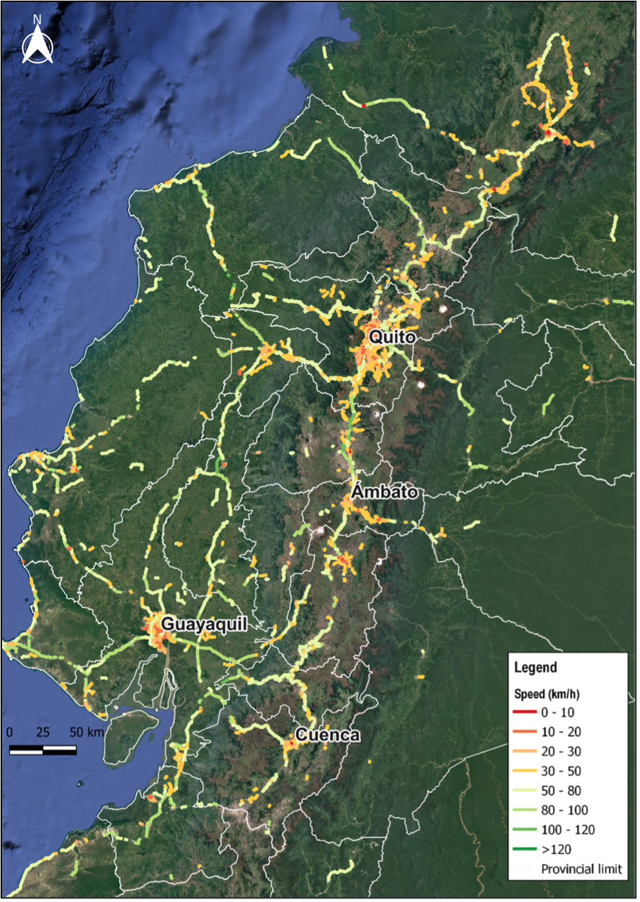

+++
title = "Leveraging Big Data on Travel Speeds and Mobility Patterns to Update Ecuador’s National Transport Model"
authors = ["Aitor Franco Arana", "Ximena Velandia Villamil"]
categories = ["Case Study"]
partner = ["Mapbox", "Outlogic", "Waze"]
dev_partner = ["World Bank"]
tags = ["Transport"]
date = 2025-09-17T00:00:00Z
+++

Improving transport planning in Ecuador requires up-to-date insights on how people travel. Since the 2012 Strategic Mobility Plan (Plan Estratégico de Movilidad), Ecuador has not undertaken a comprehensive transport modeling exercise. Planning processes have become project-focused, lacking a broader network perspective. To help address this, the World Bank’s Ecuador transport team supported the Ministry of Transport and Public Works (MTOP) in updating the country’s national transport model with fresh data. In particular, big data sources on travel speeds and mobility patterns from [Mapbox](https://www.mapbox.com/), [Outlogic](https://outlogic.io/), and [Waze](https://www.waze.com/wazeforcities/) were leveraged to provide critical inputs for the model’s supply and demand components. This approach offered a nationwide view of traffic behavior, addressing the limitations of traditional field surveys.

## Challenge

Ecuador urgently needed a transport demand model for its national road network to improve planning, estimate travel demand more accurately, and better evaluate investments and public policies. However, assembling the necessary input data through conventional field surveys posed serious challenges. The state road network spans roughly 9,660 km, so collecting traffic counts, speeds, and origin-destination data on the ground would be time-consuming and costly. This task is further complicated by security risks in certain areas – the current public order situation could make on-site data collection dangerous or impractical. These factors meant that relying solely on field data was not feasible for developing a timely and comprehensive model. Ecuador needed an innovative solution to gather transport information at scale without extensive field deployment.

<figure style="text-align: center;">
  
</figure>

## Solution

To overcome these challenges, the team harnessed big data from multiple digital platforms, enabling the creation of robust inputs for both the road network supply and travel demand. Through the Development Data Partnership, data were obtained from Mapbox, Outlogic, and Waze – each providing a unique piece of the puzzle:

- **Mapbox** supplied updated digital cartography and road network attributes. This included detailed maps of highways and streets and their characteristics, forming a reliable geospatial foundation for the model’s network. Up-to-date map data ensured that new roads, changes in road geometry, and other infrastructure updates since 2012 were reflected in the model’s supply side.

- **Outlogic** provided aggregated and anonymized location data revealing mobility patterns. By analyzing device traces, the team could infer origin-destination flows, travel times between regions, and key travel corridors or attraction zones. These insights into where and when people travel will feed into the model’s demand side, helping to construct origin-destination matrices in the next phase of the project.

- **Waze** contributed real-time traffic information and user-reported road events. Aggregated speed data from Waze’s community of drivers allowed the team to observe actual travel speeds and congestion patterns across Ecuador’s roads. Waze also provided alerts on incidents or delays, complementing the analysis with information on traffic jams, accidents, and other road conditions in near real-time.

Integrating these three data sources enabled a more precise calibration of the transport model by incorporating current mobility dynamics that traditional surveys would likely have missed. Importantly, using big data in this way vastly increased the volume and coverage of observations. Instead of a few sporadic traffic counts, the team could draw on a large number of data points captured digitally, making the inputs far more representative of typical conditions. In essence, big data allowed the ministry to remotely collect nationwide travel information, overcoming the high costs and safety risks of fieldwork.

Before incorporating the new data into the model, the team reviewed it to extract key insights and confirm its reliability. The analysis showed that most drivers comply with speed limits, and that lower travel speeds are largely linked to two factors: congestion in major urban areas and infrastructure or terrain constraints on certain interurban routes.

As illustrated in Figure 1, the analysis confirmed high overall compliance with posted speed limits. Variations in average travel speeds revealed important spatial patterns: lower speeds are concentrated in major urban areas, where congestion and frequent intersections constrain traffic flow, while higher speeds occur predominantly along flatter, well-maintained interurban corridors, particularly in coastal regions. These patterns are consistent with known differences in terrain, road design, and maintenance standards, underscoring the value of integrating real-world traffic behavior into the transport model.

<figure style="text-align: center;">
  
  <figcaption style="text-align: center; font-size: 0.9em; color: #555;">Figure 1: Average Vehicle Speeds by Location in Ecuador</figcaption>
</figure>

Overall, the review of the Mapbox, Outlogic, and Waze datasets showed that the big data inputs were consistent with reality and captured known traffic behaviors. This gave MTOP confidence that these new information sources are reliable for model calibration. The mobility pattern data from Outlogic and Mapbox, for instance, will be cross-validated with mobile phone carrier data to build a robust origin-destination matrix in the next modeling step.

## Impact

Updating Ecuador’s national transport model is a critical step toward evidence-based infrastructure planning. The new model responds to the need to incorporate the current dynamics of mobility, urban growth, and territorial changes that have emerged since 2012. In the past decade, Ecuador has seen shifts in travel patterns, expansion of road infrastructure, the rise of digital ride-hailing services, and new social and economic trends influencing transport. The model update leverages these new data to strengthen multimodal planning, improve operational efficiency, and integrate sustainability and climate resilience considerations into decision-making. In short, it brings the country’s transport planning tools up to date with present-day realities.

Having an updated, data-driven transportation model will be extremely useful for Ecuador. It provides an objective tool for policymakers to test scenarios and make informed decisions. Specifically, the new model will enable planners to:

- Evaluate the impact of new or existing projects on traffic flows and network performance. Planners can simulate how a new highway or public transit investment would affect travel times, congestion, and accessibility before committing resources.

- Improve planning efficiency by taking a network-wide perspective. Rather than evaluating projects in isolation, the model helps prioritize investments that yield the greatest benefit for the overall transport system. This ensures more cost-effective use of public funds and supports a portfolio approach to infrastructure development.

- Assess the effects of road closures and disruptions, including those caused by natural hazards and climate-related events. Ecuador’s diverse topography—ranging from coastal lowlands to the Amazon rainforest and the Andes mountains—makes its transport network highly vulnerable to floods, landslides, earthquakes, and volcanic eruptions. The model can quantify how a given road closure would impact travel times and connectivity, helping authorities design contingency plans and invest in resilient infrastructure.

By embracing big data and modernizing its analytical tools, Ecuador is positioning itself to plan its transport network more proactively and efficiently. The collaboration with Mapbox, Outlogic, and Waze through the Development Data Partnership exemplifies how innovative data solutions can fill information gaps for better public sector planning. Ultimately, a well-calibrated national transport model anchored in real-world data will help Ecuador prioritize infrastructure investments, improve road safety and mobility, and build resilience against future challenges.

