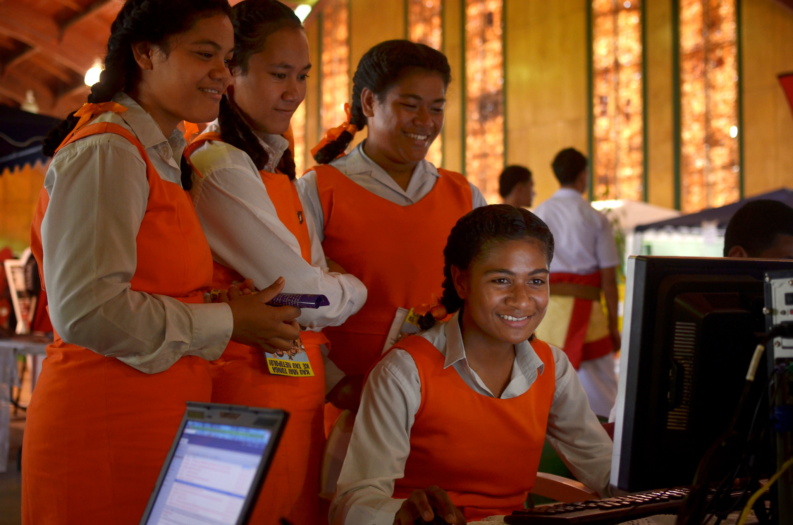

+++
title = "Leveraging Data Partnerships to Unlock the Power of Connectivity"
authors = ["Kwok Kin Lee"]
categories = ["Case Study"]
partner = ["Ookla"]
dev_partner = ["Inter American Development Bank", "World Bank" ]
tags = ["Digital Development"]
date = 2026-05-13T00:00:00Z
+++

Today, internet connectivity is no longer a luxury but a fundamental part of modern life. It is essential in many areas including education, employment, communication, and access to information. Expanding internet access is therefore crucial for advancing the Sustainable Development Goals (SDGs), as it can open up many opportunities such as economic growth, social inclusion, and environmental sustainability.

For instance, from an economic perspective, connectivity enables business expansion and job creation by allowing firms, particularly small and medium enterprises, to access wider markets and digital resources. It also facilitates remote work, which can reduce travel time and associated emissions while enhancing productivity. These combined effects contribute to economic development, poverty reduction, and cleaner air, which are key to the SDGs.

In celebration of World Telecommunication and Information Society Day (May 17), find out how the Inter-American Development Bank and the World Bank partnered with Ookla® to leverage the power of data to improve internet connectivity and bridge the digital divide in low-income countries.

<figure style="text-align: center;">
  
  <figcaption style="text-align: center; font-size: 0.9em; color: #555;">Photo Credit: World Bank</figcaption>
</figure>

## Using Data to Close Guatemala’s School Connectivity Gap

Many schools in Guatemala lack adequate internet connectivity, limiting students’ access to digital textbooks, interactive platforms, and other online learning tools. This connectivity gap affects educational opportunities and can restrict longer-term development prospects for students.

To help address this challenge, the Inter-American Development Bank (IDB) and the International Telecommunication Union (ITU), with support from Ookla, conducted an analysis to identify schools with limited connectivity and assess feasible options to expand access. Drawing on Ookla data, the study found that 2,817 schools, being about 12% of the 22,635 schools in the dataset, likely lack adequate connectivity. It then examined possible solutions including 3G as a fallback where 4G is unavailable, fiber network extensions, and point-to-point microwave links, as well as satellite connectivity as a universal fallback option.

The analysis shows that improving school connectivity could have benefits beyond the classroom. According to the study, the proposed rollout of these solutions could bring reliable internet access to more than 525,000 students and, through expanded digital infrastructure, generate wider economic gains, including job creation and added economic value. [Learn more about this project.](https://datapartnership.org/updates/investing-in-the-future-connecting-guatemala-schools-to-the-internet)
  

## Improving Internet Quality and Access in the Eastern Partnership Countries

Reliable internet connectivity underpins effective public service delivery, supports digital learning, and enables more participation in the economy. In the Eastern Partnership (EaP) countries: Armenia, Azerbaijan, Georgia, Moldova, and Ukraine, significant gaps remain, particularly in rural and underserved areas. High infrastructure costs, limited investment, and regulatory constraints continue to slow the expansion of high-speed networks, leaving disparities in access that affect education, healthcare, business competitiveness, and social inclusion.

To address these challenges, the World Bank, through the EU4Digital Phase II program, developed a framework to assess internet quality and coverage across the region. This approach brings together multiple data sources, including government statistics and data from Ookla Speedtest Intelligence, to better understand both network performance and user experience.

By integrating these datasets, the analysis offers a comprehensive picture of connectivity across the EaP region. It helps governments identify targeted actions to reduce broadband costs, strengthen market competition, and support sustainable private-sector investment. Ultimately, this work contributes to greater economic resilience, deeper regional integration, and more inclusive digital development. [Read more about this project.](https://datapartnership.org/updates/assessing-internet-quality-in-the-eastern-partnership-countries)

Data sharing and collaboration between international organizations and technology companies play a critical role in unlocking the full potential of the internet. By combining global development expertise with data from the private sector such as Ookla, these partnerships enable more accurate, timely, and actionable insights into connectivity gaps and user experience. This in turn supports better-informed policies, targeted investments, and more efficient infrastructure planning. 

As demonstrated across these projects, leveraging data not only strengthens digital infrastructure but also accelerates progress toward inclusive, resilient, and sustainable development.
