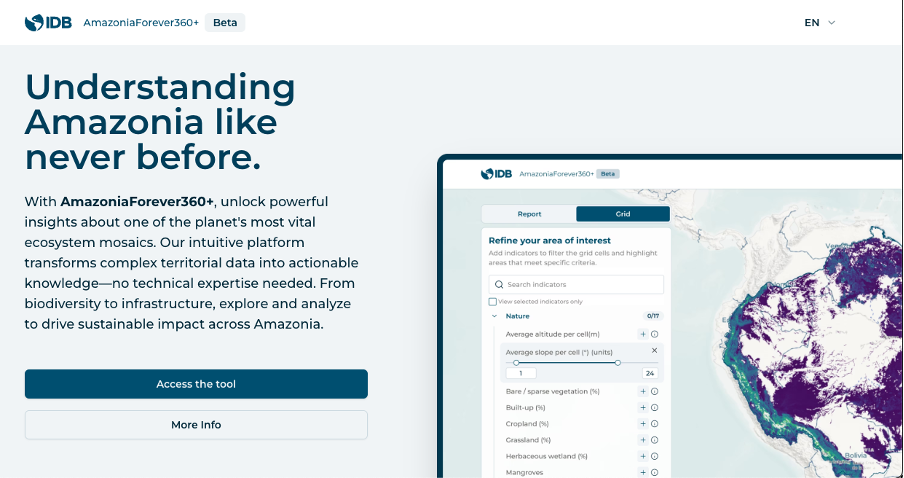

+++
title = "Leveraging Data to Understand the Pulse of Amazonia"
authors = ["Yves Lesenfants", "Adam Mehl"]
categories = ["Case Study"]
partner = ["Esri", "Meta", "Ookla"]
dev_partner = ["Inter American Development Bank"]
tags = ["Urban Development"]
date = 2025-09-30T00:00:00Z
+++

The vastness and complexity of Amazonia present distinct challenges for both development and conservation efforts. The AmazoniaForever360+ platform, currently under development by the Inter-American Development Bank (IDB), aims to support global and regional stakeholders by providing a comprehensive array of geospatial intelligence and territorial insights about the region. [Esri](https://www.esri.com/en-us/home) technology and data from [Meta](https://dataforgood.facebook.com/) and [Ookla®](https://www.ookla.com/ookla-for-good) play an important role in supporting this platform.

## Challenge

Amazonia presents a complex and diverse array of landscapes, cultural practices, and socio-political challenges. Efforts to foster sustainable development must navigate diverse administrative frameworks and the varying demographics across urban and rural settings. 

Factors such as population distribution, infrastructure, and seasonal variations pose significant barriers. It is imperative to consider the region’s human dimensions, including urban industrial hubs, the cultural tapestry, and the connections to global networks.

## Solution

Understanding Amazonia's complex geography, ecology, demographics, and socio-economic conditions requires comprehensive data analysis and presentation. However, accessing and interpreting geospatial information has traditionally required specialized technical knowledge, creating barriers for many potential users.

AmazoniaForever360+ addresses this challenge by transforming how valuable regional data is accessed and understood. As part of the IDB's Amazonia Forever program for sustainable and inclusive development, this platform processes extensive datasets from the Development Data Partnership (DDP)’s partners and other reliable sources into user-friendly formats that require no specialized technical expertise.

The platform aggregates rich and diverse information across environmental, social, economic, and developmental dimensions, making complex geospatial intelligence accessible to users regardless of their technical background. By simplifying data visualization and analysis, AmazoniaForever360+ enables users to gain unprecedented insights into the region's intricate dynamics.

To enhance this vital platform, the IDB leveraged the power of Esri’s ArcGIS system which integrates, connects and analyzes data through the context of geography. Additionally, the IDB team used Ookla’s data to understand internet accessibility and Meta’s data to examine mobility in the region. 

For instance, with the support of Ookla, the platform will be able to provide users with crucial information that enables them to make strategic, informed decisions. This data is vital for enhancing internet connectivity, shaping effective policies, fostering development, and improving essential services.

Additionally, [the IDB used Meta’s Movement Distribution datasets](https://datapartnership.org/updates/understanding-people-mobility-in-amazonia/), which track how far Facebook users in different regions travel from home on a given day. These serve as a proxy for transportation of goods and services as well as population displacement. This support from Meta’s data is important because it provides insights that help us better understand mobility trends.

In addition to our partners Ookla and Meta, and while we do not use their data directly, collaboration with the European Space Agency provides ongoing technical support and knowledge sharing.

<figure style="text-align: center;">
  
</figure>

## Impact

The Amazonia Forever working area encompasses 8.4 million square kilometers, home to an estimated 60 million people across eight countries. Collaborating with Esri, Meta, and Ookla through the DDP is crucial for the AmazoniaForever360+ platform to assist public policy professionals by offering a comprehensive range of geospatial intelligence and territorial insights about the region. 

This collaboration is important to ensure that the AmazoniaForever360+ platform will not only lead the way in enhancing internet connectivity but will also transform the online experience into something faster, better, and truly accessible for everyone in Amazonia. 

Looking ahead, the IDB team aims to expand the platform by integrating datasets from across the DDP, broadening its scope, deepening its insights, and fostering stronger collaboration with both current and future partners.

Together, we are empowering communities and fostering growth for a brighter digital future.

