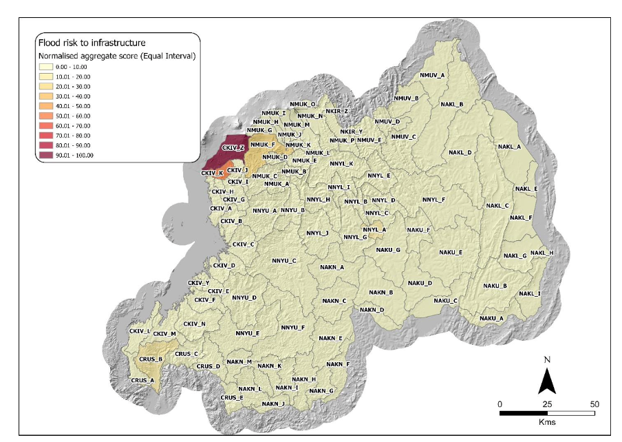

+++
title = "Leveraging JBA Data for Flood Risk Assessment in Rwanda’s Sustainable Landscape Management Framework"
authors = ["Hisham Osman", "Ko Takeuchi"]
categories = ["Case Study"]
partner = ["Jba"]
dev_partner = ["World Bank"]
tags = ["Disaster Risk Management"]
date = 2025-12-08T00:00:00Z
+++

The Rwanda Sustainable Landscape Management Investment Framework (SLM-IF) outlines a comprehensive, long-term plan to encourage sustainable land use and manage natural resources, while restoring degraded ecosystems throughout Rwanda. [JBA Global Resilience (JBA)](https://jbagr.com/) provided data support for the framework to improve catchment management and ecological restoration in the country, with a focus on areas prone to flooding.

## Challenge

Rwanda, located in East Africa, has become a symbol of progress and resilience, transitioning from a tragic past toward a future focused on sustainability. Still, the country faces a variety of interconnected environmental, social, and economic challenges that could threaten to derail efforts to enhance Rwanda’s natural capital assets and ensure sustained socio-economic growth. These challenges include land degradation and climate risks.

For instance, rapid land development with poor control is the primary cause of land degradation in Rwanda. Additionally, the country’s average temperature has increased by 1.4°C since 1970, with further rises expected by the 2030s (World Bank, 2019). Rwanda’s dependence on rain-fed agriculture and hydropower makes it especially vulnerable, creating challenges for water management and threatening the economy, particularly in sectors like nature-based tourism and agriculture.

Along with the mounting threat of the climate crisis, Rwanda faces other challenges that hinder sustainable development. These include rapid population growth, poverty, and food insecurity. Taken together, these issues threaten the country’s ecosystems, biodiversity, and socio-economic resilience.

<figure style="text-align: center;">
  
</figure>

## Solution

From land degradation and climate vulnerability to population pressure and poverty, Rwanda needs to address the country’s growing environmental and socio-economic challenges in a coordinated, strategic, and scalable manner. The SLM-IF framework is designed to address these by promoting coordinated, long-term investment in sustainable land management and ecosystem restoration.

To support this framework, the World Bank leveraged [JBA’s Global Flood Maps](https://jbagr.com/digital-tools/global-flood-maps/) to assess and manage flood hazard, as flooding is one of the most significant natural hazards impacting the people and economy of Rwanda. It results in loss of life and livelihoods, and damages and destroys infrastructure.

The Global Flood Maps supported the flood assessment by providing detailed data for Rwanda, including:

1.	Flood Extent and Depth: The Maps provide information on flood extent and depth for multiple return periods, allowing for a comprehensive understanding of potential flood hazards.
2.	Higher Detail: The Maps offer greater detail compared to other available data, enabling more reliable flood hazard evaluations.
3.	Decision Support: The detailed hazard data from JBA helped prioritize areas for SLM interventions by identifying vulnerable features such as agriculture, infrastructure, and population centres.

The highest flood risks to people are concentrated in the far north of the Western Province, particularly around Rubavu and near Volcanoes National Park. For infrastructure, the northern Kivu catchment faces the greatest flood risk.

<figure style="text-align: center;">
  
</figure>

## Impact

It is crucial for Rwanda to study its flood-prone areas as part of a strategic plan to protect its people, environment, and economy from the increasing effects of climate change and land degradation. Flooding not only results in loss of human life but also damages infrastructure such as roads, bridges, and buildings. By identifying and analyzing flood-prone regions, such as the catchments around Rubavu, Kigali, and the Nyabarongo River, Rwanda can prioritize interventions that improve safety and lessen disaster risks.

With limited financial and technical resources, the country must allocate investments carefully. With data support from JBA, a detailed understanding of flood risks helps ensure that funding and interventions under the SLM-IF are directed to areas with the highest need and potential for impact, fostering long-term climate resilience and sustainable development.

