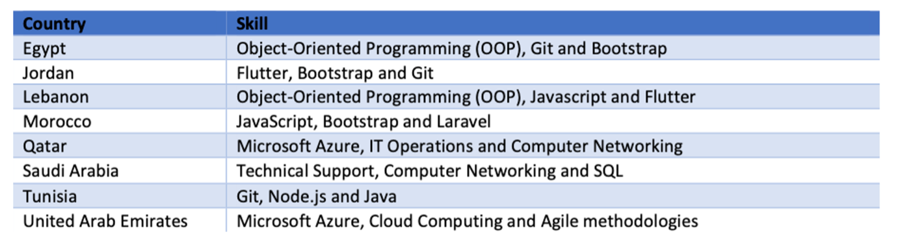

+++
title = "Leveraging LinkedIn Data to Understand the Green and Digital Transformations in the Labor Market and the Future of Work"
authors = ["Kwok Kin Lee"]
categories = ["Case Study"]
partner = ["LinkedIn"]
dev_partner = ["Inter American Development Bank", "International Monetary Fund", "World Bank"]
tags = ["Jobs and Development"]
date = 2025-03-28T00:00:00Z
links = ["https://datapartnership.org/updates/digital-transformation-lac/","https://datapartnership.org/updates/digital-skills-gap-mena","https://datapartnership.org/updates/greener-labor-market","https://datapartnership.org/updates/analyzing-the-adoption-of-artificial-intelligence-in-capital-market-activities"]

+++

The economy and the labor market have evolved due to digital and green transitions. New technologies and new forms of work stemming from digitalization, climate change, and ongoing efforts to shift to a low-carbon economy have been changing jobs and skills at a rapid pace. 
 
Firstly, digital transformation is shaping the world of work and traditional jobs. Many employers use AI and machine learning to reduce costs, enhance efficiency, and raise performance. Additionally, some traditional roles will vanish altogether and will be replaced by automation. The fast-changing nature of the job market is increasingly affecting labor demand, with employers increasingly seeking candidates with at least some degree of digital skills.

Secondly, as the world experiences more intense and frequent extreme weather events, the importance of green jobs and related skills is growing. To address the impacts of climate-related incidents, we are rapidly adopting new strategies, which is driving up the demand for green skills in the labor market.

<figure align="center">
    
</figure>

Understanding the impact of digital and green transformations on the labor market is crucial for policymakers and employers to ensure the workforce is equipped to meet current and future labor market demands. However, due to the constantly changing nature of the labor market, real-time data and updates are necessary to assess this impact.

Through the Development Data Partnership, [LinkedIn](https://www.linkedin.com/) has provided real-time data to help international organizations to identify trends like hiring rates and in-demand skills with the aim of understanding how digital and green transitions are impacting labor markets across the world.

For example, the Inter-American Development Bank (IDB)’s Competitiveness, Technology, and Innovation Division leveraged LinkedIn data for part of their quantitative and qualitative assessment of the current state of digital technologies in Latin America and the Caribbean (LAC). 

For [this study](https://datapartnership.org/updates/digital-transformation-lac/), LinkedIn offered data on the penetration of digital skills in different industries in LAC countries. The IDB team revealed that Brazil was the only country in the LAC region with both tech and disruptive tech skills above the global average in each of the selected industrial sectors (i.e., construction, energy and mining, and manufacturing). Several countries in the region did not appear to have disruptive tech skills in the selected industrial sectors. Learn more [here](https://datapartnership.org/updates/digital-transformation-lac/?).

In addition to Latin America and the Caribbean, LinkedIn also provided data support to help people understand the labor market in the Middle East and North African (MENA) region under the impact of the digital transition.

The World Bank Human Development Practice Group worked with LinkedIn to [study](https://datapartnership.org/updates/digital-skills-gap-mena) the MENA labor markets and analyze the most relevant and characteristic skills according to selected industries and occupations in the tech and digital sector.

The World Bank team found that specific programming languages such as Bootstrap, Git, JavaScript and Object-Oriented Programming stood out as the most characteristic skills found in Morocco, Lebanon, Jordan, and Egypt, whereas Qatar and the United Arab Emirates ranked Microsoft Azure (also known as Microsoft Cloud Computing) as the most frequently found skill on LinkedIn (figure 1). Discover more [here](https://datapartnership.org/updates/digital-skills-gap-mena).

<figure align="centre">
    
        

Figure 1: Top three most characteristic skills for the Software & IT Services Industry per country (MENA only) in 2021
  

    </figcaption>
</figure>

Utilizing LinkedIn data, these two studies by IDB and the World Bank provided policy recommendations such as developing more tailored in-demand training programs to help employees thrive in a digital world.

Digital transformation also impacts the financial industry. For instance, AI can be used at different stages of the investment process, and for different tasks. An interesting question is whether the financial sector is a front-runner as compared to the broader economy when it comes to the adoption of AI. 

The IMF leveraged data, including from LinkedIn, to explore labor market developments that could provide supporting evidence of broad AI skill adoption. The team discovered that the share of job postings in the financial services industry requiring AI skills has outpaced the overall share of AI-related job postings in the broader US economy, indicating a more rapid adoption compared to other industries. Read more [here](https://datapartnership.org/updates/analyzing-the-adoption-of-artificial-intelligence-in-capital-market-activities).

Apart from labor market change due to digital transformation, climate change is also altering the world of work rapidly as we need workforces capable of addressing the climate crisis and participating in the green economy. However, do workers have the skills required for greener employment? The International Monetary Fund’s Research Department utilized LinkedIn data on green hiring rates and the growth of green skills to analyze global green employment trends.

For instance, the IMF team studied workers’ demographic characteristics. They found that more green-intensive occupations tend to have higher-skilled and more urban workers, while the opposite is true for more pollution-intensive jobs. 

The rich and timely LinkedIn data on green hiring rates and the growth of green skills enabled the IMF team to provide an in-depth picture of the evolution of greener employment. Find out more [here](https://datapartnership.org/updates/greener-labor-market).

Leveraging LinkedIn’s real time data, all these projects by the World Bank, IDB, and IMF called on policymakers to ensure their workers and labor markets are equipped to adapt to the digital and green transitions and to benefit from them. The Development Data Partnership’s collaboration with LinkedIn continues to provide crucial data support for international organizations to help people thrive in the future.

