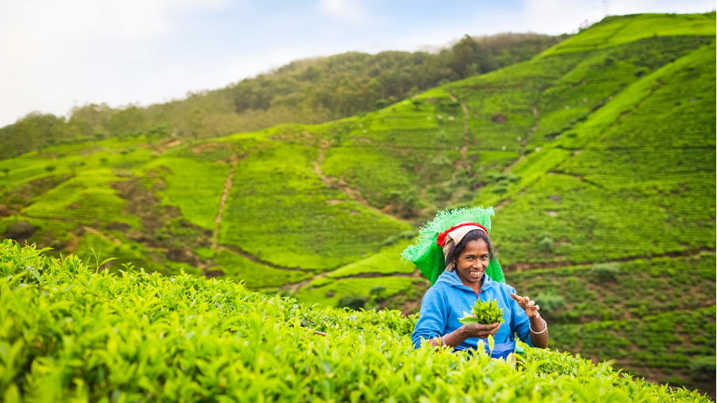
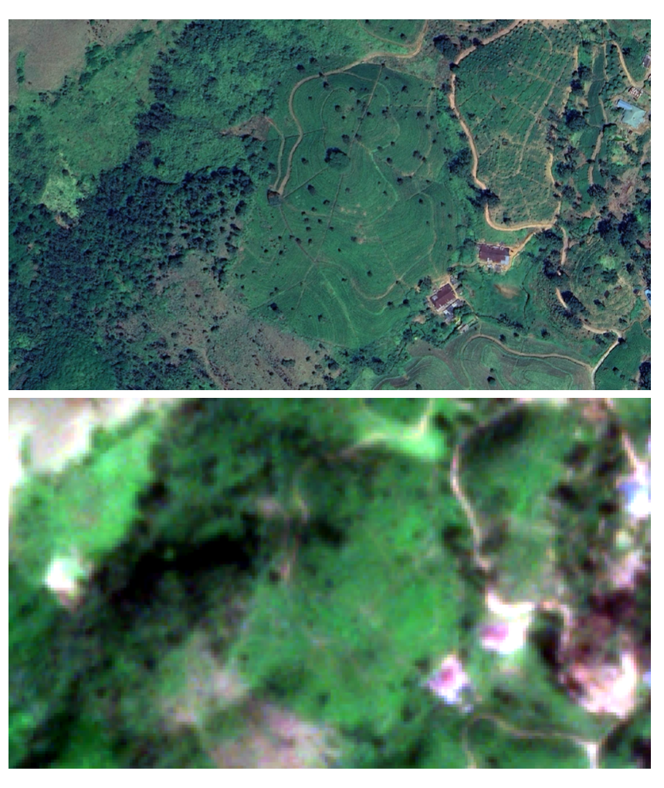
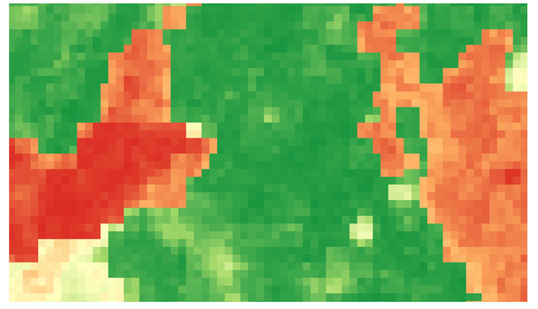

+++
title = "Leveraging Satellite Data to Understand the Economic Implications of Sri Lanka’s Fertilizer Import Ban in 2021"
authors = ["Devaki Ghose"]
categories = ["Case Study"]
partner = ["Planet"]
dev_partner = ["World Bank"]
tags = ["Agriculture and Food"]
link = ["https://documents.worldbank.org/en/publication/documents-reports/documentdetail/099557412122318720"]
date = 2025-06-17T00:00:00Z
+++

In May 2021, Sri Lanka’s government imposed a sudden ban on imports of chemical fertilizers. The World Bank’s Trade and International Integration Unit of the Development Research Group utilized satellite data, including [Planet](https://www.planet.com), to quantify the changes in tea yield since the ban, as part of a study aimed at understanding how the ban affected the country’s agricultural production and trade.

## Challenge

Sri Lanka plays a vital role in the global tea market. With over 160 years of history, the tea industry is a pillar of Sri Lanka’s agricultural sector, accounting for the majority of the country’s agricultural export earnings.

However, in a world of global value chains, there is increasing concern that protectionist policies, such as import bans, have adversely affected Sri Lanka’s economy through their effects on production and exports. Among the most notable of these was the country’s ban on fertilizer imports. On May 6, 2021, the Sri Lankan government unexpectedly banned the import of chemical fertilizers, officially citing a need to transition the country’s agricultural sector to organic farming. However, many suspected that the underlying motive was to conserve foreign exchange, as fertilizers were largely imported.

As tea serves as Sri Lanka’s primary export crop, understanding the effects of the fertilizer ban on this vital export is essential. Nonetheless, traditional methods used to assess tea area and yield in Sri Lanka typically rely on labor-intensive field surveys and statistical reports. These methods can be time-consuming, subjective, and susceptible to inaccuracies, particularly across vast and varied landscapes.

<figure align="center">
    
</figure>

## Solution

Remote sensing provides an efficient and reliable means of collecting data to map tea varieties and their acreage (Mahavidanage and Karunarat, 2010). The World Bank’s Trade and International Integration Unit of the Development Research Group mapped tea locations and yield using several image processing and analysis steps.  

These steps included acquiring medium to high-resolution satellite imagery provided by multispectral instruments from Sentinel-2 and PlanetScope. PlanetScope is a product of Planet. For this analysis, the World Bank accessed the PlanetScope data through the Development Data Partnership.

These Sentinel-2 and PlanetScope multispectral instruments offer excellent temporal coverage, enabling multi-seasonal analysis. Sentinel-2 and PlanetScope 8-band observations, featuring multiple spectral bands (including red-edge bands), are particularly valuable for vegetation analysis. PlanetScope, in particular, is crucial for mapping smaller, fragmented tea plantations or for detailed within-plantation analysis.

<figure align="centre">
    
        

Figure 1. Example tea planted area (center) in the Kandy district. The figure on top is a high-resolution image clipped from the Google Earth background. The bottom image is Planet Scope data acquired on December 26, 2023, showing the color contrast of tea plantations and other land cover types.
  

    </figcaption>
</figure>

<figure align="centre">
    
        

Figure 2. Tea occurrence probabilities calculated from PlanetScope and elevation data of the same area in the Kandy district. Green colors refer to a higher occurrence probability of tea while reddish colors are lower occurrence probability.
  

    </figcaption>
</figure>

Alongside satellite data, the World Bank team analyzed high-frequency trade data and administrative records to quantify the costs of the lack of access to chemical fertilizers caused by the import ban for agricultural production and trade in Sri Lanka.

Here are the key findings:
•	The team’s analysis indicates significant declines in fertilizer imports, agricultural output—particularly for rice and tea—and in the exports of crops that depend on fertilizer. Overall, the ban resulted in a 4.35% reduction in income, with disproportionate losses for farmers, estate workers, and the regions that cultivate fertilizer-intensive crops. 
•	Tea yields in 2022 (the first year after the fertilizer import ban) were 428 kg/ha (or 26.8%) below baseline, a strongly statistically significant difference that corresponds to a 28.7% drop relative to the average yield of the 2014-2021 period.

Consequently, the first agricultural season following the import ban saw significantly low tea yields, indicating a major adverse effect of the fertilizer ban on Sri Lankan agriculture.

## Impact

[This World Bank study](https://documents.worldbank.org/en/publication/documents-reports/documentdetail/099557412122318720) evaluated the economic implications of this policy, including its effects on crop yields, trade flows (both imports and exports), household incomes, and overall well-being. Its findings provided a compelling glimpse into the extensive consequences of trade-induced fertilizer shortages for a country. These findings were based on the tea yield estimates obtained using satellite data from Planet. With support from Planet, the team was able to accurately quantify the change in tea yield.

When assessing the potential impact of a proposed policy, policymakers must carefully consider its costs and benefits. For policies with significant implications—such as those affecting agricultural production and food security—high-resolution satellite data, like that from Planet, can offer valuable insights into their effects.

