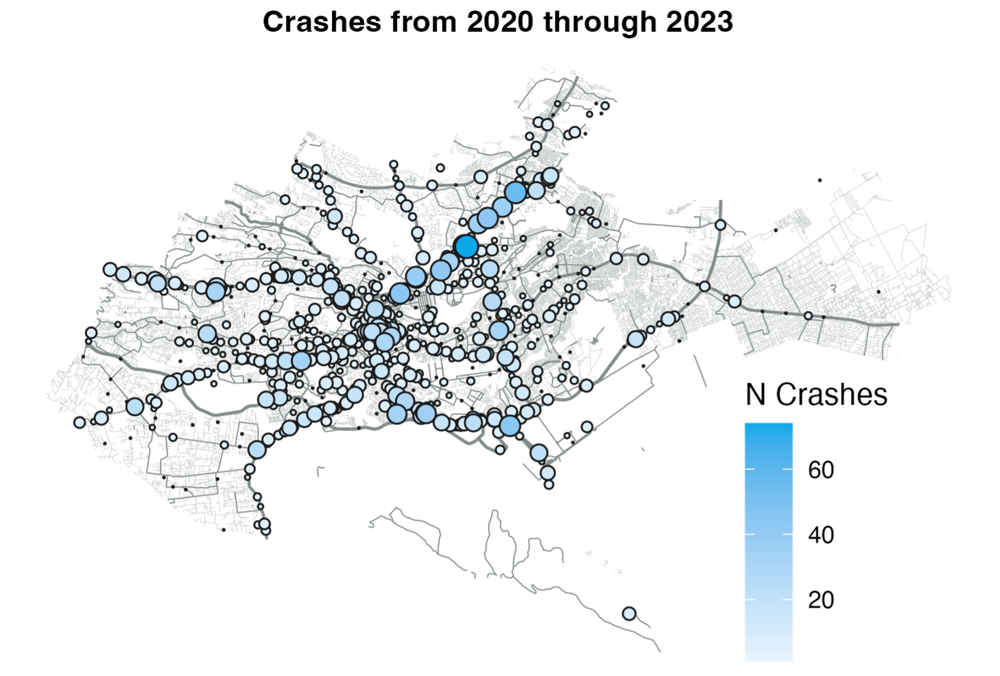

+++
title = "Leveraging Social Media Data to Map Road Traffic Crashes"
authors = ["Arianna Legovini", "Robert Marty", "Sveta Milusheva", "Guadalupe Bedoya"]
categories = ["Case Study"]
partner = ["X"]
dev_partner = ["Transport"]
links = ["https://blogs.worldbank.org/en/opendata/newly-released-dataset-maps-30-000-road-crashes-in-nairobi-using?"]
date = 2025-01-31T00:00:00Z

+++

## Challenge

Road traffic crashes are among the world’s most pressing public health challenges. Crashes are the [leading cause of death](https://www.cdc.gov/transportation-safety/global/index.html?#:~:text=Each%20year%2C%201.19%20million%20people,for%20individuals%20ages%205-29) for those 5-29 years old and are the [8th leading cause of death](https://www.who.int/data/gho/data/themes/topics/topic-details/GHO/road-traffic-mortality?) considering all ages. Crash data offers a tool to guide efforts to enhance road safety; data allow identifying the most risky road segments and enable evaluating interventions aimed at improving safety. However, crash data are rare where crashes are most common. Low- and middle-income countries (LMICS) account for [92% of traffic deaths](https://blogs.worldbank.org/en/opendata/newly-released-dataset-maps-30-000-road-crashes-in-nairobi-using?), yet administrative records of crashes in LMICS often [underestimate crashes](https://www.globalroadsafetyfacility.org/driver?) and, when data does exist, they are often recorded on paper.  

## Solution

The rise of smartphones and social media has empowered citizens to voice concerns. Kenyans in particular have leveraged these technologies to voice concerns about their country’s notable challenges with [traffic](https://www.kenyans.co.ke/news/102889-nairobi-emerges-second-among-african-cities-bad-traffic?) and [crashes](https://www.afro.who.int/countries/kenya/news/kenya-launches-road-safety-initiative-reduce-crashes#:~:text=At%20the%20end%20of%20the,period%20in%20the%20year%202021.). [@Ma3Route](https://x.com/Ma3Route), an X account and platform for crowdsourcing transport information, has 1.5 million followers and is used by many across Kenya to report traffic jams and crashes—see the example posts below: 

<blockquote class="twitter-tweet">

  13:21 Accident along Eastern Bypass after 75 Barracks, traffic from Tuskys Emba to Utawala. 
  via <a href="https://twitter.com/Nickeywambua?ref_src=twsrc%5Etfw">@Nickeywambua</a>

&mdash; Ma3Route (@Ma3Route) 
<a href="https://twitter.com/Ma3Route/status/1050692843583492097?ref_src=twsrc%5Etfw">October 12, 2018</a></blockquote> 

<blockquote class="twitter-tweet">

  <a href="https://twitter.com/Ma3Route?ref_src=twsrc%5Etfw">@Ma3Route</a> 
  Expect traffic on Thika Road outbound. Multiple car accident after Alsops Stage. 
  via <a href="https://twitter.com/EveOmmutsa?ref_src=twsrc%5Etfw">@EveOmmutsa</a>

&mdash; Ma3Route (@Ma3Route) 
<a href="https://twitter.com/Ma3Route/status/1760643890552488218?ref_src=twsrc%5Etfw">February 22, 2024</a></blockquote> 

<blockquote class="twitter-tweet">

  01:00 Accident at Safaricom HQ, outbound. 
  via <a href="https://twitter.com/rugualex?ref_src=twsrc%5Etfw">@rugualex</a>

&mdash; Ma3Route (@Ma3Route) 
<a href="https://twitter.com/Ma3Route/status/997597923981561857?ref_src=twsrc%5Etfw">May 18, 2018</a></blockquote> 

Leveraging the Twitter (now X) API, facilitate through the Development Data Partnership, the [Smart and Safe Kenya Transport (smarTTrans)](https://documents1.worldbank.org/curated/en/723411574361015073/pdf/Smart-and-Safe-Kenya-Transport-SMARTTRANS.pdf?_gl=1*1crmlnu*_gcl_au*MTU5MzgxNTc5Mi4xNzI2NjkyNjM4) team at the World Bank has worked to translate crowdsourced crash reports from @Ma3Route to structured data on crashes for Nairobi—Kenya’s capital and largest city. Using the API, the team queried over 1 million tweets from @Ma3Route since its start in 2012 and developed algorithms to (1) determine whether the tweet reports a crash, (2) geolocate the crash based on the text of the tweet (few people had geolocation enabled), and (3) group crash reports into individual crashes.  

After developing the algorithms, the team worked to groundtruth the crowdsourced crash reports—partnering with a delivery company (Sendy) to confirm the presence of a crash at the location determined by the algorithm (the paper [here](https://journals.plos.org/plosone/article?id=10.1371%2Fjournal.pone.0244317) describes the groundtruthing and algorithms). In parallel, the team has worked to digitize administrative records of crashes—enabling comparisons between administrative records and crowdsourced reports (see the blog [here](https://blogs.worldbank.org/en/opendata/finding-missing-data-creating-actionable-information-solving-development-problems?)). 

<figure align="centre">
    
        

Figure 1. Number of Crashes from 2020 through 2023 
  

    </figcaption>
</figure>

## Impact

In total, these efforts have produced data on the time and location of 30,000 crashes across Nairobi—which the team has recently [publicly released](https://blogs.worldbank.org/en/opendata/newly-released-dataset-maps-30-000-road-crashes-in-nairobi-using?). By making the dataset public, we hope that others will creatively leverage the data to improve road safety outcomes. We have already had students from local universities, NGOs and individual researchers start to use this data to help generate more knowledge and potential solutions to the road safety challenge in Kenya.  

Mapping crashes has enabled the identification of blackspots and high-risk corridors in Nairobi. For example, the above map shows crashes concentrated in Nairobi’s Central Business District as well as along major roads, such as Thika Road.  

The team has since used crash data—both derived from @Ma3Route as well as from administrative records—for subsequent analysis. For example, [our working paper](https://openknowledge.worldbank.org/server/api/core/bitstreams/161cbc25-33ec-4369-8717-f5298ac952ff/content?) shows that Kenya’s curfew policies in response to COVID-19 increased crashes in the hours before the curfew—as people rushed home ahead of the curfew. 

Altogether, these analyses demonstrate how crash data can be used to target interventions, evaluate policies, and understand the larger consequences of crashes. Moreover, as digital technologies continue to [spread in lower income countries](https://www.worldbank.org/en/results/2024/01/18/digital-transformation-drives-development-in-afe-afw-africa?#:~:text=Over%20160%20million%20Africans%20gained,payment%20between%202014%20and%202021.), we hope this example of leveraging crowdsourced data to inform policy can serve as a model for other contexts. The Development Data Partnership is pivotal in helping to make the data from these technologies available more widely, making it possible to generate these analyses and support more effective policies in the countries where we work.