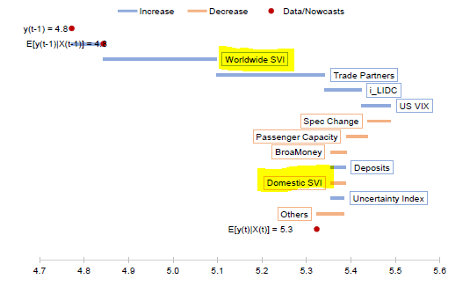
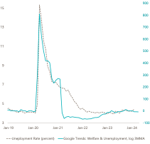

+++
title = "Macroeconomic Monitoring with Google Trends"
authors = ["Lamya Kejji"]
categories = ["Case Study"]
partner = ["Google"]
dev_partner = "International Monetary Fund"
tags = ["Jobs and Development"]
date = 2024-05-14T00:00:00Z
links = [
"https://www.imf.org/en/Publications/WP/Issues/2023/08/03/Panel-Nowcasting-for-Countries-Whose-Quarterly-GDPs-are-Unavailable-534455",
"https://www.imf.org/en/Publications/WP/Issues/2022/05/07/Sub-Saharan-Africa-Economic-Activity-GDP-Machine-Learning-Nowcasting-COVID-19-517646",
"https://www.imf.org/en/Publications/WP/Issues/2018/12/14/In-Search-of-Information-Use-of-Google-Trends-Data-to-Narrow-Information-Gaps-for-Low-income-46475",
"https://www.imf.org/en/Publications/WP/Issues/2021/12/17/Using-the-Google-Places-API-and-Google-Trends-Data-to-Develop-High-Frequency-Indicators-of-510876"
]
+++

Challenges such as a lack of timely high-frequency data make it difficult to monitor and evaluate changing economic situations. [Google](https://www.google.com)�s weekly search volume index (SVI) helped the International Monetary Fund provide more timely response and assessment of economic activity especially in Labor Markets and Tourism. 

## Challenge

In order to assess global economic conditions, and provide prompt policy recommendations to member countries, teams at IMF conduct real-time monitoring of economic activity, especially in Labor Markets and Tourism, and implement GDP Nowcasting models to provide more timely responses and assessments of economic growth in real-time. These models become even more crucial in times of crises. The challenges are that (i) there is a general lack of timely high-frequency data, especially with longer spans and (ii) for developing and low-income countries, such data is often not available, even in lower frequency and (iii) these indicators often react with a lag to changing economic conditions, and the release of official statistics comes with its own delays.

## Solution

Accessing people�s Internet searches would provide an insight into their current interests, concerns, and intentions. Google provides a private API through the Data Partnership which allows the querying of a weekly search volume index (SVI) of a keyword or topic in a specific category or in general and is available globally.  Google SVI stretches back to 2004 and this makes it a powerful resource for conducting comprehensive analyses over extended periods. Furthermore, the SVI can be broken down to regional level which allows for a nuanced understanding of geographic variations in interests and trends. 
SVI measures how many times a keyword (or key words under a topic) has been submitted to the Google search engine. A search topic, rather than just a keyword, can be specified to deal with ambiguity of a search word due to homographs. Search results are normalized to the time and location of a query by a process called the normalization method, which can be found on the [Google Trends Documentation](https://support.google.com/trends/answer/4365533?hl=en).

<figure align="center">
    
        

Source: IDB analysis based on Meta's Data for Good (Oct-Nov 2023) 
  

    </figcaption>
</figure>

## Impact

In _�Use of Google Trends� Data to Narrow Information Gaps in low-income developing countries (LIDCs)�_, Google SVI proved to correlate strongly with economic indicators such as inflation, capital flows, and real GDP. In LIDCs. The paper also showed that including SVIs in the GDP nowcasting model pool of variables improved the out-of-sample performance of the model. 

In an application to Sub Saharan African Countries (SSA), the paper _�Overcoming Data Sparsity: A Machine Learning Approach to Track the Real-Time Impact of COVID-19 in Sub-Saharan Africa�_ uses Google SVIs as predictors in a machine-learning framework that helps track economic activity in SSA. For instance, in the case of Botswana, the SVI in the �Travel� category for the word �Botswana� is among the top predictors of GDP Growth.

In a great showcase of how SVI is crucial in times of crises, the paper _�Using the Google Places API and Google Trends Data to Develop High Frequency Indicators of Economic Activity�_ developed high-frequency indicators based on Google data to measure the various business dynamics and activity since the start of the Covid-19 pandemic by combining (i) Google Places API to build indicators of �business status� for several major cities for the period from April 2020 to 2021 and (ii) Google Trends data, creating �business activity� indicators that match the classifications used in the national accounts and other official business statistics. Through a simple regression experiment, the team showed that the two indicators predicted the fall and subsequent recovery in the GDP of selected countries during the early stage of COVID-19.

In a more recent paper, _�Panel Nowcasting for Countries Whose Quarterly GDPs are Unavailable�_, a team of economists, produced Quarterly GDP for 20 countries in SSA that do not publish quarterly GDP. The model uses WorldWide search for a country in 28 different topics as an indicator of worldwide attention to the country. In the chart below we can see that Worldwide SVI and Domestic SVI are both important predictors in the GDP nowcasting.

<figure align="center">
        <figcaption>
        

Decomposition of growth nowcasts for Uganda 
  

    </figcaption>

The statistics department is creating a Labor Market Tracker where Google SVI is used for monitoring unemployment. Using a Google Predefined category for welfare and unemployment, the tracker can indicate shifts in the job market before they're reflected in official statistics. Increases in searches in this category correlate with unemployment in multiple countries.

<figure align="center">
        <figcaption>
        

Unemployment: Official data vs Google SVI
  

    </figcaption>

