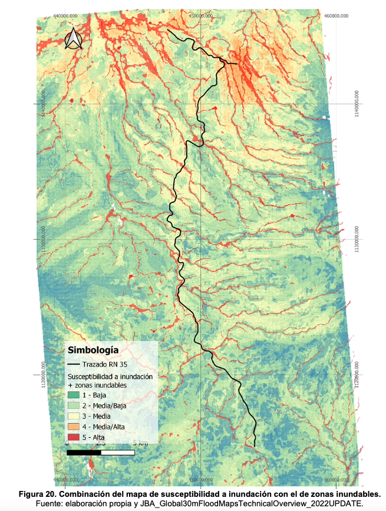

+++
title = "Mapping Flood Hazard to Strengthen Road Infrastructure Resilience in Costa Rica"
authors = ["Porta Raimon", "Katya Barrantes", "Valentina Saavedra"]
categories = ["Case Study"]
partner = ["Jba"]
dev_partner = ["Inter American Development Bank"]
tags = ["Disaster Risk Management"]
date = 2026-02-11T00:00:00Z
+++

As part of a study by the Inter-American Development Bank (IDB) on the Bernardo Soto–Florencia section of Costa Rica’s National Route 35, flood exposure was assessed using global flood hazard data from [JBA Global Resilience (JBA)](https://jbagr.com). The findings helped identify priority sections for more resilient infrastructure design.

## Challenge

Costa Rica’s National Route 35 is a priority national and regional corridor, linking the country’s Central Valley with the productive northern region of San Carlos and forming part of the Mesoamerican International Highway Network. Its economic significance, combined with exposure to natural hazards, makes the corridor a strong case for assessing climate and disaster risks in transport infrastructure.
 
This need is reinforced by Costa Rica’s high vulnerability to climate change, highlighted by the impacts of Hurricane Otto and Tropical Storm Nate on roads and bridges, and reflected in national development and adaptation priorities focused on strengthening infrastructure resilience.

<figure style="text-align: center;">
  
</figure>

## Solution

The IDB conducted an assessment of disaster and climate change risk for National Route 35, along the Bernardo Soto–Florencia section in Costa Rica. Its main objective was to integrate climate change considerations into hydrological and hydraulic analyses used in road design, and to evaluate how future climate conditions may affect the performance, safety, and resilience of this strategically important transport corridor.

To better understand flood risk along National Route 35, the study used high-resolution [Global Flood Maps](https://jbagr.com/digital-tools/global-flood-maps/) from JBA. These maps provided information on flood extent and depth for multiple return periods and were used alongside project-specific hydrological, hydraulic, and geospatial analyses, including flood-susceptibility mapping. Together, these data sources supported the identification of sections of the corridor exposed to flooding and helped inform the prioritization of design attention to strengthen infrastructure resilience under current and future climate conditions.

The map below showcases flood susceptibility along Costa Rica’s National Route 35 (Bernardo Soto–Florencia section). It combines flood susceptibility with mapped flood-prone areas to highlight the road segments more exposed to flooding.

<figure style="text-align: center;">
  
</figure>

## Impact

By identifying flood-prone areas along the Bernardo Soto–Florencia corridor, the study provides insights to inform more resilient infrastructure design decisions. Beyond this specific corridor, the project also contributes to Costa Rica’s broader efforts to plan and design infrastructure that is better prepared for climate variability and future extreme events.
 
In addition, the analysis supported the identification, anticipation, prevention, and mitigation of potential project-related impacts on the community, in line with the IDB Environmental and Social Policy Framework. Where necessary, it also informed refinements to the hydraulic design of specific sections and elements of the corridor.

More broadly, the study aligns with the IDB’s regional efforts to strengthen disaster and climate risk analysis across project identification, preparation, and implementation, supporting more integrated risk and resilience assessments and helping vulnerable countries advance their sustainable development and adaptation goals.

