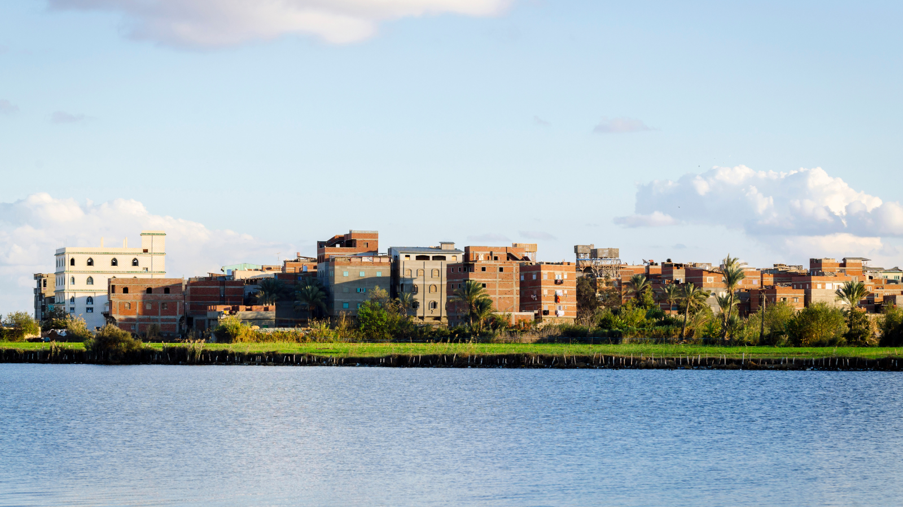
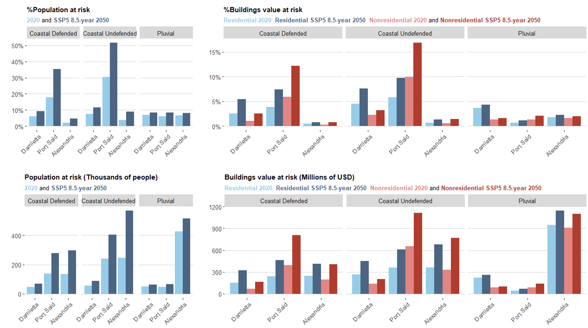

+++
title = "Mapping Flood Risk and Economic Impacts in Egypt’s Coastal Cities"
authors = ["Hogeun Park"]
categories = ["Case Study"]
partner = ["Jba"]
dev_partner = ["World Bank"]
tags = ["Disaster Risk Managment"]
date = 2026-06-09T00:00:00Z
+++

Coastal cities in Egypt face growing risks from both coastal flooding linked to sea-level rise and pluvial flooding caused by intense rainfall. Understanding not only where flooding may occur, but also how it disrupts local and national economies, is increasingly critical for urban policy and climate resilience planning.

A recent study by the World Bank’s Urban, Resilience, and Land Practice Department combines high-resolution flood hazard data from [JBA Global Resilience](https://jbagr.com) (JBA) with an economy-wide modeling framework to assess current and future flood risk in selected Egyptian coastal cities, focusing on the scale and distribution of potential economic losses.

## Challenge

Egypt, like many countries with long coastlines, has experienced rapid urban growth along the shore. According to the Global Facility for Disaster Reduction and Recovery, around 4.3 million people were living within one kilometer of Egypt’s coast in 2020, an increase of 44% over the previous two decades. 

Many of these coastal cities are located at or near sea level, making them particularly vulnerable to sea-level rise, storm surges, and intense rainfall events. In the Nile Delta, where a large share of Egypt’s coastal urban population is concentrated, vulnerability is further heightened by land subsidence and accelerating coastal erosion. Reduced sediment flows following the construction of upstream dams, combined with climate change, are already amplifying flood risks and stressing urban infrastructure.

<figure style="text-align: center;">
  
</figure>

## Solution

Our study assesses the economic costs of severe flooding in three strategically important Egyptian port cities—Alexandria, Damietta, and Port Said—considering both coastal flooding driven by sea-level rise and pluvial flooding from extreme rainfall. These cities were selected because they differ in economic structure, exposure, and vulnerability, while collectively representing the Nile Delta’s coastal urban system.

[JBA’s Global Flood Maps](https://jbagr.com/digital-tools/global-flood-maps/), accessed through the Development Data Partnership, form a core input to the analysis. The maps provide flood hazard layers, which are then combined with a high-resolution exposure dataset that estimates the replacement value of residential and non-residential buildings at the city scale.

<figure style="text-align: center;">
  
  <figcaption style="text-align: center; font-size: 0.9em; color: #555;">Figure 1: Percentage and absolute values of population and residential and non-residential value at risk for RP=100 years
</figcaption>
</figure>

To translate physical flood impacts into economic outcomes, the study applies a computable general equilibrium (CGE) model calibrated for Egypt. This approach makes it possible to capture not only direct losses to damaged capital, but also indirect and spillover effects across sectors and regions. The analysis explores seven flood scenarios under three levels of damage intensity, allowing comparison across cities, flood types, and climate futures.

The use of JBA’s Global Flood Maps enable a consistent and spatially comparable estimation of flood extents and depths across cities and scenarios. When integrated with detailed exposure data, this provides a robust basis for identifying which assets and sectors are most at risk.

Building on this physical analysis, the CGE modeling framework shows that flood impacts extend well beyond the flooded areas themselves. Output losses can spread across supply chains and regions, affecting both local economies and national performance. This highlights the importance of viewing flood risk not only as a local infrastructure issue, but also as a broader economic concern.

The findings point to the need for targeted resilience investments, particularly in coastal protection, drainage, and critical non-residential infrastructure. They also show that responses need to be tailored: managing coastal flooding risks is especially important in Port Said and Damietta, while improving stormwater management and preparedness for extreme rainfall is more critical for Alexandria.

## Impact

Looking ahead, continued urban growth along Egypt’s coast could further increase flood impacts if development continues in high-risk areas. As cities expand, exposure of economic infrastructure is likely to rise unless disaster risk reduction measures and forward-looking land-use planning take future hazard zones into account. High-quality data on flood extents and depths will therefore remain essential for informed planning, emergency management, and climate-resilient urban development.

