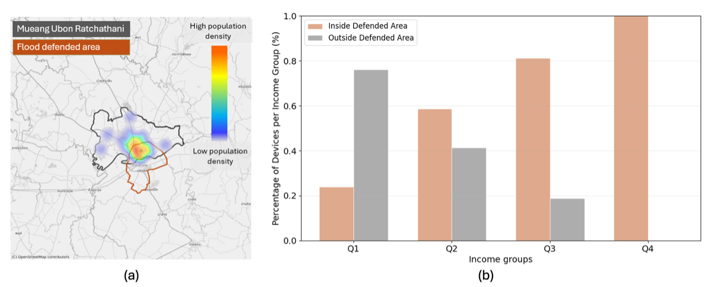
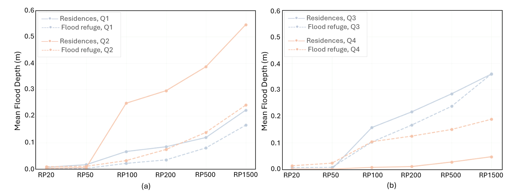

+++
title = "Mapping Vulnerability and Mobility: Leveraging Digital Data to Inform Flood Displacement and Resilience Planning"
authors = ["Macario II O Cordel"]
categories = ["Case Study"]
partner = ["JBA"]
dev_partner = ["Asian Development Bank"]
tags = ["Disaster Risk Management", "Climate Change"]
date = 2025-06-04T00:00:00Z
+++

The climate crisis is a growing factor influencing human mobility, especially in developing countries. The Asian Development Bank utilized [JBA’s Global Flood Maps](https://jbagr.com/digital-tools/global-flood-maps/) to analyze how flood exposure and patterns of displacement differ among income groups.

## Challenge

Climate change is increasingly driving human mobility, particularly in developing countries like Thailand. Temporary displacements caused by extreme weather events—such as floods—are becoming more frequent and require effective monitoring to inform disaster preparedness and response. This study focuses on short-term displacements triggered by flooding, using the 2019 extreme flood in Mueang Ubon Ratchathani as a case study.

Recent advances in digital technology, especially mobile phone GPS data, offer new opportunities to track population movement with greater spatial and temporal precision. In our analysis, GPS data captured where people relocated to during the flood, how far they traveled, and how long they stayed away from their homes, as demonstrated in Figure 1. Most movements were short-term—lasting one to two days—and occurred within the same province, suggesting a strong reliance on community-based coping strategies.

However, GPS mobility data alone does not reveal whether people’s original homes or relocation areas were potentially affected by flooding.

<figure align="centre">
    
        

Figure 1: Movement Patterns Based on GPS Pings in Mueang Ubon Ratchathani During the September 2019 Flood (EM-DAT Reported Event): GPS pings with timestamps allow the identification of a device’s usual residence and detection of displacement during extreme weather. This data reveals how long individuals stayed outside their residential locations and the extent of evacuation triggered by flooding.
  

    </figcaption>
</figure>

## Solution

To address the limitations of GPS data, we combined it with wealth indices and [JBA’s Global Flood Maps](https://jbagr.com/digital-tools/global-flood-maps/). We inferred individuals’ usual residences, overlaid them with flood exposure data for different return periods (RP20, RP50, etc.), and used local wealth indices as proxies for socioeconomic status (SES). This allowed us to assess how flood exposure and displacement patterns vary across income groups.

Our findings highlight stark disparities, as shown in Figure 2. Lower-income residents (Q1–Q2) tend to live outside flood-defended zones and are exposed to frequent flooding, even at lower RPs. In contrast, higher-income groups (Q3–Q4) typically reside in flood-resilient areas and face minimal risk during moderate floods. As flood severity increases (e.g., RP100–RP1500), even some higher-income areas begin to show vulnerability, although lower-income groups still experience far greater flood depths and exposure, as shown in Figure 3.

The locations where people seek refuge also vary by income. During moderate floods, higher-income individuals are less likely to relocate unless necessary, as their homes offer protection. When they do relocate, they sometimes move to areas with worse flood conditions. In contrast, lower-income evacuees often end up in safer areas than their original homes—an indication that public support and relocation efforts are more targeted toward vulnerable populations.

<figure align="centre">
    
        

Figure 2: JBA’s Global Flood Map provides a critical layer for assessing climate vulnerability in Mueang Ubon Ratchathani. In panel (a), the defended area is shown alongside a heatmap of nighttime device pings, indicating the usual residential locations of mobile devices. Panel (b) shows the distribution of people’s usual residences in flood-defended and non-defended areas, disaggregated by wealth index quartiles. As proxy to the socioeconomic status of individuals, the lower quartile represents the lowest income group, while the highest quartile corresponds to the highest income group. This integration highlights how lower-income populations are more likely to reside in non-defended zones, which helps inform a more equitable disaster preparedness and response planning.
  

    </figcaption>
</figure>

<figure align="centre">
    
        

Figure 3: Possible flood depth at usual residences and evacuation sites during the 2019 flooding event across return periods by income group (Q1 = lowest, Q4 = highest). For lower return periods, flood depths at residences are shallow but increase with return period severity, especially in lower-income areas (a). Higher-income groups (b) show divergent patterns: Q3’s minimal displacement suggests resilient housing while Q4’s greater mobility reflects vehicle access enabling voluntary relocation to distant (though potentially riskier) locations. Evacuation sites—often designated by authorities—can offer lower flood exposure for Q1 and Q2, while Q3 and Q4 either remain in place due to more resilient housing and infrastructure or self-relocate.
  

    </figcaption>
</figure>

## Impact

This study demonstrates how integrating GPS mobility data, flood maps, and SES indicators can provide rich, localized insights into climate-related displacement. While our findings are specific to Mueang Ubon Ratchathani, the methodology can be applied to other flood-prone regions to support proactive disaster planning. These insights can inform decisions about safer residential zoning, emergency response prioritization, and equitable investment infrastructure.

Nonetheless, digital approaches have limitations—including potential coverage bias and limited data representativeness in areas with low mobile phone penetration. To overcome these challenges, it is essential to invest in digital infrastructure and complement digital sources with traditional data collection methods for validation and context.

