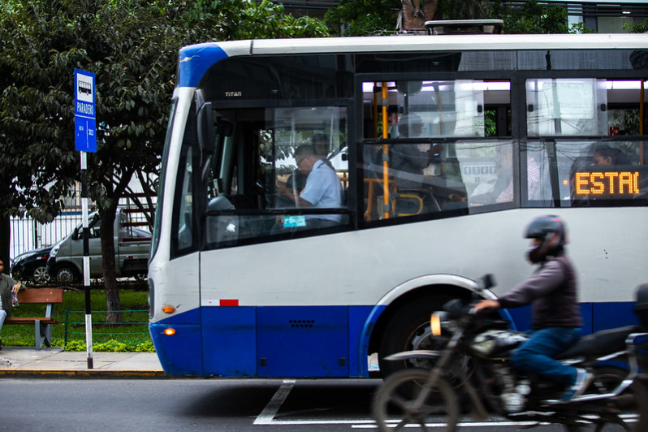

+++
title = "Using mobility data to improve lives in Lima"
date = 2024-01-31T00:00:00.000+00:00
authors = ["Felipe Targa", "Aiga Stokenberga", "Ellin Ivarsson"]
categories = ["Case Study"]
dev_partner = ["World Bank"]
partner= ["Mapbox", "Veraset","Waze"]
tags = ["Urban Development", "Transport"]
links = ["https://blogs.worldbank.org/transport/improving-lives-lima-one-intersection-time"]   
+++

Improving traffic flow and enhancing road safety are critical to Lima which was ranked the fourth most congested metropolitan area in the world in 2022. The World Bank’s Transport Global Practice leveraged mobility data from [Mapbox](https://www.mapbox.com/), [Veraset](https://www.veraset.com/), and [Waze](https://www.waze.com/wazeforcities/) to inform interventions to improve Lima’s transport network.

## Challenge

Transport is one of the most pressing problems in Lima. According to World Bank analysis, only about 18 percent of all jobs in the metropolitan area can be accessed within 45 minutes of travel by public transport or non-motorized transport, and less than 1 in 10 Lima residents report feeling satisfied with public transport quality. The World Bank has estimated that Lima’s transport woes are costing the entire country of Peru the equivalent of 1.8 percent of its GDP each year.

Reliable and robust data analysis is essential for policy makers and international development organizations such as the World Bank to study how to improve people’s daily lives in the city, such as easing traffic bottlenecks and improving road safety. 

<figure align="center">
    
    <figcaption>
        

		Photo : World Bank
		

    </figcaption>
</figure>

## Solution

Leveraging [Mapbox](https://www.mapbox.com/), [Veraset](https://www.veraset.com/), and [Waze](https://www.waze.com/wazeforcities/)data, the World Bank’s Transport Global Practice is preparing an ambitious 10-year investment program to improve the lives of everyday Limeños, led by the Peruvian government and Lima’s transportation agencies, that will rethink and revamp Lima’s transport network from the ground up.  

The goals of the program are manifold: improving traffic flow, enhancing road safety, lowering carbon emissions, promoting a shift toward walking, cycling, and public transport, and redesigning neighborhoods to boost walkability.

## Impact

Through the Mapbox, Veraset and Waze data, the World Bank team has been able to identify the number of trips between different areas of the city, average distances traveled, travel times, average speeds, and congestion hotspots, which is helpful in a context where no recent traditional mobility survey data is available. This analysis has helped inform the interventions to be financed under the project that will contribute to alleviating congestion and improve access to job opportunities. Improved travel times, including for public transport and non-motorized transport, will provide almost two-thirds of the estimated economic benefits of the first phase of the program and will allow the city to more fully reap the benefits that come from high density.

This study will be a solid starting point for continued research on mobility patterns not only in Lima but also in other cities with similar characteristics, including in terms of limited data availability.
