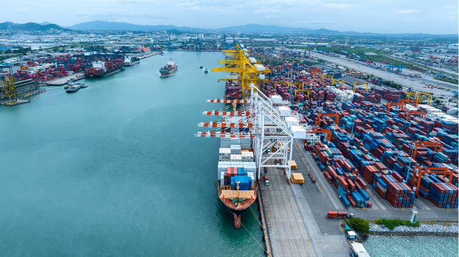
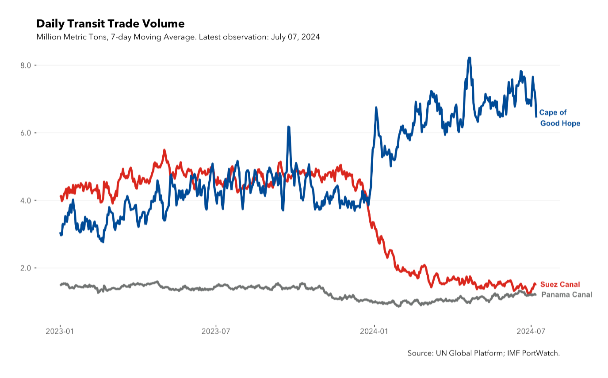

+++
title = "Monitoring and Simulating Trade Disruptions through Satellite-Based Vessel Data and Big Data Analytics"
authors = ["Serkan Arslanalp", "Parisa Kamali", "Robin Koepke", "Matt McKetty", "Mario Saraiva", "Alessandra Sozzi", "Jasper Verschuur"]
categories = ["Case Study"]
partner = ["Esri"]
dev_partner = "International Monetary Fund"
tags = ["Digital Development"]
date = 2024-07-17T00:00:00Z
+++

Global supply chains are increasingly vulnerable to the impacts of climate change, natural hazards and geopolitical trade tensions. [The International Monetary Fund](https://www.imf.org/en/Home) and [the Environmental Change Institute](https://www.eci.ox.ac.uk/)at the University of Oxford established [PortWatch](https://portwatch.imf.org/) to help people assess the domestic and international trade impact of actual and future disruptions. [Esri](https://www.esri.com/en-us/home) provided essential technical support for the development and operation of PortWatch. 

## Challenge

When disaster strikes, the impact is felt all around the world. It affects not only how we live and work, but also how we trade. 

As floods, tropical storms and other extreme weather events are becoming more common and severe, they seriously threaten key maritime trade infrastructure like ports. Trade disruptions due to climate extremes can have ripple effects on the global economy and supply chains. On the other hand, geopolitical conflicts and increased restrictions due to tensions between countries can disrupt trade flows and cause supply chain problems even in third-party countries.

For economies to adapt and thrive in such crises, policymakers and international organizations need better analytics to monitor and simulate disruptions to global maritime trade from external shocks.

<figure align="center">
    
</figure> 

## Solution

[The International Monetary Fund](https://www.imf.org/en/Home) and [the Environmental Change Institute](https://www.eci.ox.ac.uk/) at the University of Oxford established an online platform [PortWatch](https://portwatch.imf.org/) to help users assess the domestic and international trade impact of actual and future disasters.

With support from [Esri](https://www.esri.com/en-us/home), the IMF team was able to establish PortWatch through access to ArcGIS technologies. By using data from satellites on the position of sea vessels, Portwatch, hosted on the cloud-based ArcGIS Hub, provides near real-time data to the public and countries about their ports. This is possible because the ArcGIS technologies enable the team to easily store data and make it available to member countries, making it easy to visualize, update, and share automated port data. [^1] 

A key feature of PortWatch for its users is the disaster alert system. After major disruptions, PortWatch provides email alerts on the realized and expected trade disruptions in affected countries. This information is intended to help policymakers, development partners and businesses respond to disasters quickly and effectively.

In addition, the platform allows users to explore how global supply chains are exposed to present and hypothetical disruptions to port activity. Users can simulate the potential indirect spillover effects of port disruptions to other countries in the maritime network and global supply chain.

PortWatch will also provide climate scenario analysis, facilitating stress testing of the maritime trade network. Such stress tests capture the economic losses from more frequent and intense climate extremes in the future.

## Impact

The support of [Esri](https://www.esri.com/en-us/home) is essential to the development and operation of [PortWatch](https://portwatch.imf.org/), which provides critical insights for monitoring and simulating trade disruptions from climate extremes and other disasters across the globe.

For instance, PortWatch monitors and analyzes trade disruptions in the Red Sea. The Suez Canal is a vital shipping route with about 15 percent of global maritime trade volume passing through it and over 22,000 transit calls annually, but recent attacks on commercial ships have prompted shipping companies to re-route traffic away from it and through the Cape of Good Hope. PortWatch has provided updates on [changes in maritime shipping and transit volumes](https://www.imf.org/en/Blogs/Articles/2024/03/07/Red-Sea-Attacks-Disrupt-Global-Trade) in the Red Sea, helping people better understand the impact of this maritime crisis on international trade flows.

 <figure align="center">
    
    <figcaption>
        
 Photo Credit: IMF PortWatch (portwatch.imf.org) 

    </figcaption>
</figure>

Additionally, in March 2024, a cargo ship collided with a bridge near the Port of Baltimore in the United States, resulting in a sharp reduction in port activity, with only one terminal operational. With Baltimore handling 3 percent of U.S. maritime trade, it serves as an important port for the import and export of motorized vehicles. In response to this collision, PortWatch has simulated spillover effects of port disruptions to other countries and shared relevant data with its members.

In the long run, we expect PortWatch data to be a reliable, trustworthy, and valuable source of information on risks to the global trade network and global supply chains, including from climate risks. This will allow the whole membership to be able to navigate the risks to the global trade system and global supply chains. This will be evidenced in macro policy-making, academic citations, and new standards for transparency and efficiency in global trade.

[^1]: https://www.esri.com/en-us/lg/industry/logistics-distribution/stories/portwatch-case-study?