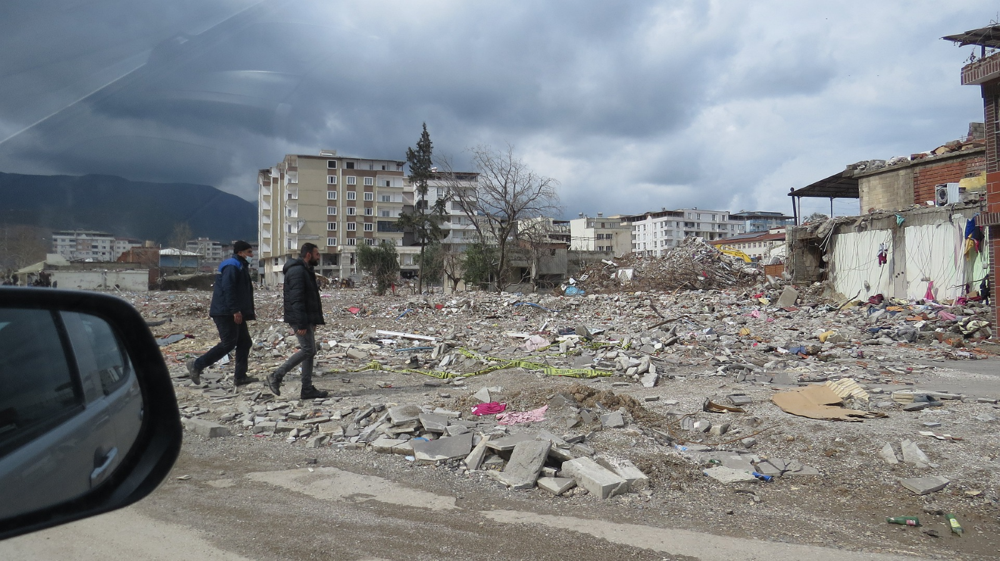
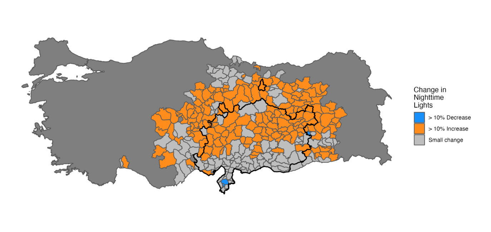

+++
date = 2023-05-01T00:00:00.000+00:00
title = "Monitoring the Economic Impact of Crises in Syria and Türkiye to Inform Response"
authors = ["Gabriel Vicente", "Sahiti Sarva"]
categories = ["Case Study"]
dev_partner = ["World Bank"]
partner= ["Meta", "Ookla", "Veraset", "Outlogic"]
tags = ["Digital Development"]
links = [
    "https://datapartnership.org/syria-economic-monitor",
    "https://datapartnership.org/turkiye-earthquake-impact"
]
thumbnail = "monitoring-the-economic-impact-of-crises-in-syria-and-turkiye-thumbnail.png"
+++

The World Bank’s Data Lab was requested to provide support for the Türkiye Country Economist team and the Syria Economic Monitor team to better understand the economic impacts of crises such as the earthquake that took place in February 2023 and the resilience of the affected economies. With the help of the Development Data Partnership, this support includes a range of data provided by [Meta](https://dataforgood.facebook.com), [Ookla for Good™](https://www.ookla.com/ookla-for-good), [Outlogic](https://outlogic.io), and [Veraset](https://www.veraset.com)  and other sources on different areas such as business activity trends and people’s mobility.

## Challenge

Türkiye and Syria have been facing various challenges. On February 6, 2023, a powerful 7.8 magnitude earthquake and a series of strong tremors and aftershocks wrought substantial damage across southeast Türkiye and northwest Syria. The death toll has surpassed more than 50,000 people and the earthquake’s aftermath has been substantially impacting the people, infrastructure, and economies of the two countries.

In addition to the catastrophic earthquake, the prolonged conflict in Syria has inflicted a devastating toll on its people and economy. The conflict has also weakened the country’s statistical capacity, making reliable and timely information regarding many areas of economic activity, particularly trade, inaccessible. Furthermore, the World Bank has no formal communication with the Syrian government, making basic data access and verification unusually challenging.

Therefore, support from *Data Partners* is critical for effective World Bank and donor interventions that will require a deep and data-driven understanding of the economic impacts of the crises these two countries have been facing.

<figure align="center">
    
    <figcaption>
        

		Photo Credit: Ahmet ERTAŞ from Pixabay
		

    </figcaption>
</figure>

## Solution

To assess how the crises have been impacting Türkiye and Syria, the World Bank’s Data Lab team has leveraged data from [Meta](https://dataforgood.facebook.com), [Ookla for Good™](https://www.ookla.com/ookla-for-good), [Outlogic](https://outlogic.io), and [Veraset](https://www.veraset.com) and other sources to produce data products on various areas, including:

- Business Activity Trends - Many local businesses use [Meta](https://dataforgood.facebook.com) as their primary business website. To study the earthquake’s impacts, the social media platform has supported the team by providing data such as daily business activity quantile information from the 5th of February 2023.

- Post-Earthquake Internet Connectivity – Datasets from [Meta](https://dataforgood.facebook.com) and [Ookla for Good™](https://www.ookla.com/ookla-for-good) have been provided to detect changes in network connectivity. For instance, Ookla has provided information on download speed, upload speed, and latency.

- Mobility – [Veraset](https://www.veraset.com)  has provided mobility data consisting of anonymized time-stamped geographical points generated by GPS-enabled devices. The team has also used mobility data from [Outlogic](https://outlogic.io) to monitor trends in traffic along key border crossings in Syria.

- Nighttime Lights – Nighttime lights have become a commonly used indicator to estimate changes in local economic activity. For instance, to study changes in nighttime lights in Türkiye from before and after the earthquake, the World Bank’s Data Lab team has leveraged daily and monthly data from [VIIRS Black Marble](https://blackmarble.gsfc.nasa.gov).

In addition, the team has prepared a [Strategic Brief](https://datapartnership.org/turkiye-earthquake-impact/reports/turkiye-earthquake-strategic-brief.html), which presents available datasets and analytics to help the Türkiye Country Economist team understand the earthquake’s socio-economic impacts.

<figure align="center">
    
    <figcaption>
        

        Figure 1: Change in nighttime lights in Türkiye from two weeks before the earthquake (February 6, 2023) to two weeks after the earthquake using data from VIIRS Black Marble
        

    </figcaption>
</figure>

## Impact

Crises such as natural hazards and conflicts bring devastating socio-economic impacts. They also make it more difficult to collect data to create and implement data-driven policymaking.

However, the combination of rich data [Meta](https://dataforgood.facebook.com), [Ookla for Good™](https://www.ookla.com/ookla-for-good), [Outlogic](https://outlogic.io), and [Veraset](https://www.veraset.com) and other sources provides insightful information, enabling the World Bank, local, national, and international policymakers to comprehend the impacts of Türkiye and Syria from reliable, objective, third-party data.

It might not be able to prevent some crises in the years to come. However, we can mitigate their impact by making recovery efforts more effective. That’s why it is vital to have timely data at high levels of granularity through the support of *Data Partners*.
