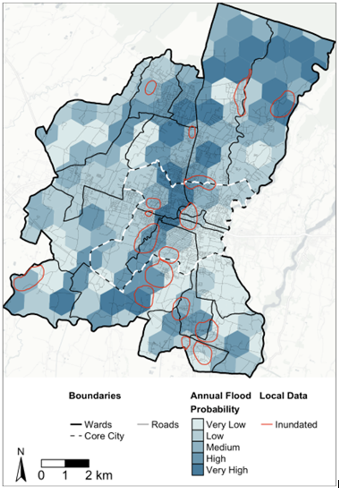

+++
title = "Nature-Based Solutions for Climate-Resilient Urban Development in Itahari, Nepal"
authors = ["Abebaw Alemayehu", "Jeny Shrestha"]
categories = ["Case Study"]
partner = ["JBA"]
dev_partner = ["World Bank"]
tags = ["Disaster Risk Management"]
date = 2024-10-25T00:00:00Z

+++

Cities across Nepal are increasingly vulnerable to natural disasters and climate change impacts. Rapid, unplanned urbanization and the country's unique topography make major cities particularly prone to floods, landslides, and heat stress. This vulnerability is further exacerbated by a reliance on "grey infrastructure"—such as concrete embankments and drainage systems—which, while essential, is insufficient to address these growing challenges. To tackle this, the World Bank used [JBA’s Global Flood Maps] (https://www.jbafloodmaps.com/) to assess flood risks and identify high-hazard areas in Itahari Sub-Metropolitan City.

Itahari, a key economic and transportation hub, spans 94 square kilometers and houses over 200,000 people. With its vibrant urban environment, the city promises improved living standards, job creation, and a model for inclusive development. However, its path to sustainable urbanization faces significant challenges, particularly from climate change and unchecked urban expansion.

## Challenge

Despite its potential, rapid urban growth in Itahari has exacerbated its vulnerability to recurring floods, causing significant damage to infrastructure, homes, and livelihoods, leading to substantial economic losses, health risks, and social displacement. Inadequate urban planning and unmanaged development further compound these issues, resulting in environmental degradation, increased flood hazards, and heightened vulnerability to climate change impacts. This highlights the need for a paradigm shift toward an integrated, adaptive approach, emphasizing Nature-based Solutions (NbS) and sustainable urban planning. 

<figure align="centre">
    
        

Figure 1:  World Bank
  

    </figcaption>
</figure>

## Solution

To address these challenges and build long-term resilience, Itahari, with the support of the World Bank, is leading the way by incorporating NbS into its climate-resilient urban planning and flood risk mitigation strategies. The city is a key participant in the Nepal Urban Governance and Infrastructure Project that aims to strengthen municipal capacity for strategic infrastructure development. NbS focus on protecting, managing, or restoring ecosystems to tackle climate change, disaster risks, and societal challenges while also promoting human well-being and biodiversity benefits. By integrating NbS, Itahari seeks to harmonize urban growth with natural processes, addressing urban challenges sustainably. 

A key aspect of this initiative is understanding flood risks and identifying high-hazard areas using data from [JBA’s Global Flood Maps] (https://www.jbafloodmaps.com/). This analysis is crucial, and the World Bank Global Program on NbS for Climate Resilience facilitated the initial identification through the NbS Opportunity Scan. The data generated guided the development of a Technical Assistance proposal, supported by the City Climate Finance Gap Fund. With the technical input from Royal Haskoning DHV, Netherlands, city planners and experts validated high-risk areas, verified findings, and improved hydraulic modeling to refine predictions for effective NbS.

A catalogue of 45 locally relevant NbS measures was generated and analyzed using multi-criteria analysis to assess their feasibility and effectiveness. After comprehensive data analysis, field visits, and stakeholder consultations, a shortlist of measures was created and evaluated in detail. The result was a comprehensive NbS package tailored to the unique challenges of Itahari, with clear implementation guidelines and cost estimations.

<figure align="centre">
    
        

  

    </figcaption>
</figure>

## Impact

Identifying flood risks is crucial for helping policymakers and vulnerable communities mitigate natural hazards. In Itahari, [JBA’s Global Flood Maps] (https://www.jbafloodmaps.com/) enabled the World Bank team to conduct a data-driven analysis that prioritized investments in NbS for the city. The impact of the NbS package is expected to be transformative. By reducing flood risks and improving environmental sustainability, the initiative will enhance the quality of life for residents, protect critical infrastructure, and promote a healthier urban ecosystem. 

Looking ahead, this approach has significant potential for expansion to 293 municipalities across Nepal, strengthening urban resilience, promoting environmental sustainability, and contributing to the country's home-grown Green, Resilient, and Inclusive Development (GRID) agenda.

