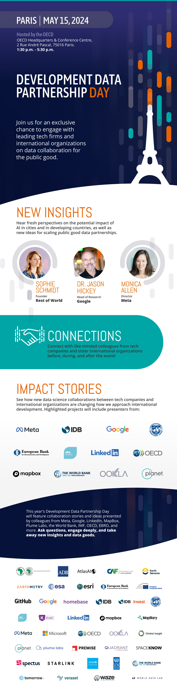

+++
date =  2024-04-05T00:00:00Z
title = "Development Data Partnership Day 2024"
authors = ["Claudia Calderon"]
categories = ["Announcement"]
dev_parter = ["International Monetary Fund", "World Bank", "Inter-American Development Bank", "UNDP" , "OECD" , "CAF" , "EBRD", "Asian Development Bank" ]
+++

**Join us for the Development Data Partnership Day on Wednesday, May 15, 2024, from 1:30 p.m. to 5:30 p.m. CET at the [OECD Headquarters & Conference Centre](https://www.oecd.org/conference-centre/access/) in Paris, France.**

Partnership Day is a unique event where tech companies and international organizations meet to share insights and field stories about their collaborations for public good. At this year's Partnership Day, we will hear from Sophie Schmidt, Founder and Publisher of **"Rest of World,"** to learn how AI trends are being felt on the ground in developing countries, as well as Dr. Jason Hickey, **Google's** Head of Research, who will introduce AI-supported tools for social good. We will also meet Monica Allen, **Meta's** Director of Public Policy Campaigns and Programmes, who will share Meta's current and future plans for translating company data into meaningful social and economic insights. 

Partnership Day will also feature our favorite tradition - relay lightning talks - where duos from companies and international organizations will proudly present the results of their collaborations. This year's relay talks will feature participants from Meta, LinkedIn, Ookla, JBA, EBRD, OECD, IMF, IDB, the World Bank, and others.

    <button type="button" class="btn btn-outline-info"><a href="partnershipdayagenda2024.pdf"> Full Agenda
    </a>
    </button>
    &nbsp;
    

    <button type="button" class="btn btn-outline-info"><a href="https://forms.office.com.mcas.ms/pages/responsepage.aspx?id=wP6iMWsmZ0y1bieW2PWcNnFCsHhxqiNJllqArA6vm_1UME01STJNWlFIV1U3TVcwNzRVRFpQVzY4Qy4u"> Register Here
    </a>
    </button>
    &nbsp;
    

<section id="agenda">
<iframe src="partnershipdayagenda2024.pdf#toolbar=0&statusbar=0&page=1" width="100%" height="900px">
</iframe>
</section>

The Strategic Advisory Group Meeting 2024, where representatives from member international organizations and data partners meet to discuss the next steps for the Partnership, will take place on Thursday, May 16 from 2:30 p.m. - 6:30 p.m. CET. 
