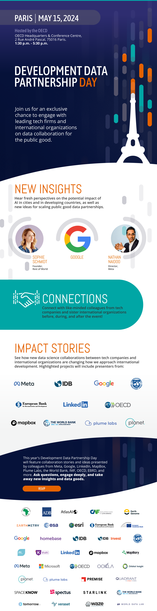

+++
date =  2024-04-05T00:00:00Z
title = "Development Data Partnership Day 2024"
authors = ["Claudia Calderon"]
categories = ["Announcement"]
dev_parter = ["International Monetary Fund", "World Bank", "Inter-American Development Bank", "UNDP" , "OECD" , "CAF" , "EBRD", "Asian Development Bank" ]
+++

**Join us for the Development Data Partnership Day on Wednesday, May 15, 2023, from 1:30 p.m. to 5:30 p.m. in person at the [OECD Headquarters & Conference Centre](https://www.oecd.org/conference-centre/access/) in Paris, France.**

The Partnership Day is an exclusive event where tech leaders such as Nathan Naido, **Meta's** Director of Public Policy, and Dr. Jason Hickey, **Google's** Head of Research, will share insights on how private-sector collaborations and AI can help tackle development challenges. Additionally, Sophie Schmidt, Founder and Publisher of **Rest of World** will offer a unique perspective on how AI impacts developing countries.

Hear how project collaborations between private companies and international organizations, such as Meta, LinkedIn, Plume Labs, JBA, Planet, EBRD, OECD, IMF, IDB, and the World Bank, reshape how we address international development. 

    <button type="button" class="btn btn-outline-info"><a href="https://forms.office.com.mcas.ms/pages/responsepage.aspx?id=wP6iMWsmZ0y1bieW2PWcNnFCsHhxqiNJllqArA6vm_1UME01STJNWlFIV1U3TVcwNzRVRFpQVzY4Qy4u"> Registration
    </a>
    </button>
    &nbsp;
    

The Strategic Advisory Group Meeting 2024, where representatives from member international organizations and data partners meet to discuss the next steps for the Partnership, will take place on Thrusday, May 16 from 2:30 p.m. - 6:30 p.m.
