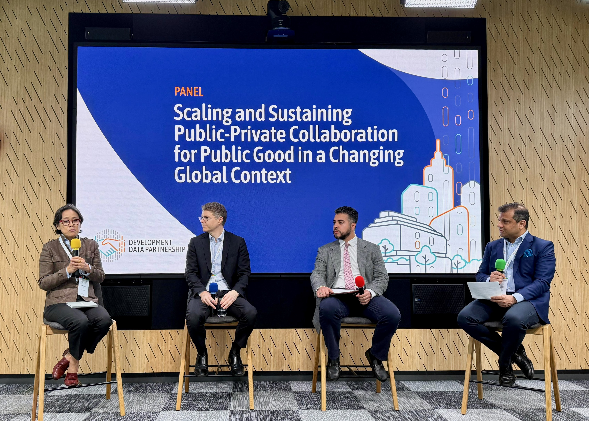
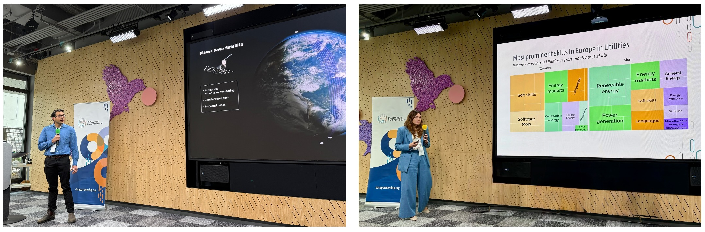

+++
title = "Partnership Day 2025: Leveraging Partnerships for the Public Good"
authors = ["Kwok Kin Lee"]
date = 2025-07-01T00:00:00Z
+++

Collaboration between technology companies and international organizations is crucial in today's evolving international development landscape. Public-private partnerships facilitate the exchange of expertise and promote innovative solutions to tackle emerging global challenges.

This year’s [Development Data Partnership (Partnership) Day](https://datapartnership.org/updates/partnership-day-2025/) underscored the critical importance of leveraging the Partnership’s strong technical, legal, and governance frameworks to drive impact and respond effectively to an increasingly complex development environment.

The event took place on June 17, 2025, at the Google NYC Office located at St. John's Terminal. It gathered tech companies, multilateral organizations, and members of the data community to exchange insights on leveraging data collaboration for the public good. The event also presented new perspectives through impactful stories and presentations that demonstrated how transforming data can inspire meaningful action.

Megan Ryskamp, Director of Social Impact Partnerships at Google, began the event by highlighting the use of Google technologies to connect partners in addressing pressing challenges, emphasizing the importance of creating solutions through these connections. Next, Marco Marini, Division Chief at the International Monetary Fund, highlighted how the Partnership enhances development outcomes by facilitating data sharing between the private sector and public organizations, as well as addressing barriers to data access and usage.

The Partnership has supported over 400 proposals covering 24 sectors across 190 countries and territories and is currently focusing on sharing code and methodologies, as highlighted by Holly Krambeck, Program Manager at the World Bank, who updated the audience on the Partnership's work. She stated that the Partnership has successfully created code packages that can be reused by other organizations and partners.

<figure align="centre">
    
        

Development Data Partnership Day
  

    </figcaption>
</figure>

Following these key updates, Sarah Williams, Associate Professor and Director of the Civic Data Design Lab at the Massachusetts Institute of Technology, discussed her work on using data to elevate marginalized voices and spark civic debate. She added that by integrating grassroots efforts with data analysis, communities can advocate for their needs, such as improved internet access and air quality monitoring.

The event also highlighted a panel discussion focused on scaling and sustaining public-private collaboration for the public good. Anup Kaphle, Editor-in-Chief at Rest of World and moderator of the panel noted the shifting global development priorities and asked panellists about efforts to keep public-private partnerships impactful, equitable, and future-ready.

Robert Opp, Chief Data Officer of the United Nations Development Programme and a panellist, discussed the need to establish strong partnerships and effective data governance within institutions to enhance collaboration. He underscored that it is crucial to have a robust and inclusive digital infrastructure that enables countries to leverage their data for innovation while ensuring safety and privacy.

Haishan Fu, Chief Statistician at the World Bank and a panellist, emphasized the importance of partnerships between the public and private sectors to enhance data utilization in policymaking. She noted that traditional government data alone is insufficient for modern needs, pointing out the necessity of collaboration to create integrated data systems.

Alexander Diaz, Head of AI for Social Impact at Google and a panellist, spoke to the audience about Google’s philanthropic efforts and its dedication to research that promotes social good. He also emphasized the significance of collaboration between tech companies and nonprofit organizations to more effectively tackle global challenges.

<figure align="centre">
    
        

Panel focused on Scaling and Sustaining Public-Private Collaboration for the Public Good
  

    </figcaption>
</figure>

The event also provided an opportunity to learn about the impact of the Development Data Partnership. Duos from tech companies and international organizations presented the results of their collaborations.

- Andrew Hassanali from Planet and Devaki Ghose from the World Bank discussed [the use of Planet data to understand the economic implications of Sri Lanka’s fertilizer import ban in 2021.](https://datapartnership.org/updates/leveraging-satellite-data-to-understand-the-economic-implications-of-sri-lanka-fertilizer-import-ban-in-2021/)
- Katherine Macdonald from Ookla and Yohan Iddawela from the Asian Development Bank talked about [measuring mobile internet access and wealth inequality in the Philippines by leveraging Ookla data.](https://datapartnership.org/updates/mobile-internet-connectivity-and-household-wealth-in-the-philippines/)
- Salim Sawaya from ESRI and Yves Lesenfants from the Inter-American Development Bank introduced their project for supporting the AmazoniaForever360+ platform.
- LinkedIn’s Rosie Hood and Akash Kaura joined Konstantina Kalogianni from the International Energy Agency and Patricia Yañez-Pagans from IDB Invest to discuss [how LinkedIn data was used to study gender inequality in the energy sector](https://datapartnership.org/updates/examining-gender-disparities-in-skills-within-the-energy-sector-insights-from-linkedin-data/) and structural barriers to career mobility for women in Latin America and the Caribbean.
- Alex Minett from JBA Consulting and Mac Cordel from the Asian Development Bank gave a presentation on [monitoring weather-related movements toward inclusive climate resilience.](https://datapartnership.org/updates/mapping-vulnerability-and-mobility-leveraging-digital-data-to-inform-flood-displacement-and-resilience-planning/)
- Anna Carter from Google and Dharana Rijal from the International Monetary Fund spoke about the use of open-source building data for economic measurement.
- Sahiti Sarva and Maria Sol Tadeo from the World Bank presented a new training course developed to teach how to utilize Partnership data and open data for monitoring the economic impact of crises.

<figure align="centre">
    
        

Global Impact Stories 
  

    </figcaption>
</figure>

In his closing remarks, Momar Kouta, Senior Statistics Information Systems Officer at the African Development Bank, emphasized the success of collaboration and innovation. He acknowledged the contributions of partners and highlighted the importance of transforming data into action for addressing interconnected issues like health, climate change, and economic inclusion.

<figure align="center">

</figure>

All in all, this year’s Partnership Day was a vibrant event filled with insightful talks and engaging discussions that collectively fostered a rich environment for sharing knowledge and inspiration. Attendees gained valuable insights into how we can harness data partnerships to enhance and sustain initiatives benefiting the public good.

Finally, we want to express our heartfelt thanks to all the speakers and attendees for helping make this event a success!  

