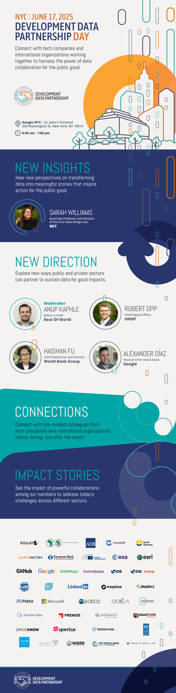

+++
date =  2025-04-30T00:00:00Z
title = "Development Data Partnership Day 2025"
authors = ["Claudia Calderon"]
categories = ["Announcement"]
dev_parter = ["International Monetary Fund", "World Bank", "Inter-American Development Bank", "UNDP" , "OECD" , "EBRD", "Asian Development Bank", "Asian Development Bank","IDB Invest", "UNICEF"]
+++

**Join us for Development Data Partnership Day on Tuesday, June 17, 2025, from 8:30 a.m. to 1:00 p.m. US ET at the Google NYC Office at St. John's Terminal 550 Washington St, New York, NY 10014.**

This day will focus on connecting with tech companies and international organizations working together to harness the power of data collaboration for the public good and discover new perspectives and insights on how to transform data into meaningful stories that inspire action.

  <button type="button" class="btn btn-outline-info" style="margin: 10px;">
    <a href="https://forms.office.com/Pages/ResponsePage.aspx?id=wP6iMWsmZ0y1bieW2PWcNnFCsHhxqiNJllqArA6vm_1URDM4Mkk5SFU0NFlRSzdERDJLSVFXTUVWTy4u" style="text-decoration: none; color: inherit; font-weight: bold;">
      Register Here
    </a>
  </button>

  <button type="button" class="btn btn-outline-info" style="margin: 10px;">
    <a href="Agenda2025.pdf" style="text-decoration: none; color: inherit; font-weight: bold;">
      Full Agenda
    </a>
  </button>

  <button type="button" class="btn btn-outline-info" style="margin: 10px;">
    <a href="https://forms.office.com/Pages/ResponsePage.aspx?id=wP6iMWsmZ0y1bieW2PWcNnFCsHhxqiNJllqArA6vm_1URDM4Mkk5SFU0NFlRSzdERDJLSVFXTUVWTy4u" style="text-decoration: none; color: inherit; font-weight: bold;">
      Register Here
    </a>
  </button>

