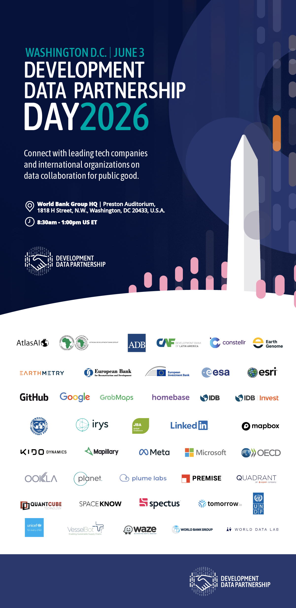

+++
date =  2026-03-09T00:00:00Z
title = "Development Data Partnership Day 2026"
authors = ["Claudia Calderon"]
categories = ["Announcement"]
dev_parter = ["International Monetary Fund", "World Bank", "Inter-American Development Bank", "UNDP" , "OECD" , "EBRD", "EIB", "CAF", "Asian Development Bank", "Asian Development Bank","IDB Invest", "UNICEF"]
+++

**Join us for Development Data Partnership Day on Wednesday, June 3, 2026, from 8:30 a.m. to 1:00 p.m. US ET at the World Bank Group Headquarters (Preston Auditorium, 1818 H Street, N.W., Washington, DC 20453, US).**

<section>

</section>
