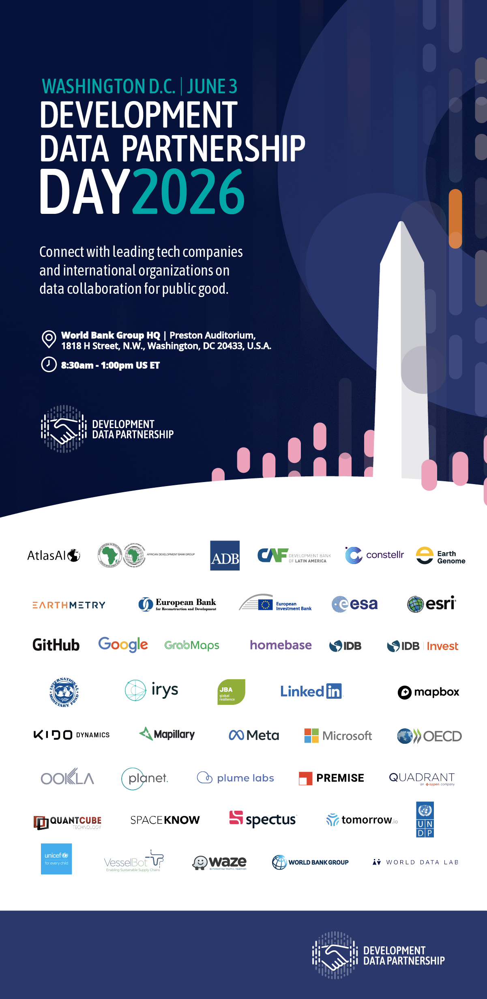

+++
date =  2026-03-09T00:00:00Z
title = "Development Data Partnership Day 2026"
authors = ["Claudia Calderon"]
categories = ["Announcement"]
dev_parter = ["International Monetary Fund", "World Bank", "Inter-American Development Bank", "UNDP" , "OECD" , "EBRD", "EIB", "CAF", "Asian Development Bank", "Asian Development Bank","IDB Invest", "UNICEF"]
+++

**Join us for Development Data Partnership Day on Wednesday, June 3, 2026, from 8:30 a.m. to 1:00 p.m. US ET at the Preston Auditorium at the World Bank Group Headquarters in Washington, DC.**

<section style="text-align: center;">

  <button
    type="button"
    class="btn btn-outline-info"
    style="
      margin: 20px;
      padding: 14px 28px;
      font-size: 18px;
      font-weight: 700;
      border-radius: 30px;
      border: 2px solid #0dcaf0;
      background-color: #0dcaf0;
      color: white;
      box-shadow: 0 4px 12px rgba(13, 202, 240, 0.4);
      transition: all 0.2s ease-in-out;
      cursor: pointer;
    "
    onmouseover="this.style.transform='scale(1.05)'; this.style.boxShadow='0 6px 16px rgba(13,202,240,0.6)'"
    onmouseout="this.style.transform='scale(1)'; this.style.boxShadow='0 4px 12px rgba(13,202,240,0.4)'"
  >
    <a
      href="https://forms.cloud.microsoft/Pages/ResponsePage.aspx?id=wP6iMWsmZ0y1bieW2PWcNtgdePFm-edDiPXPftZ-c2VUOUc3UllKU1RXWkhTNTBXWDAxNldMS1IwTyQlQCN0PWcu"
      style="text-decoration: none; color: white;"
      target="_blank"
    >
      🚀 EVENT REGISTRATION HERE
    </a>
  </button>

  

  <button
    type="button"
    class="btn btn-outline-info"
    style="
      margin: 20px;
      padding: 14px 28px;
      font-size: 18px;
      font-weight: 700;
      border-radius: 30px;
      border: 2px solid #0dcaf0;
      background-color: #0dcaf0;
      color: white;
      box-shadow: 0 4px 12px rgba(13, 202, 240, 0.4);
      transition: all 0.2s ease-in-out;
      cursor: pointer;
    "
    onmouseover="this.style.transform='scale(1.05)'; this.style.boxShadow='0 6px 16px rgba(13,202,240,0.6)'"
    onmouseout="this.style.transform='scale(1)'; this.style.boxShadow='0 4px 12px rgba(13,202,240,0.4)'"
  >
    <a
      href="https://forms.cloud.microsoft/Pages/ResponsePage.aspx?id=wP6iMWsmZ0y1bieW2PWcNtgdePFm-edDiPXPftZ-c2VUOUc3UllKU1RXWkhTNTBXWDAxNldMS1IwTyQlQCN0PWcu"
      style="text-decoration: none; color: white;"
      target="_blank"
    >
      🚀 EVENT REGISTRATION HERE
    </a>
  </button>

</section>
