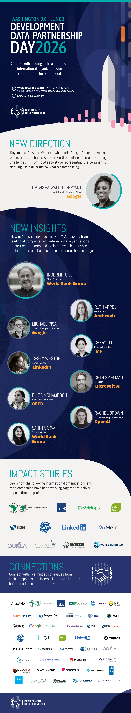

+++
date = 2026-03-09T00:00:00Z
title = "Development Data Partnership Day and Trainings"
authors = ["Claudia Calderon"]
categories = ["Announcement"]
dev_partner = ["International Monetary Fund", "World Bank", "Inter-American Development Bank", "UNDP", "OECD", "EBRD", "EIB", "CAF", "Asian Development Bank", "IDB Invest", "UNICEF"]
+++

**Development Data Partnership Day | June 3, 2026 | 8:30 a.m. – 1:00 p.m. ET** 
Preston Auditorium, World Bank Group Headquarters, Washington, DC 

The Development Data Partnership Day will feature Dr. Aisha Walcott-Bryant from Google Research Africa, alongside leading economists and researchers from Anthropic, OpenAI, Microsoft, Google, the World Bank, OECD, and the IMF. Discussions will focus on the real effects of AI on jobs, productivity, and global labor markets. The day will conclude with impact stories highlighting collaboration, including expanding school connectivity in Guatemala and mapping flood risk in Asia.  
[**View Agenda**](https://datapartnership.org/updates/partnership-day/training.pdf)

<a href="https://forms.cloud.microsoft/Pages/ResponsePage.aspx?id=wP6iMWsmZ0y1bieW2PWcNnFCsHhxqiNJllqArA6vm_1UMVFWWDZIOEQ5T0ExMFgzTk9PVVdTUlQ0NS4u"
   style="display:inline-block; width:260px; margin:6px; padding:12px 16px; font-size:15px; font-weight:700; border-radius:30px; background:#3eacad; color:#ffffff; text-decoration:none;">
REGISTER — PARTNERSHIP DAY
</a>

 

**Hands-On Training | June 5, 2026** 

Free, instructor-led courses on June 5 will provide practical skills for working with private sector data. Instructors include experts from OpenAI, LinkedIn, Esri, and others. Seats are limited — secure your spot below.  
[**View Training Schedule**](https://datapartnership.org/updates/partnership-day/training.pdf)

<a href="https://forms.cloud.microsoft/Pages/ResponsePage.aspx?id=wP6iMWsmZ0y1bieW2PWcNnFCsHhxqiNJllqArA6vm_1UMVFWWDZIOEQ5T0ExMFgzTk9PVVdTUlQ0NS4u"
   style="display:inline-block; width:260px; margin:6px; padding:12px 16px; font-size:15px; font-weight:700; border-radius:30px; background:#3eacad; color:#ffffff; text-decoration:none;">
REGISTER — TRAINING SESSIONS
</a>

 

