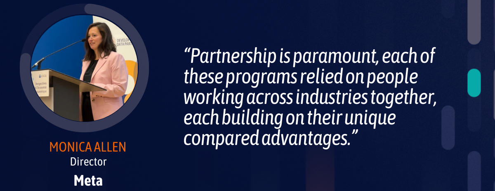

+++
date =  2024-06-10T00:00:00Z
title = "Partnership Day 2024: Harnessing Data and Technology and Private-Public Sector Collaboration to Tackle Development Challenges"
authors = ["Kwok Kin Lee", "Claudia Calderon"]
dev_parter = ["International Monetary Fund", "World Bank", "Inter-American Development Bank", "UNDP" , "OECD" , "CAF" , "EBRD", "Asian Development Bank" ]
+++

The [Development Data Partnership Day](https://datapartnership.org/updates/partnership-day-2024/) shed light on the significant roles of technology and private-public sector collaboration in helping international organizations and countries address development challenges for a more sustainable future.

This year’s event was held on May 15, 2024 at the [OECD](https://www.oecd.org/) Headquarters and Conference Centre in Paris, France and brought together tech companies, multilateral organizations and the data community to share insights on the impact of collaborations for public good, exchange perspectives on artificial intelligence (AI), and explore innovative solutions. 

 <figure align="center">
    
</figure>

The event kicked off with the first speaker Åsa Johansson, Deputy Director of the Statistics and Data Directorate at the OECD highlighted the role of the [Development Data Partnership](wwww.datapartnership.org) in facilitating collaboration with the private sector to leverage third party data to measure, monitor and address global events and generate evidence base policy analysis. Next up was Holly Krambeck, Program Manager at the World Bank, who shared how the [Partnership](wwww.datapartnership.org) is leveraging its infrastructure to facilitate data sharing among international organizations and lay the groundwork for creating an AI Large Language Model library for widely used languages that are not included in current models. 

Technology and private-public sector data collaboration are crucial to sustainable development. Arturo Franco, Special Advisor to the Senior Managing Director for Development Policy and Partnerships at the World Bank, shared how the power data has unlocked new possibilities and opportunities, allowing us to benchmark global progress and understand complexities. Monica Allen, Director of Public Policy Campaigns and Programs at Meta, discussed the impact and what has been learned from public-private sector collaboration for public good through its Data for Good Program. For instance, Monica highlighted how, in Nigeria, Meta’s AI poverty maps, which use satellite imagery, connectivity data, and computer vision, helped detect poverty at the scale of small neighborhoods that official statistics and census data alone cannot identify.

 <figure align="center">
    
</figure>

AI’s role in advancing growth and development for a sustainable future was a key topic highlighted during the event. Our speakers discussed different perspectives on the impact of AI in developing countries and how it can be a potential solution to driving greater innovation and growth. 
 
Jason Hickey, Google’s Head of Research, discussed how AI has revolutionized the world. His team leverages this technology to foster development and sustainability in Africa and the Global South. For instance, they are using AI to improve weather forecasting and nowcasting for areas with little or no accurate forecasting, as well as to provide flooding prediction in 80 countries. In addition, Jason told the audience how Google is applying AI to support urban planning by providing open building data and mitigate climate change by optimizing traffic lights and improving urban mobility.  Tackling food security is also a key focus of his work.

 <figure align="center">
    
</figure>

Sophie Schmidt, founder and publisher of Rest of World shared how her team’s AI reporting demonstrates the clear and profound role that human culture will play in shaping global AI outcomes, drawing on stories from various countries including China, Mali, Indonesia, Russia, India, and Afghanistan. She also highlighted the importance and urgent need to listening to local AI actors, solve the low resource language problem and approach AI efforts with eyes wide open with respect to culture.  
 
 <figure align="center">
    
</figure>

The event also provided an opportunity to learn about the impact of the [Development Data Partnership]((wwww.datapartnership.org)). The Partnership includes 12 international organizations and nearly 30 Data Partners, and it has supported the 17 Sustainable Development Goals as well as more than 350 projects covering 190 countries and territories. 
 
Duos from companies and international organizations also presented the results of their collaborations.
 
* Tim Deisemann from the European Bank for Reconstruction and Developmentand Rosie Hood from LinkedIn talked about using [LinkedIn data to understand labor markets in the green economy](https://datapartnership.org/updates/implications-of-the-green-transition/). 
 
* Julia Diaz from the IDB and Jill Falman from Meta talked about [understanding mobility in the Amazonia by using Movement Distribution datasets from Meta](https://datapartnership.org/updates/understanding-people-mobility-in-amazonia/).
 
* Lamya Kejji from the IMF and Ruha Devanesan from Google showed that the IMF is using [Google trends data for macroeconomic monitoring and nowcasting of GDP](https://datapartnership.org/updates/macroeconomic-monitoring-with-google-trends/).
 
* Michelle Marshalian from the OECD and Katherine Macdonald from Ookla shared [how the OECD is reaching digital desert using Ookla data](https://datapartnership.org/updates/reaching-digital-deserts/). 
 
* Lorena Cano from the IDB and Alex Minett from JBA shared how JBA global flood  maps are informing the development of resilient infrastructure in Puno, Peru.
	
* Additionally, Alison Weingarden from the OECD highlighted how they are using Mapbox data to provide services to towns and villages.

 <figure align="center">
    
    
</figure>

From insightful talks to engaging discussions, the Partnership Day shared knowledge, inspiration, and offered new perspectives on how we developed and leverage new technologies and AI to address development challenges for a sustainable future. 

 

