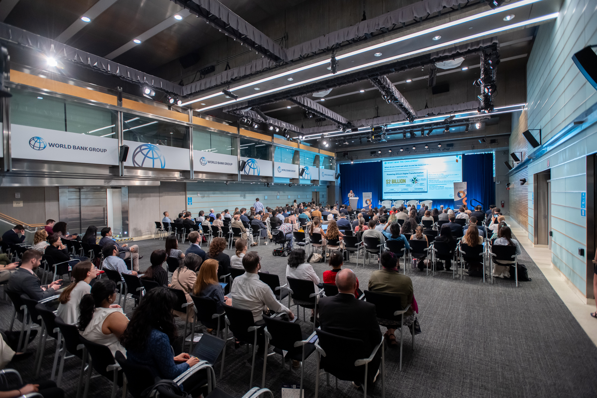
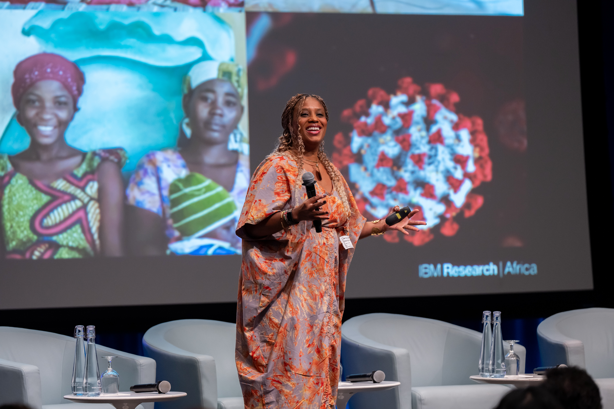
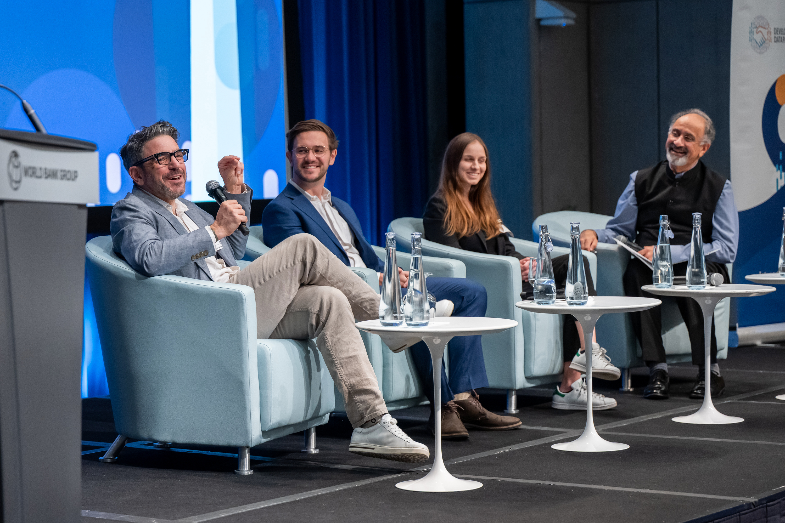
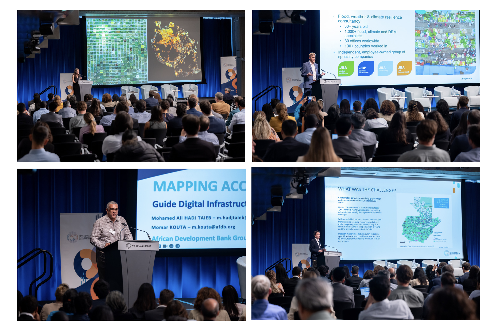

+++
date = 2026-06-13T00:00:00Z
title = "Development Data Partnership Day 2026: Data, AI, and Partnerships for the Public Good"
authors = ["Kwok Kin Lee"]
dev_parter = ["World Bank", "Inter-American Development Bank", "UNDP", "OECD", "IMF", "Asian Development Bank", "African Development Bank"]
+++

The [Development Data Partnership Day](https://datapartnership.org/updates/partnership-day-2026/) highlighted the significance of bringing together international organizations and technology companies to identify emerging trends, support policy decisions, and turn data into valuable insights for the public good as AI becomes increasingly crucial to development.

The event took place on June 3, 2026, at the [World Bank Group](https://www.worldbank.org/) Headquarters in Washington, D.C. It gathered technology companies, international organizations, researchers, and members of the data community to exchange their understanding of how data and AI can support development. Throughout the day, speakers shared approaches to measuring AI adoption, understanding skills and labor market changes, and applying private-sector data to development challenges such as digital connectivity, flood risk, carbon emissions, and transportation planning.

 <figure align="center">
    
    <figcaption>The event brought together representatives from international organizations, technology companies, the research community, and the broader data community to exchange insights on how data and AI can support development. Credit: Ian Foulk / World Bank Group</figcaption>
</figure>

Haishan Fu, Chief Statistician and Director of the World Bank Group, opened the event by reflecting on the [Partnership's](https://datapartnership.org/) growth over eight years and announcing the new Global AI Adoption Index program, supported by the Gates Foundation and Schmidt Sciences. Developed through collaboration with the Partnership's data partners, including Anthropic, OpenAI, and Microsoft, the program aims to track global AI adoption.

Next up, Dr. Aisha Walcott-Bryant, Head of Google Research Africa, delivered the keynote speech on how AI, data, and partnerships can address development challenges. She drew on examples from malaria control, mapping buildings and communities using remote sensing and satellite imagery, and developing language datasets. Her remarks emphasized that effective partnerships must be grounded in local needs, community ownership, and the people they are designed to serve.

 <figure align="center">
    
    <figcaption>Dr. Aisha Walcott-Bryant, Head of Google Research Africa, delivers the keynote speech. Credit: Ian Foulk / World Bank Group</figcaption>
</figure>

Following this, Holly Krambeck, Program Manager of the [Development Data Partnership](https://datapartnership.org/), updated the audience on its progress, noting that it now brings together more than 30 technology companies and 12 international organizations and has supported more than 500 projects across six continents and 24 sectors. She also welcomed five new partners — Anthropic, Irys, Kido Dynamics, OpenAI, and OpenRouter — and highlighted the Partnership's priorities, including national language data trusts, a new code catalog, and the development of a harmonized system for measuring global AI adoption.

The event also featured two panel discussions. Moderated by Rosie Hood, Lead Data Scientist at LinkedIn's Economic Graph Research Institute, the first panel discussion explored how LinkedIn data can complement official statistics by providing more timely and granular insights into skills, hiring, AI exposure, and talent mobility. El Iza Mohamedou, Dushyanth Raju, and Sheryl Lee from the OECD, World Bank Group, and IMF highlighted that while private-sector data cannot replace official statistics, it can help policymakers better understand fast-changing labor markets and inform responses to skills gaps, reskilling needs, AI adoption, and workforce transitions.

 <figure align="center">
    
    <figcaption>Panel discussion focused on how LinkedIn data can complement official statistics on skills, hiring, and labor markets. Credit: Ian Foulk / World Bank Group</figcaption>
</figure>

The second panel discussion brought together Ruth Appel from Anthropic, Drew Johnston from OpenAI, and Steph Spielman from Microsoft AI in conversation with Indermit Gill, World Bank Group Chief Economist, to discuss how AI usage data can help explain the technology's impact on economies, jobs, skills, and learning. The speakers highlighted their work, while emphasizing the need for data which is privacy-preserving, comparable, and more representative, so as to understand not only who is using AI and how, but also who may be left behind as the technology evolves.

 <figure align="center">
    
    <figcaption>Panel discussion focused on the impact of AI on work, featuring representatives from Anthropic, OpenAI, and Microsoft AI. Credit: Ian Foulk / World Bank Group</figcaption>
</figure>

The audience also had the opportunity to learn about the impact of the [Partnership](https://datapartnership.org/) through two Impact Stories sessions, moderated respectively by Viviana Canon Tamayo, Program Coordinator at UNICEF, and Swati Dawra, Head of Strategic Resources and Data, Technology & AI Enablement at UNDP. During the sessions, speakers from technology companies and international organizations presented the results of their collaborations.

* Katherine Macdonald from Ookla® and Enrique Iglesias Rodríguez from the Inter-American Development Bank spoke about how, with support from Ookla, the Inter-American Development Bank and the International Telecommunication Union worked together to [help address school connectivity gaps in Guatemala](https://datapartnership.org/updates/investing-in-the-future-connecting-guatemala-schools-to-the-internet/).

* Mohamed Ali Hadj Taieb from the African Development Bank Group shared how digital connectivity mapping is helping identify infrastructure gaps across East Africa.

* Cynthia Lo from GitHub and Sahiti Sarva from the World Bank Group shared how GitHub data can be used to better understand the white-collar workforce in South Asian countries.

* John Bevington from JBA Global Resilience and Takaaki Masaki from the Asian Development Bank (ADB) discussed how an ADB project used JBA data to examine flood exposure and wealth in Asia and the Pacific.

* Sebastian B. Mueller from ADB told the audience about how VesselBot and GrabMaps data were used to understand Low Emission Zones in Southeast Asia.

* Laura McGorman from Meta, Andrew Stober from Google Geo, and Maria Sol Tadeo from the World Bank Group discussed how data from Meta and Waze is helping reimagine transportation planning for a World Bank Group project in Bali, which also received data support from GrabMaps and Mapbox.

 <figure align="center">
    
    <figcaption>Speakers from technology companies and international organizations shared the results of their projects, highlighting how private-sector data is supporting real-world development work across sectors and regions. Credit: Ian Foulk / World Bank Group</figcaption>
</figure>

In his closing remarks, Jean-Michel Baudoin, Chief Information Officer and General Manager at the Inter-American Development Bank, emphasized that development institutions need more and better data, especially from low-income countries. He highlighted that the [Partnership](https://datapartnership.org/) has shown the importance of collaboration between international organizations and private-sector partners, and called on partners to focus on using data for good. As AI changes the way people work and how development is delivered, he stressed that accurate, trusted, and well-governed data will be essential.

This year's event brought together inspirational presentations and discussions, creating a valuable space for learning, exchange, and reflection. It highlighted how data partnerships can help policymakers and development organizations better understand emerging trends, including AI adoption, and better support stronger, more sustainable initiatives that serve the public good.

We extend our sincere thanks to all speakers, participants, and partners for contributing to the success of this year's event.
