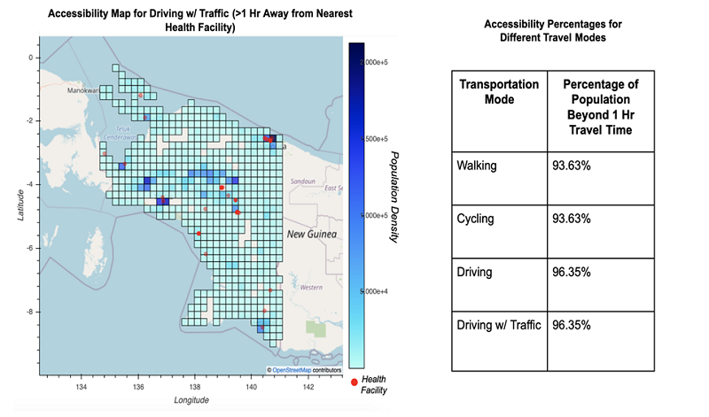

+++
date = 2020-10-22T04:00:00Z
partner = ["Meta", "Mapbox"]
title = "Analyzing Spatial Accessibility of Health Facilities in Indonesia and Philippines "
authors = ["Afeefah Syed", "Maksim Pecherskiy"]
dev_partner = ["World Bank"]
post_type = "Case Study"
links = [
    "https://unstats.un.org/unsd/undataforum/blog/planning-for-equitable-access-to-health-infrastructure/",
]
tags = ["Health", "Transport"]
+++
**Challenge**: Indonesia and the Philippines are archipelagos, where geographic and administrative boundaries are similar. The collection of islands is home to different concentrations of ethnic, cultural, linguistic, and socioeconomic groups, with an imbalanced distribution of health facilities and physicians.

**Solution**: Through geospatial analysis, the Development Data Partnership team examined how physically accessible hospitals and clinics are and how governments, in the short term, can efficiently allocate resources by setting up mobile health clinics that expand health accessibility to vulnerable populations. The interactive maps, which are produced by combining Facebook population density maps, Mapbox matrix API, and OpenStreetMap POIs, show the percentage of a population in a study region that cannot reach a health facility within 1 hour of travel time, by mode.

**Impact**: During health crises such as COVID-19 and beyond, it is crucial to assess and increase accessibility to health facilities. By using a combination of public and private sector data, the study provides a more comprehensive understanding of health facility accessibility.
