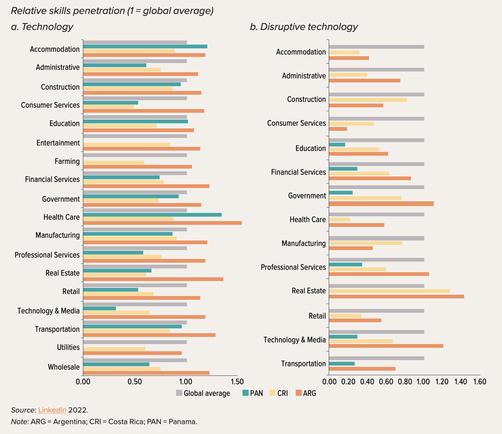

+++
title = "Examining the Prevalence of Technology Skills in Central America and the Dominican Republic"
authors = ["Harry Moroz", "Mariana Viollaz"]
categories = ["Case Study"]
partner = ["LinkedIn"]
dev_partner = ["World Bank"]
tags = ["Jobs and Development"]
links = ["https://documents.worldbank.org/en/publication/documents-reports/documentdetail/099050624121033690/p18001211dc88000f19cfe1e75dadacd3e4"]
date = 2024-10-18T00:00:00Z

+++

Technological advancements like artificial intelligence (AI) have the potential to shape labor markets in Central America and the Dominican Republic (CADR). But taking advantage of this progress will require developing workforces with the skills that complement these new technologies. The World Bank’s Social Protection and Labor Global Practice of the Latin America and Caribbean region used [LinkedIn](https://www.linkedin.com/) data to gain a more nuanced picture of the technology-related skills of CADR workers.

## Challenge

Computers, robots, AI, and improved information and communication technology (ICT) are shaping the future of work by changing what workers do (their tasks) and how they do it (their working arrangements).  While these changes could bring significant disruption to labor markets, slow progress in adapting to the demands of the future of work could mean missing out on the opportunities created by technological advancements.

In this context, CADR countries face various challenges. For instance, the penetration and diffusion of technology are limited in the region. While the Dominican Republic and Costa Rica have rates of internet use that approach those of Korea and the United States, in all other CADR countries at least one-third of the population did not use the Internet in 2021.

Another key challenge is that as technological progress translates into stronger demand for digital skills, it is essential to ensure current and future workers are prepared. However, detailed data on skills is generally unavailable in CADR countries, making exploration of this challenge difficult.

## Solution

Through the Development Data Partnership, the World Bank’s Social Protection and Labor Global Practice of the Latin America and Caribbean region accessed LinkedIn user profiles to study the digital skills of a subset of CADR countries.

In the region, Costa Rica and Panama have sufficient LinkedIn users to make valid insights with this data. The user profile data on skills is used to calculate skill penetration—that is, the share of an industry’s top 50 skills that come from one of 249 different skills categories that group the thousands of skills of LinkedIn users. Argentina is included in the analysis as a comparator. 

The team found that Costa Rica and Panama lag in the technology and disruptive technology skills most closely associated with new technologies with technology skills penetration scores that are around 75 percent of the global average and disruptive technology scores that are lower than this. Costa Rica and Panama perform substantially lower than the global average in the penetration of technology skills such as digital literacy, graphic design, and mobile app and web development as well as in disruptive technology skills such as AI, data science, and robotics (figure 1). 

<figure align="centre">
    
        

Figure 1:  Penetration of Technology and Disruptive Technology Skills, 2022
  

    </figcaption>
</figure>

## Impact

Technological progress is a key component of development, allowing for increased productivity, new products and services, and access to new markets. 

The [LinkedIn](https://www.linkedin.com/) data enabled the World Bank team to find evidence that a lack of technology and disruptive technology skills could hold CADR countries back from taking advantage of the benefits of technological advancements. 

To strengthen pathways for skills development and deployment in the region, CADR countries can develop labor market insight tools to collect, analyze, and disseminate information about labor market demand, build education and training systems adaptable to this demand, and deploy intermediation programs that link workers to training and, ultimately, to jobs. 

To do this, Costa Rica and Panama can deploy vacancy, skills profiling, and other specialized surveys and exploring novel sources of labor market information (for example, online job postings); identify areas of growing demand in real time, developing training programs in response, and incorporating other support services into these training programs; and expand their public employment services systems to provide labor market intelligence, career and skills guidance, job matching, and referral services

