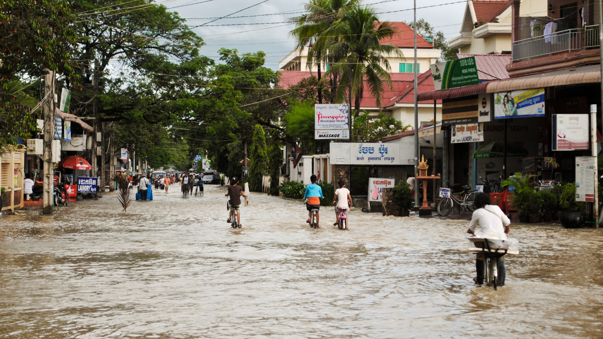
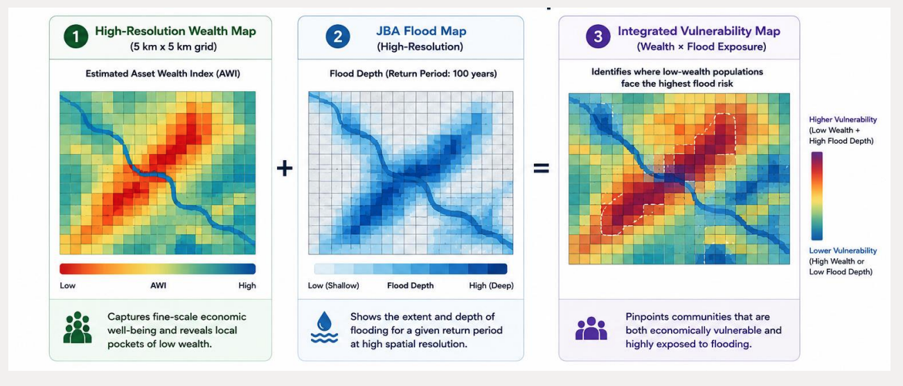

+++
title = "Prosperity at Risk: Flood Exposure and Wealth in Asia and the Pacific"
authors = ["Takaaki Masaki"]
categories = ["Case Study"]
partner = ["Jba"]
dev_partner = ["Asian Development Bank"]
tags = ["Disaster Risk Managment", "Inequality and Shared Prosperity"]
date = 2026-07-27T00:00:00Z
+++

Each year, floods drive millions of families across Asia and the Pacific from their homes—and often push them deeper into poverty. But which communities are hit hardest? Behind the headline numbers, that turns out to be a surprisingly hard question to answer. Flood risk in Asia and the Pacific is closely linked to poverty, but broad statistics often miss which communities are both exposed to flooding and economically vulnerable. Through an ongoing project with support from [JBA Global Resilience](https://jbagr.com) (JBA), the Asian Development Bank combines high-resolution wealth data with [JBA’s Global Flood Maps](https://jbagr.com/digital-tools/global-flood-maps) to pinpoint the areas of greatest need and target support more effectively.

## Challenge

Flooding is a growing risk across Asia and the Pacific, but its impacts are highly uneven and often difficult to identify using broad statistics alone. In Manila, for example, flood risk can vary dramatically over short distances - during the rainy season, a person can travel only a few blocks and suddenly see entire streets underwater. This local variation means that national-level figures may show how many people are exposed to flooding, but not which communities face the greatest impact.

Across the region, the scale of exposure is staggering. Around 1.8 billion people live in areas exposed to one-in-100-year flood events, with more than two-thirds of them in South and East Asia ([Rentschler, Salhab and Jafino, 2022](https://www.nature.com/articles/s41467-022-30727-4); [World Bank, 2022](https://blogs.worldbank.org/en/climatechange/flood-risk-already-affects-181-billion-people-climate-change-and-unplanned)). Flood exposure is also closely linked to poverty - nearly 90% of exposed populations live in low- and middle-income countries.

The real challenge, then, is not just to know where floods occur, but also to find the highly localized pockets of vulnerability inside a country. Many existing analyses rely on national or regional poverty estimates, which can mask important differences within countries. Without more granular data, communities that are both economically vulnerable and highly exposed to flooding may remain invisible, making it difficult for governments and development partners to target support where it is needed most.

<figure style="text-align: center;">
  
</figure>

## Solution

To find communities most vulnerable to flooding, our project combines two layers: a wealth map and a flood map.

The first layer is a high-resolution wealth map built from an estimated Asset Wealth Index. This map captures fine-scale differences in economic well-being and helps identify local pockets of low wealth that may be hidden in national or regional averages. We build it by combining traditional sources such as household surveys with geospatial information, including publicly available satellite data and tools.

The second layer, the flood map, uses high-resolution flood hazard data from [JBA’s Global Flood Maps](https://jbagr.com/digital-tools/global-flood-maps) to show where flooding may occur and how severe it could be. 

By bringing these two layers together, the project builds an integrated vulnerability map that identifies the places where low-wealth populations are also highly exposed to flood risk. In other words, it shows not just where flooding may happen, but where it hits communities that have the fewest resources to prepare, cope, and recover.

<figure style="text-align: center;">
  
</figure>

## Impact

By combining high-resolution wealth data with JBA’s Global Flood Maps, the project makes vulnerable communities more visible in decision-making. The integrated vulnerability map pinpoints where low-wealth populations face the highest flood risk, helping decision-makers better understand not only where flooding may occur, but also where its impacts could be most severe.

The project also enables smarter resource allocation. Instead of relying only on broad national or regional estimates, governments and development organizations can use these insights to prioritize the right places and the right services—water and sanitation, health care, food security, infrastructure investment, and livelihood assistance.

With support from JBA Global Resilience, the project can help decision-makers use limited resources more efficiently and target assistance more accurately. In the longer term, this kind of data-driven approach could help reach households that need support most, reduce gaps in service delivery, and contribute to stronger, more resilient communities.

