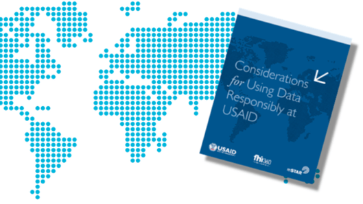
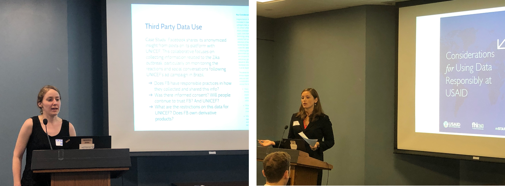
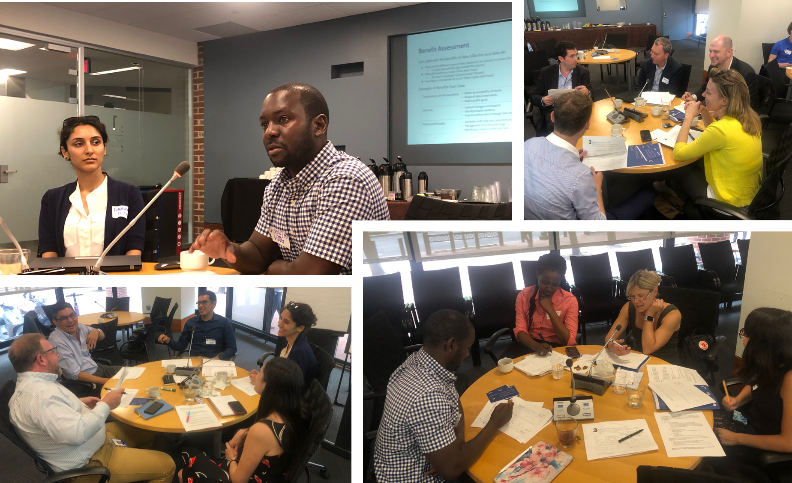

+++
date = 2019-07-01T21:52:59Z
title = "On Responsible Data Use"
authors = ["Holly Krambeck"]
post_type = "Article"
dev_partner = ["World Bank"]
+++

As we develop the Data Partnership, we have a responsibility to the people impacted by our initiative -- to local governments and partners, and to our own organizations -- to think about how we are collecting, using, storing, and sharing information. To borrow a few lines from [ICT Works](https://www.ictworks.org/), we should:

* **Use data to make more informed decisions**, to understand how our programs are doing and how to make them better.
* **Protect the privacy and security** of the information we have–especially when it involves vulnerable populations.
* **Share derived data products** to improve the development community’s understanding of needs, and to be transparent about our programs and whether they are effective.

These broad responsibilities are frequently in tension with one another, and balancing them requires not only following best practices for data management and data security, but understanding the context where we operate as well as the risks and benefits of our decisions.

[USAID’s Considerations for Using Data Responsibly](https://www.usaid.gov/responsibledata) covers topics such as prioritizing use of data, proactively analyzing the benefit/risk to those impacted, and following context-appropriate industry best practices for data management and data security.

On June 18, the Data Partnership (formerly Data Collaboratives) partnered with USAID to facilitate an interactive workshop for working group members on using data responsibly in international development. Following are observations recorded by our remarkable summer intern, [**Magreth Kakoko**](https://www.linkedin.com/in/magreth-kakoko-480667171/)**.**

***

The increasing availability of data in emerging economies presents us with new opportunities in international development, as well as new risks and challenges. In a USAID-led interactive workshop, around 25 Data Partnership working group members convened to discuss responsible data practices in development programs.

First, [Rebecca Saxton-Fox](https://www.linkedin.com/in/rebeccasaxtonfox/) and [Taylor Braun-Dorrell](https://www.linkedin.com/in/taylor-braun-dorrell-4083a035/) from the US Global Development Lab presented USAID’s new workbook on responsible data use in international development (see PPT, here: [http://bit.ly/2S7nQdI](http://bit.ly/2S7nQdI "http://bit.ly/2S7nQdI")).

The workbook, which took nearly four years to develop, helps practitioners ask and answer the right questions, as well as to balance risks with practical concerns. The working groups appreciated the approach, which is flexible and based on context.

The interactive exercises centered around three main topics: data sharing, third party data use, and data aggregation. Below, I have tried to summarize what I have learned from my colleagues.

**On Data Sharing**

Data sharing refers to when an organization opts to share its non-open data with third parties, for the purpose of supporting a public good. Organizations need to evaluate the third parties’ data governance systems before sharing their data – for example, understanding how the third party will store and dispose of the data, as well as share and distribute derived products. Beyond IT processes, participants also discussed the importance of considering the reputations of the data sharing parties, as well as understanding the intended uses. Colleagues advised that concerns regarding data use and data privacy should be addressed in legal agreements before the data is shared.

**On Third Party Data Use**

Third party data use refers to an organization that uses data collected by partners. Similar to data sharing, an organization has to evaluate the data practices of the third party whose data they want to use. Does the third party have informed consent from all their users? What does informed consent mean to them and what does it mean to you? The idea of informed consent differs between individuals, companies and organizations. There is thus a need to consider the nature of informed consent when working with third party data. Third party companies collect data from users of varying levels of data literacy. Are they all informed on the data practices of the platform they are using? Organizations could explore the data practices of their partners and how informed the users of those platforms are on these data practices. Organizations working with third party data ought to establish what informed consent means to them, and to what standards do they hold themselves when it comes to informed consent. Exploring the means to set these standards and make sure they will be clear in all their projects is also essential.

Like data sharing, the reputation of the data sharer is an aspect worth consideration. A partner’s reputation can affect an organization or a project using their data, even if their reputation has no links with the data being requested.

**On Data Aggregation and Disaggregation**

With each project, there is always tension between how much data aggregation and disaggregation is needed, while still maintaining accountability, privacy and comprehensibility. Data aggregation/disaggregation depends on the context of a project. We can disaggregate data, for example, when we need to analyze and compare issues on a subset of the population. But even then, the context with which the disaggregated data is collected and anonymously shared needs to be taken into consideration. For instance, consider a case where ethnicities of a population you are part of are being published at different subset levels - from the national level to household level. At what level would you feel your privacy being threatened? What if health data were being published at the same subset levels?

There is also a higher probability of anonymized disaggregated datasets at lower subset levels being combined such that the data are no longer anonymous. While there are tools that can be used to keep disaggregated data anonymous even at lower subset levels, there needs to be a balance between using the tools and maintaining data accuracy/good data quality.

An assessment of risks and benefits that come with sharing data/using third party in a project also needs to be done during the project’s planning stage. Ideally, the assessment should involve all stakeholders and domain experts of a project. Some aspects that could be explored include the type of data that will be requested from a third party, the benefits of using the data in the project, the risks associated with data use, the likelihood of the project succeeding, and the beneficiaries of the project (individuals, donors, or the government?). The likelihood of occurrence of the assessed benefits and risks could also be explored.

**Final Thoughts**

My main takeaway from the workshop is that responsible data use is an ongoing topic. Most of the challenges do not have generalized right or wrong answers. They are to be worked through on a case by case basis with project stakeholders.

The importance of responsible data practices amongst data practitioners in development projects cannot be over-emphasized, as we strive to achieve more accountability and data security in our projects.
