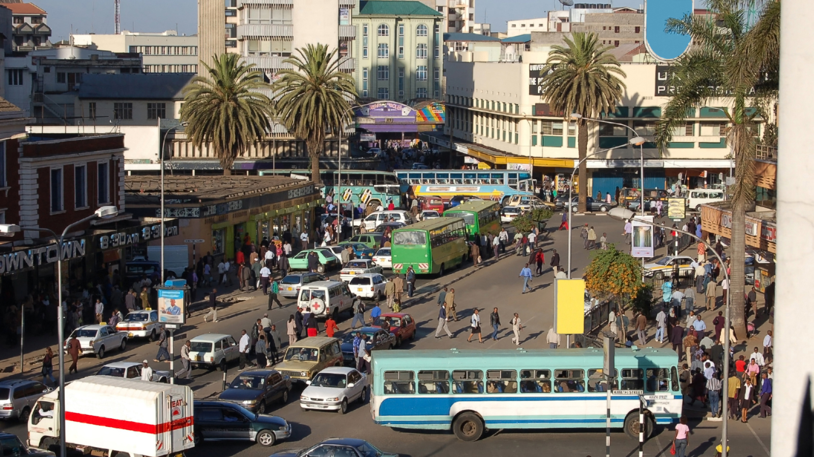
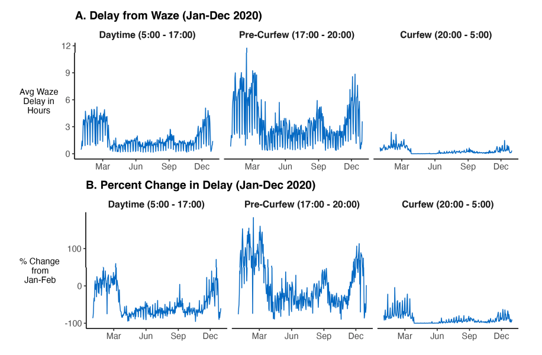

+++
title = "Revealing the Unintended Consequences of Curfews on Road Safety"
authors = ["Kwok Kin Lee"]
categories = ["Case Study"]
partner = ["Waze"]
dev_partner = ["World Bank" ]
tags = ["Transport"]
links= ["https://openknowledge.worldbank.org/entities/publication/1d9b6863-f65e-42e9-8179-a8ee4e64aaee"]
date = 2026-03-16T00:00:00Z
+++

The World Bank’s Development Impact department (DECDI) examined the impact of curfews on road safety in an urban lower-middle-income setting. It found that curfews lead to large reductions in crashes during curfew hours, when cars are off the road, but that these reductions can be fully offset by an increase in crashes during heavy-traffic hours, when people rush to get home before the curfew starts. The analysis drew on multiple data sources, including traffic jam information from [Waze](https://www.waze.com/wazeforcities).

## Challenge 

Historically used to manage social unrest and control crime, looting, and violence, curfews were widely adopted during the COVID-19 pandemic, with more than 100 countries implementing them to limit the spread of the virus. While their effectiveness in reducing disease transmission may remain to be proven, curfews can impose significant social and economic costs across multiple domains.

For instance, curfews can affect how and when people move, with knock-on effects for other outcomes such as road safety. They may reduce the number of vehicles on the road and lower crash rates during restricted hours, but they can also encourage faster and riskier driving at other times, potentially increasing crashes. Understanding these effects is crucial to avoid relying on policy tools in future pandemics and crises that may be costly and ineffective.

<figure style="text-align: center;">
  
</figure>

## Solution 

The Development Impact department at the World Bank conducted an analysis to examine the effects of COVID-19 curfew policies on road safety and urban mobility in Nairobi, Kenya. Nairobi, like many cities in low- and middle-income countries experiences high rates of road traffic crashes. The team has made a [multiyear investment](https://documents.worldbank.org/en/publication/documents-reports/documentdetail/099062824091529433) in data infrastructure for urban management that turned a data-poor environment into a relatively data-rich one.

In Kenya, a dusk-to-dawn curfew was implemented in March 2020, with the stated aim of preventing the spread of COVID-19. The team harnessed detailed, high-frequency data on road traffic crashes to examine crashes before and after the curfew's implementation, relative to the same period a year earlier. 

[This study](https://documents1.worldbank.org/curated/en/099451204052328998/pdf/IDU10b94e1aa1864314ab41a3d119bb2e9028839.pdf)’s multiple data sources include road traffic crashes from the Kenya National Police Service and Flare. In addition, Waze provided information on the location, speed, and delay time of traffic jams. The team computed the total traffic delay time due to traffic jams in Nairobi on an hourly basis, and used this delay time as a proxy for congestion on the roads.

<figure style="text-align: center;">
  
</figure>

Analysis revealed a direct decrease in crashes during the curfew hours when a dusk-to-dawn curfew was implemented, and a concomitant increase in the number of crashes during the hours before the curfew. The effect was large enough to cancel out the post-curfew reduction in crashes, and it occurred even though the number of vehicles on the road was lower, indicating an increase in the probability of a crash per car. This resulted from a behavioral response to the curfew—increased driving speed—leading to higher crash rates.

Speed increased during the hours right before the curfew, as people rushed to reach their final destination just before the curfew. This was especially true when the curfew began during rush hour. When the curfew was updated to begin after rush hour, the effect was mitigated.

## Impact 

Curfews are often associated with war, conflict, crowd control, and public safety. Whether they are an effective tool for protecting public safety therefore warrants careful consideration, particularly because curfews can directly restrict personal freedom. This study examines one critical dimension of public safety: road safety. It shows that curfews can generate important external effects on traffic conditions that may, in practice, undermine the very goal of improving public safety.

The team’s analysis shows that curfews can have significant unintended consequences for road safety, increasing the risk of crashes during non-curfew hours due to consequential effects. These findings highlight the need for careful scrutiny of curfews in future crises and pandemics, and for policies to be designed in ways that minimize unintended harm. 

Through the Development Data Partnership, project teams gain access to high-quality datasets contributed by private-sector partners, enabling more rigorous analysis of complex development challenges. In this study, access to detailed traffic data was essential for examining how curfews affected traffic conditions and road safety, underscoring the critical role that privately sourced data can play in generating timely and evidence-based insights for public policy.

