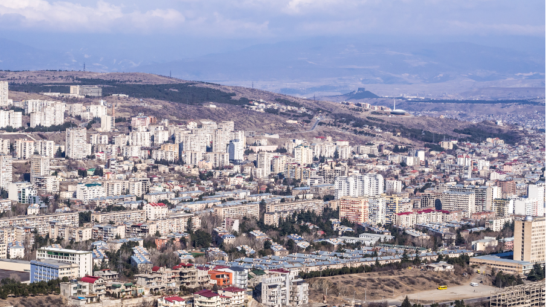
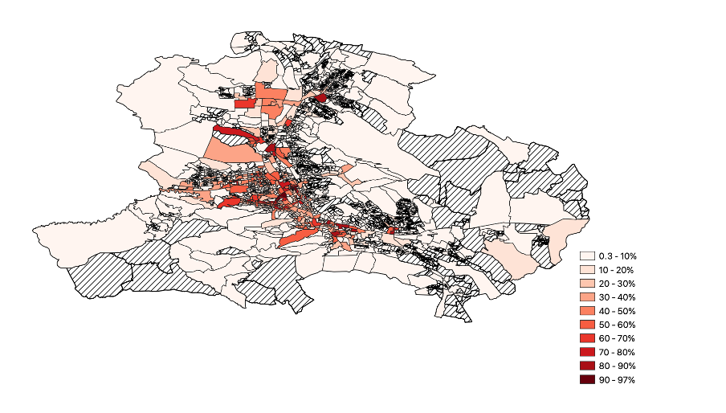

+++
title = "Exploring the crucial role of traffic-related emissions on air pollution in Tbilisi"
authors = ["Patrick Behrer", "Sandra Baquie", "Xinming Du", "Alan Fuchs", "Natsuko Nozaki"]
categories = ["Case Study"]
partner = ["Waze"]
dev_partner = "World Bank"
tags = ["Health"]
date = 2024-09-18T00:00:00Z
+++

With financial support from Sweden, the World Bank’s Poverty and Equity Team working in the South Caucasus was seeking to understand how exposure to pollution varies within Tbilisi, Georgia across income groups and occupations to aid policy makers in developing solutions that benefit those who are most vulnerable to pollution. They leveraged [Waze for Cities] (https://www.waze.com/wazeforcities/) data to identify congested roads and studied air pollution at those points. They found that congestion significantly reduced air quality in Tbilisi.

## Challenge

Air pollution is a serious global health concern, damaging people’s well-being and the economy. Air pollution levels in Tbilisi, the capital of Georgia, exceed international standards and surpass those of other capitals in the region. The monthly average concentration of PM2.5 from 2016-2022 was higher than 20 μg/m3, which is four times the annual average recommended by the World Health Organization (WHO). From 2017 to 2021, Tbilisi experienced higher air pollution levels than Istanbul (Türkiye), Baku (Azerbaijan), and Kyiv (Ukraine).

Despite high pollution levels, existing papers about air pollution in Georgia are limited. A few notable reports provide valuable insights into the topic. More data analyses on air pollution are necessary to help policymakers, researchers, and society at large better understand and address air pollution.

<figure align="center">
    
        

  

    </figcaption>
</figure>

## Solution

The World Bank’s Poverty and Equity Team working in the South Caucasus, with the financial support from Sweden, conducted an analysis of the impacts and sources of air pollution in Tbilisi to inform policy making. Part of this study utilized traffic data because it is key to understanding the burden of pollution in the Georgian capital because transportation is a major source of emissions within the city. Knowing where and when traffic is particularly bad in the city can help the Poverty and Equity Team develop exposure maps and understand how the problem of pollution shifts across the city as traffic shifts.

Through the Development Data Partnership, the team utilized traffic data from [Waze for Cities] (https://www.waze.com/wazeforcities/). The data is derived from cell phone-based applications and user movements and covers a period from 2019 to 2021. This dataset had information on speed and waiting times for each road segment in Tbilisi at 5-minute intervals. To assess traffic congestion, the team defined instances where the speed fell below 5 km per hour. This indicated significant congestion. They then geocoded the corresponding road segments and aggregated the traffic jam data to the census block on a day level basis. Then, they linked the traffic jam intensity with air pollution to explore the relationship between traffic sources and air quality.

With the Waze for Cities data, the team analyzed (figure 1) the distribution of traffic jams across Tbilisi, focusing on the proportion of traffic jam days from 2019 to 2021, at the census block level. The data revealed that a higher concentration of traffic jams occurred near the city center. As distance from the city center increased, the congestion intensity decreased.

<figure align="center">
    
        

Figure 1: Proportion of days with traffic jams (speed below 5km/h) 2019 - 2021
  

    </figcaption>
</figure>

More notably, this study found a positive correlation between traffic jams and air pollution. As the number of traffic jam days increased, the resulting increase in air pollution was consistent and proportional.

## Impact

The [Waze for Cities] (https://www.waze.com/wazeforcities/) data enabled the Poverty and Equity Team to investigate the crucial role of traffic-related emissions in contributing to air pollution in Tbilisi. As traffic is a key source of air pollution in the Georgian capital, actions must be taken by policymakers to tackle this health issue. For instance, the team found that eliminating traffic jams, either by adopting carbon pricing to reduce the number of vehicles on roads, incentivizing public transport, or improving urban planning, could reduce air pollution.

It is crucial to extend air pollution research to middle- income countries such as Georgia, where the issue remains relatively understudied despite the growing severity of pollution problems. These nations face unique challenges shaped by their specific economic and environmental contexts, necessitating focused research efforts. By prioritizing investigations in middle-income countries, we can gain a more comprehensive understanding of the global air pollution landscape and develop tailored solutions to mitigate pollution challenges faced by these regions.

