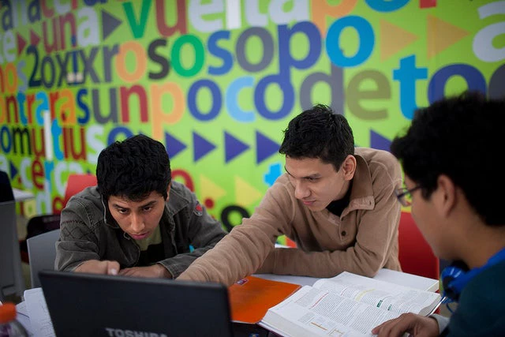

+++
title = "Shared Challenges, Adaptable Solutions: How Data Can Support Learning Across the Global South"
authors = ["Development Data Partnership Team"]
categories = ["Case Study"]
partner = ["Jba", "Ookla"]
dev_partner = ["Asian Development Bank", "Inter American Development Bank"]
tags = ["Disaster Risk Management", "Digital Development"]
date = 2026-09-09T00:00:00Z
+++

Cooperation and partnerships for knowledge sharing are key to advancing sustainable development across the Global South. They allow countries to learn from one another’s experience, compare approaches to shared challenges, and adapt ideas to their own needs and circumstances.

Observed each year on September 12, the International Day for South-South Cooperation draws attention to the value of sharing knowledge, experience, and innovation among countries. By learning from approaches developed in other contexts, countries can identify ideas and methods relevant to their own development challenges.

Data can support this process. Many countries face related challenges, but the conditions behind them and the resources available to address them vary. Evidence from one country or region should therefore not be treated as a ready-made solution for another. The wider value often lies in the questions asked, the data combined, the analytical methods used, and the limitations identified.

Through the Development Data Partnership, international organizations and technology companies work together to make privately held data available for public-interest research and policy analysis. The following two projects, one from Asia and the Pacific and one from Latin America and the Caribbean, show how a method or analysis developed to address one country’s or region’s challenge can become a reference point for governments elsewhere in the Global South facing similar problems.

<figure style="text-align: center;">
  
  <figcaption style="text-align: center; font-size: 0.9em; color: #555;">Photo: World Bank</figcaption>
</figure>

## Identifying where flood risk and economic vulnerability overlap

Across Asia and the Pacific, flood exposure can vary considerably within a country and even within a city. National or regional figures may estimate how many people are exposed, but they can miss communities that face both high flood risk and limited economic resources.

An ongoing Asian Development Bank project, supported by [JBA Global Resilience](https://jbagr.com), addresses this gap by combining two layers of information. The first is a high-resolution wealth map based on an estimated Asset Wealth Index, developed using household surveys and geospatial information, including publicly available satellite data and tools. The second uses JBA’s Global Flood Maps to show where flooding may occur and how severe it could be.

Bringing the two layers together helps identify areas where low-wealth populations are highly exposed to flooding. This can give decision-makers a more detailed basis for targeting services and investments, including water and sanitation, health care, infrastructure, food security, and livelihood support.

This approach can help decision-makers use limited resources more efficiently and target assistance more accurately. As flooding is becoming more common worldwide, governments elsewhere in the Global South facing similar overlaps between flood risk and economic vulnerability could draw on this combined approach, adapting the method to their own national context using their own local data and knowledge. Learn more [here](https://datapartnership.org/updates/prosperity-at-risk-flood-exposure-and-wealth-in-asia-and-the-pacific).

## Comparing affordable ways to connect schools in Jamaica

Reliable internet access can connect students and teachers with digital textbooks, current information, and interactive learning platforms. Yet closing connectivity gaps requires more than locating schools without fixed broadband. Governments also need to understand likely demand and compare infrastructure options against geography, coverage, quality, and cost.

In Jamaica, the Inter-American Development Bank and the International Telecommunication Union used data and insights from  [Ookla®](https://www.ookla.com/ookla-for-good) to identify connectivity gaps among public institutions. The study then estimated internet demand around each school and compared fiber, cellular, and satellite options, including the infrastructure required and the number of nearby residents who could also benefit.

Other countries in Latin America and the Caribbean, and elsewhere in the Global South, may also face gaps in school connectivity. The Jamaica project can offer useful lessons for the Inter-American Development Bank’s work elsewhere in the region and for governments facing similar problems more broadly. They could adapt its decision-making framework to identify gaps, estimate demand, compare technologies, and consider how investments in schools might also benefit surrounding communities. Find out more [here](https://datapartnership.org/updates/cost-effective-solutions-to-close-jamaica-school-connectivity-gap).

## From project evidence to shared knowledge

These projects show how data partnerships can produce practical evidence and analytical methods that countries can adapt to their own needs. To promote South–South learning, governments and institutions need data and analytical support to compare results, discuss data requirements and limitations, and exchange implementation experience. This process can turn locally grounded analysis into shared knowledge while accounting for differences in national contexts and priorities.

