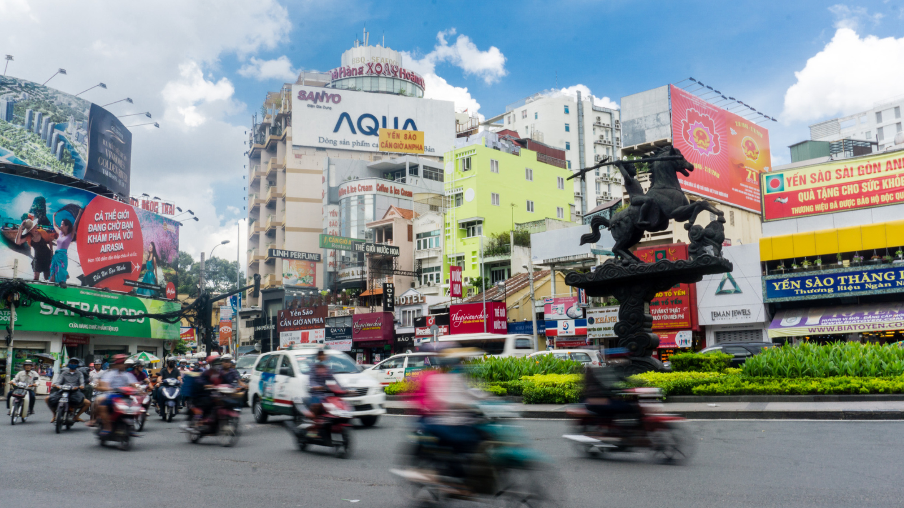

+++
title = "Examining the Impact of Social Distancing on Household-Level Economic Performances in Vietnam"
authors = ["Dao Le-Van", "Daisuke Fukuzawa", "Duong Trung Le"]
categories = ["Case Study"]
partner = ["Meta"]
dev_partner = "World Bank"
tags = ["Inequality and Shared Prosperity"]
date = 2024-09-25T00:00:00Z
link = ["https://www.tandfonline.com/doi/abs/10.1080/17516234.2023.2275226"]
+++

During the COVID-19 pandemic, governments implemented social distancing measures to curb the spread of the virus. However, these measures also impacted people’s socioeconomic well-being. The World Bank’s Office of the Chief Economist, East Asia and Pacific leveraged a large dataset surveyed by [Meta] (https://dataforgood.facebook.com/) and several academic institutions to examine the heterogeneous impact of social distancing on household-level economic performances in Viet Nam.

## Challenge

To reduce the risk of further local transmission of COVID-19, governments across the world implemented social distancing activities. However, those measures also had negative impacts on individuals and society as a whole, such as damage to mental well-being, economic hardship, and social behavior changes. In addition, the effectiveness of social distancing activities may have also varied depending on factors such as culture, community structure, and access to resources.

In Viet Nam, in response to this health crisis, the government aimed to pursue dual goals: maintaining public health and economic growth. In that context, social distancing and national lockdown were vigorously implemented from the end of May 2021. The rapid and unexpected implementation of social distancing directives is considered an exogenous shock that directly affected household-economic outcomes. 

<figure align="centre">
    
        

  

    </figcaption>
</figure>

## Solution

To understand the relationship between social distancing policies and economic outcomes at the household level (i.e. the likelihood of unemployment, financial insecurity, and food insecurity) in Vietnam, the World Bank’s Office of the Chief Economist, East Asia and Pacific utilized data from Meta’s [COVID-19 Trends and Impact Survey] (https://dataforgood.facebook.com/dfg/tools/covid-19-trends-and-impact-survey) conducted in partnership with University of Maryland (UMD) and Carnegie Mellon University (CMU). The access to the data was facilitated by the Development Data Partnership.

The researchers found that social distancing activities hurt people’s employment status. First, at the aggregate, the finding suggests that every 1-percent increase in social distancing activities during the COVID-19 outbreak is associated with an increase in unemployment probability of 0.4 percent, holding other factors equal. Due to government and local community support, the study does not find an impact of social distancing on financial and food insecurity. Next, exploring the heterogeneity of effect across demographic groups, the paper finds that the increase in unemployment likelihood as a result of heightened social distancing intensity was more pronounced among women and lower-education groups – the subgroups often facing greater barriers in the labor force. 

## Impact

While social distancing measures were widely implemented by governments to combat the pandemic, the data support from Meta enabled the World Bank team to reveal the economic trade-off of this public-health measure. The findings highlight that vulnerable populations, particularly the poor and less educated, bore a disproportionate burden of these costs. It is crucial to provide welfare programs for these disadvantaged groups post-pandemic. Our society's resilience will be measured by our ability to support and elevate those most affected, both during and in the aftermath of this global health crisis.

