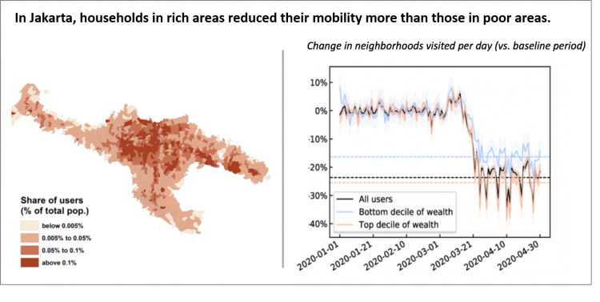

+++
date = 2020-07-28T13:12:14Z
title = "Assessing Social Inequality and Lockdown Policies using Mobile Location Data in Indonesia"
authors = ["Nicholas Jones"]
post_type = "Case Study"
dev_partner = ["World Bank"]
partner = ["Cuebiq", "Unacast",]
tags = ["Health", "Inequality and Shared Prosperity", "Social Protection"]
links = [
    "https://blogs.worldbank.org/sustainablecities/poor-people-respond-differently-stay-home-orders-heres-what-data-says",
]
+++

## Challenge

 Lockdown policies such as stay-at-home orders and non-essential business closures are central to fighting the novel coronavirus. However, policy makers are having a hard time answering key questions about their efficacy. For example, have impacts differed over time and across district boundaries? And crucially, are vulnerable groups less able than others to comply with social distancing regulations?

## Solution

[Cuebiq](https://www.cuebiq.com/visitation-insights-covid19/) privacy-protected GPS location data have been utilised to derive actionable insights to inform COVID-19 responses to better protect urban dwellers against risk. It is noted that lockdown policies affect citizens differently. In Indonesia, economically advantaged residents reduced the number of neighborhoods they visited by 25%, eight percentage points higher than that observed for lower-income people.

## Impact

Vulnerable groups find it more challenging to comply with social distancing measures for a wide variety of reasons, including limited household savings, a weak or nonexistent social safety net, incomes that depend on face-to-face contact, crowded living arrangements, and poor access to basic services. By understanding differentiated policy impacts across groups and areas within a city, this type of analysis can open the door to broader conversations about complementary measures needed to protect the health and livelihoods of citizens, particularly the most vulnerable.
