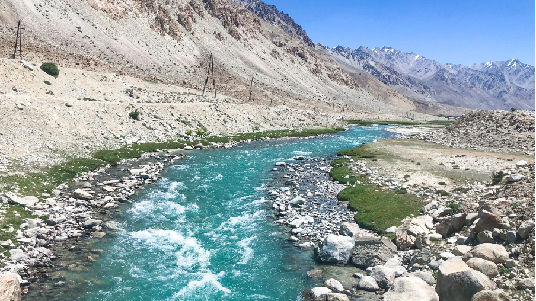
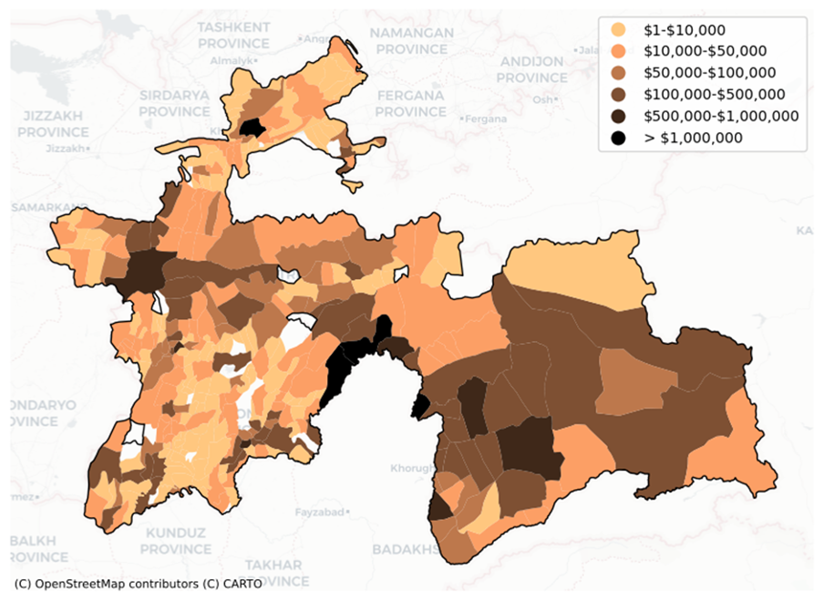

+++
title = "Strengthening Climate Resilience of the Tajikistan Road Network"
authors = ["Michael Anyala", "Elco Koks", "Ian Greenwood", "Travis Waller"]
categories = ["Case Study"]
partner = ["JBA"]
dev_partner = ["Asian Development Bank"]
tags = ["Transport"]
date = 2025-05-07T00:00:00Z
+++

Using data from [JBA's Global Flood Maps](https://jbagr.com/digital-tools/global-flood-maps/), the transport team at the [Asian Development Bank (ADB)](https://www.adb.org/) examined flood risk and its economic impacts in Tajikistan. This study highlights the urgent need for resilient transport infrastructure in the country to reduce climate-related risks, support economic stability, and enhance accessibility.

## Challenge

Safe and reliable infrastructure, including road systems, is crucial for our everyday lives and the operation of our communities and economies. Nevertheless, extreme weather events like flooding are increasingly impacting the effectiveness of our infrastructure.

[Tajikistan is a landlocked country in Central Asia characterized by difficult topographical conditions, which can make its transport infrastructure vulnerable to various risks stemming from severe climate change events.](https://www.adb.org/sites/default/files/publication/996131/sdwp-095-climate-resilience-road-tajikistan.pdf) For example, melting glaciers and snow can lead to flash floods that jeopardize road networks. Therefore, Tajikistan needs to implement strategies to safeguard its transport assets against these occurrences and guarantee the safe and continuous movement of people and goods, both domestically and internationally.

<figure align="center">
     
</figure>

## Solution

With support from the Development Data Partnership, the transport team at the Asian Development Bank utilized data from JBA’s Global Flood Maps to assist their evaluation of national-level climate risk impacts in Tajikistan, and to contribute to a more in-depth examination of the Dangara-Guliston corridor to support the preparation of the ADB-funded [Tajikistan Green Corridor Demonstration Project.](https://www.adb.org/projects/54286-001/main)

The usage of the JBA data on river floods (caused by rivers overtopping their banks) and surface water floods (caused by extreme local rainfall) at a national level was to provide climate risk exposure models for the team’s analysis. 
This national-level flood data was integrated into a comprehensive analysis framework that examined the origin and destination of trips on the road network. The framework also evaluated the network's exposure to various events and assessed the resulting impacts on travel and access to social services. This approach allowed for the identification of locations where higher design standards are necessary or where alternative routes are needed.

For the economic impact of flooding, the team revealed that river flooding could cause Expected Annual Damage (EAD) of approximately $30.2 million annually, increasing under more severe climate scenarios. Surface water flooding, though a smaller risk with an EAD of $0.112 million per year, significantly affects several districts. 

Additionally, the team discovered that disruptions from floods and landslides could delay or interrupt up to 20% of travel demand. Simulated road closures, such as along the Dangara-Guliston corridor, show a 3.1% increase in Vehicle Kilometers Traveled (VKT) and an 8.9% rise in Vehicle Travel Time (VTT), underscoring the extensive impacts of transportation network disruptions.

<figure align="center">
    
    <figcaption style="text-align:center;">
        Figure: Expected Annual Damage for river flooding in Tajikistan per municipality (draft)
    </figcaption>
</figure>

## Impact

Incorporating climate resilience features into road designs is crucial for reducing anticipated social and economic losses while enhancing long-term road service reliability. 

Several adaptation strategies tailored to Tajikistan’s climate and infrastructure needs have been identified. These include climate-resilient maintenance practices, such as regularly clearing blockages and removing debris to prevent disruptions caused by flooding. Additionally, climate-proofing infrastructure involves constructing flood walls, elevating roads, resizing drainage systems, and using geosynthetics for slope stability to protect against extreme weather events.

This ADB study provides a consistent method for identifying the risks faced by the transport network, understanding how these risks will evolve over time, and discovering opportunities to minimize them. Importantly, it underscores the necessity of resilient transport infrastructure in Tajikistan to mitigate climate risks, support economic stability, and improve accessibility. 

The study’s findings are essential for supporting policymakers in ensuring that investments maximize their impact on improving people's lives. They also lay the groundwork for future investments and create opportunities to optimize the location of social services, ultimately reducing the negative effects of climatic events on society.

