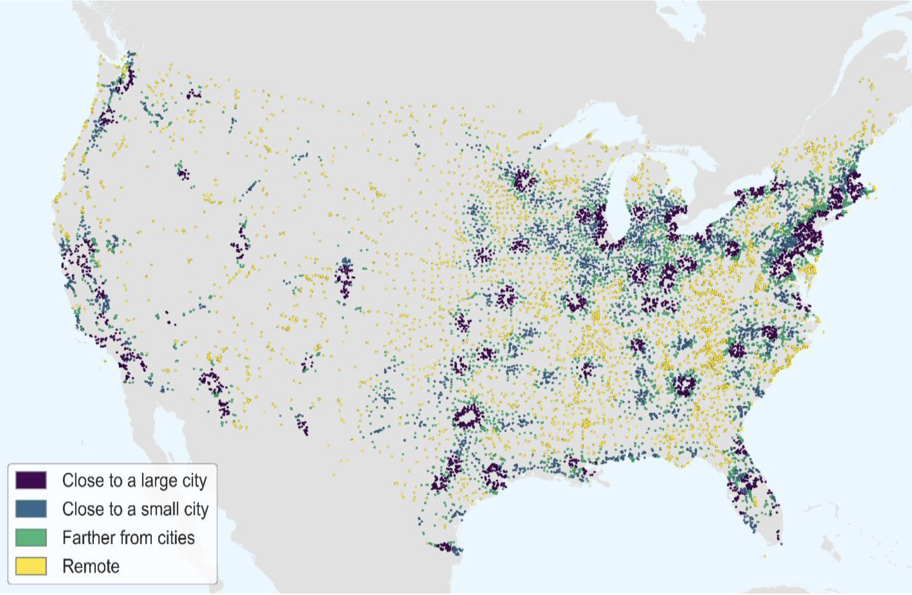

+++
title = "Studying Service Accessibility in Towns and Villages"
authors = ["Alison Weingarden", "Claire Hoffmann", "Nikos Patias", "Carsten Dolle"]
categories = ["Case Study"]
partner = ["Mapbox"]
dev_partner = "Organization for Economic Co Operation and Development"
tags = ["Urban Development"]
date = 2024-08-28T00:00:00Z
links = ["https://www.oecd.org/en/publications/getting-to-services-in-towns-and-villages_df1e9b88-en.html"]
+++

Settlements – cities, towns and villages – provide jobs and access to services for their own residents and other people living nearby. The ease of access to those services depends on different factors. The [OECD’s Centre for Entrepreneurship, SMEs, Regions and Cities (CFE)](https://www.oecd-events.org/smes-cities/partner/fc8fb48c-8fa9-438e-bdd2-9b531aec6504/oecd-centre-for-entrepreneurship-smes-regions-and-cities#:~:text=The%20OECD%20Centre%20for%20Entrepreneurship,and%20implement%20sound%20tourism%20policies.) leveraged [Mapbox](https://www.mapbox.com/) data on travel time to study the relationship between the access of towns and villages to a city and the provision of their own local services.

The availability and accessibility of high-quality services such as healthcare and education are essential for the well-being of everyone.  However, people living in and near cities typically have better access to services such as healthcare and public transport because economies of scale make it more feasible to sustain large infrastructures (e.g. specialized medical services or multimodal transport networks) in larger urban areas compared to smaller places. Nevertheless, residents of smaller places have access to some local services and can travel to larger towns or nearby cities for more specialized services. 

## Challenge

To improve service provision, policymakers need to understand how it differs within and across countries. This is particularly important for places facing demographic pressures. Indeed, an increasing number of towns and villages across OECD countries are projected to experience population decline and ageing. For instance, half of all villages in the European Union and more than 40% of its towns have lost population. Remote places, those that already struggle with access to services, are also facing the most demographic challenges. 

<figure align="center">
    
        

  

    </figcaption>
</figure>

## Solution

The spatial relationships across settlements impact geographic patterns of service provision. These relationships, referred to as “reachability”, relate to a settlement’s relative size and connections to other settlements nearby.

The OECD’s Centre for Entrepreneurship, SMEs, Regions and Cities (CFE) used Mapbox data to identify whether villages and towns have access to a city, meaning if its residents can reach any part of a city, including the city’s (closest or outermost) border, within 30 minutes. This is part of the [“Getting to Services in Towns and Villages: Preparing Regions for Demographic Change”](https://www.oecd.org/en/publications/getting-to-services-in-towns-and-villages_df1e9b88-en.html) publication.
 
To this end, based on an existing dataset of travel times within Europe calculated from [TomTom](https://www.tomtom.com/) road network data, combined with the new [Isochrone API](https://docs.mapbox.com/api/navigation/isochrone/) from Mapbox provided through the Development Data Partnership, the team was able to compute areas that were reachable within a specified amount of time from the population-weighted centroid of each settlement and returned the reachable regions as isochrones on a map (i.e. contours of polygons representing equal travel times). This definition uses travel time rather than distance, which is an important distinction because it accounts for differences in road quality and terrain that impact accessibility by car. 

Figure 1 shows a map of all smaller settlements (i.e. villages and towns) in the United States by their “Time to cities” classification. In the eastern half of the country, many smaller settlements are clustered around cities (dark purple and blue dots). Settlements that are green dots are 30-60 minutes from a city, while “Remote” settlements (lighter yellow dots) are located more than an hour from a city. In the west of the country (e.g. Montana and Utah), a larger fraction of towns and villages are classified as “Remote”.

<figure align="center">
    
    <figcaption style="text-align:center;">
        Figure 1: United States’ towns and villages by time to cities 
        Source: Based on <a href="https://docs.mapbox.com/api/navigation/isochrone/">Mapbox Isochrone API</a>.
    </figcaption>
</figure>

Using their gathered data, the team analyzed how service prevalence varied according to settlement characteristics. They found that access to a city affects the provision of local services.
Whilst cities typically have more services than towns and many more than villages, it was found that towns and villages far from cities tend to have more services than similar-sized settlements close to cities. This is due to the fact that those living in suburban areas may still be able to make use of some services in the city rather than in their own town or village. 

Additionally, towns have more services when they are regional centers, i.e. the largest settlement within a certain driving time.

## Impact

To make sure everyone can get access to services, it is important for policymakers to strengthen the provision of local services that can be provided on a smaller scale – those that should be easy to access. This is particularly important in towns and villages as small places are crucial for their residents and others nearby, especially older people and those with fewer resources. 

In addition to the positive impacts on personal well-being, efficient service delivery can promote economic and environmental benefits by boosting productivity and reducing travel times. This study, including the use of Mapbox data, provides valuable insights for regional development policies and in particular for those regions facing demographic changes, including ageing and population declines in rural areas.

