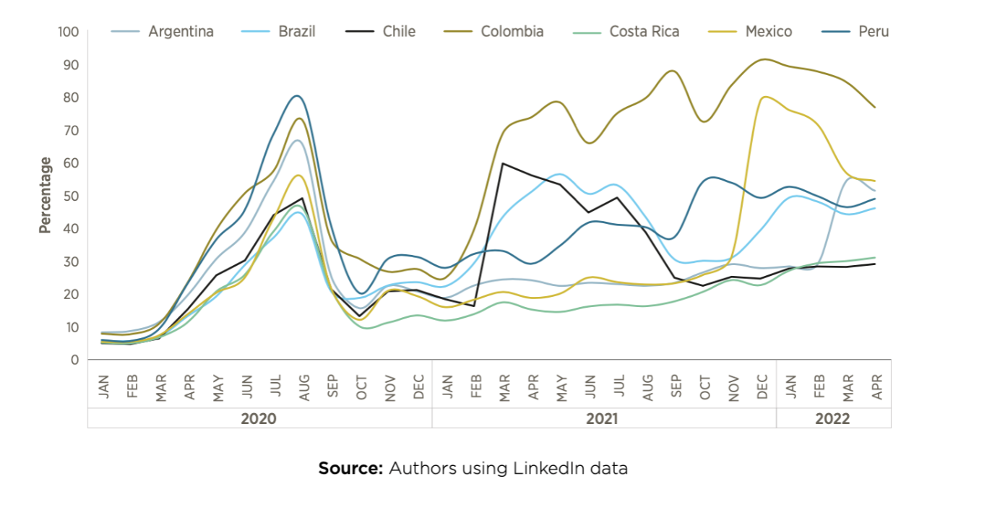

+++
title = "Analyzing the Evolution of Telework Adoption in Latin America and the Caribbean"
date = 2023-06-21T00:00:00.000+00:00
authors = ["Maria Fernanda Prada", "Graciana Rucci", "Fabiola Saavedra Caballero" ]
categories = ["Case Study"]
dev_partner = ["Inter-American Development Bank"]
partner= ["LinkedIn"]
tags = ["Jobs and Development"]
links = [
    "https://publications.iadb.org/en/transition-telework-latin-america-and-caribbean-key-findings-using-linkedin-data",
]
thumbnail = "telework-adoption-in-LAC-thumbnail.jpg"
+++

Due to the COVID pandemic, the use of telework increased rapidly in Latin America and the Caribbean (LAC) region, as it did globally. The Inter-American Development Bank leveraged data from [LinkedIn](https://economicgraph.linkedin.com) between January 2000 and April 2022 from Argentina, Brazil, Chile, Colombia, Costa Rica, Mexico, and Peru to shed some light on telework adoption and country-specific behavior during and after the health crisis.

## Challenge
The COVID-19 crisis generated a sudden need for businesses to start operating remotely and for employees to work from home. In consequence, the rate of telework increased rapidly in Latin America and the Caribbean, as it did all over the world.

Despite this, not all countries and industries in the LAC region were equally ready to shift to telework, resulting in only a segment of the labor market being able to adopt it. These disparities became more pronounced in the post-pandemic scenario, as variations in the severity of containment measures, internet accessibility, and labor market characteristics across countries diverged.

Understanding the dynamics of telework in LAC region and cross economic sectors poses a challenge due to the limited availability of comprehensive data. Traditional sources like perception surveys or administrative records offer limited insights into actual telework adoption, and specific surveys that include telework as a topic are scarce in LAC.

<figure align="center">
    
    <figcaption>
        

		Photo Credit: Image by Oleksandr Pidvalnyi from Pixabay
		

    </figcaption>
</figure>

## Solution

The Inter-American Development Bank team collaborated with LinkedIn, which was able to provide data relevant to understand and analyze telework. LinkedIn data is particularly relevant as it is oriented towards a subset of the workforce focused on knowledge-intensive sectors, which even before the COVID-19 outbreak were already adopting telework agreements, especially for high-skilled workers [Milasi et al., 2021](https://www.oecd-ilibrary.org/economics/telework-before-the-covid-19-pandemic_d5e42dd1-en#:~:text=Trends%20and%20drivers%20of%20differences%20across%20the%20EU,-This%20paper%20provides&text=Descriptive%20evidence%20shows%20that%20before,big%20differences%20across%20EU%20countries).

By using LinkedIn job postings data in Argentina, Brazil, Chile, Colombia, Costa Rica, Mexico, and Peru between January 2020 and April 2022 the team could perform an analysis of telework trends across countries and economic sectors deeper than with available traditional data sources.

Researchers found a common trend of sudden increase in telework adoption in the seven LAC countries at the beginning of the COVID-19 outbreak (first semester of 2020), followed by divergent patterns across countries in the subsequent months of 2021 and 2022.

Here are the key findings of the study The Transition to Telework in Latin America and the Caribbean: Key Findings using LinkedIn data:

•	Countries with more strict government containment measures were the ones that experienced higher telework rates during 2020.

•	It is unclear what the role was that internet network coverage and internet network performance played in telework adoption after the containment measures were removed.

•	Telework adoption reflects the dynamics of the labor demand and was driven mostly by the professional services economic sector.

•	It appears that telework will not return to its pre-pandemic levels and it is here to stay.

<figure align="center">
    
    <figcaption>
        

		Figure 1: Telework across LAC Countries after COVID-19 Outbreak
		

    </figcaption>
</figure>

## Impact

Under this new post-pandemic context, where telework is a feasible alternative adopted in more economic sectors than before COVID-19, an opportunity to implement policies that support workers arises. Workers need skills to adapt to this transition either by acquiring new capacities or by transforming the ones they already have (reskilling); employment offices need new strategies to cope with the new labor market, and vulnerable populations need assiduous attention, so they will not be left behind.

Even though the adoption of telework varies across countries and industries in the LAC region, it is evident that telework will not return to its pre-pandemic levels. This research underscores the relevance of using non-traditional data particularly related to skills demand, to address the challenges posed by the new normal. Such information provides insights and background analysis that can inform future policymaking and regulation for the region. Information from platforms like LinkedIn allow users to access information in an efficient, granular, and cost-effective way, enabling stakeholders to navigate the evolving landscape of the future of work with precision and effectiveness.
