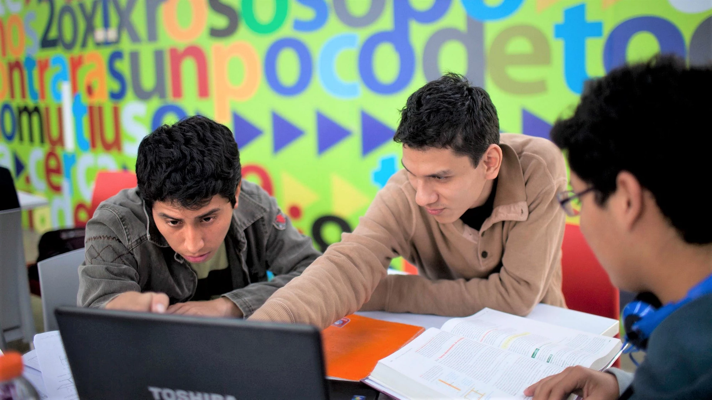

+++
title = "The Digitalization Transition in Argentina, Brazil, Chile, Colombia, Mexico and Peru Through the Lens of the LinkedIn Skill Genome Data"
authors = ["Niccolo Comini", "Nicolo Gozzi", "Nicola Perra"]
categories = ["Case Study"]
partner = ["LinkedIn"]
dev_partner = ["World Bank"]
tags = ["Jobs and Development"]
date = 2026-04-13T00:00:00Z
+++

A World Bank study funded by the Digital Development Trust Fund examined how advanced digital skills emerged, evolved, and were adopted in six Latin American countries by using [LinkedIn](https://economicgraph.linkedin.com.mcas.ms/content/dam/me/economicgraph/en-us/PDF/data-for-impact-summer-2025.pdf?McasCtx=4&McasTsid=20893) data.

## Challenge

Digital transformation has reshaped how we live and work, from how businesses operate and services are delivered to how people learn, communicate, and earn a living.

Yet this transformation has not been experienced equally. In Latin America, the COVID-19 pandemic exposed gaps in digital access and skills, particularly among women, workers in the informal sector, and other groups. Understanding how digital skills emerge, spread, and are adopted across industries is therefore not just a technical exercise. Rather, it is a critical step toward building more inclusive, resilient, and future-ready economies.

<figure style="text-align: center;">
  
  <figcaption style="text-align: center; font-size: 0.9em; color: #555;">Photo: World Bank</figcaption>
</figure>

## Solution

Through the Development Data Partnership, we investigated the emergence, evolution, and adoption of advanced digital skills in Argentina, Brazil, Chile, Colombia, Mexico, and Peru by exploring the LinkedIn Skill Genome.  This unique dataset provided us with the top 10 representative skills each year from 2017 to 2023 for 19 industries in each country. The data was extracted by LinkedIn from the profiles of users located in each country.

Here are some of the key findings:
- On average, digital skills counted for only 6% of total skills. Chile, Colombia, and Peru showed the largest growth of digital skills by the end of 2023. Furthermore, these countries are those that deviated the most in the post-COVID-19 period with respect to previous years.

- Mexico was the country with the least number of digital skills by the end of the observation period, which, however, might be due to the relatively low penetration of LinkedIn in the country.

- We observed some digital skills that were present in all countries by the end of 2023, such as AutoCAD, Git, JavaScript, Node.js, Revit, and SQL. These are all software/programming languages relevant for web applications and data analytics (Git, JavaScript, Node.js, SQL) or for engineering (AutoCAD and Revit).

- All countries, except for Mexico, featured a set of unique digital skills that suggest specialization in specific sectors. For example, in Brazil, we observed a concentration of digital skills related to programming for web interactive platforms (i.e., JavaScript).

- Overall, we observed the highest level of digital skills penetration in three industries: Technology and Media, Construction, and Professional Services.

Our analysis comes with several limitations. For instance, the analysis relies on self-reported LinkedIn data, which may not fully capture workers’ actual skill levels. Additionally, LinkedIn usage varies significantly across countries and sectors, potentially biasing results toward more formal, knowledge-intensive industries and underrepresenting informal employment.

## Impact

This study provides an in-depth, comparative view of digital transformation across six Latin American countries by leveraging LinkedIn data, covering 19 industries over time. By tracking the evolution, specialization, and sectoral penetration of advanced digital skills before and after the COVID-19 pandemic, the study reveals both shared patterns and important differences in how digital skills have evolved across countries.

Beyond the regional insights, the study more generally demonstrates how social media data can serve as a powerful, scalable tool for monitoring human capital and informing evidence-based policies on digital transformation.

