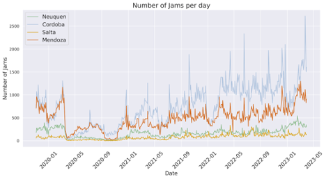

+++
title = " Assessing Traffic Congestion and Accessibility to Jobs Using Waze for Cities and Mapbox Data"
date = 2024-01-25T00:00:00.000+00:00
authors = ["Javier Morales Sarriera", "Maria Sol Tadeo", "Alejandro Sicra" ]
categories = ["Case Study"]
dev_partner = ["World Bank"]
partner= ["Mapbox", "Waze"]
tags = ["Urban Development", "Transport"]
links = ["https://documents.worldbank.org/en/publication/documents-reports/documentdetail/099092923133023894/p1793840d233790a6082280d3b7852eaf4b"]  
+++

Traffic congestion and suburbanization are becoming increasingly significant factors affecting urban mobility and limiting access to jobs and opportunities in most mid-sized cities worldwide. To understand how these patterns have changed over time, the World Bank’s Transport Global Practice in Latin America assessed mobility patterns in the Metropolitan Areas of Córdoba, Mendoza, Salta and Neuquén-Cipolletti in Argentina. However, the data available to most transport planners in Argentina, including these four areas, is inadequate to understand exactly how travel patterns have changed in recent years. As part of this study, high-frequency data from [Waze for Cities] (https://www.waze.com/wazeforcities/) and [Mapbox] (https://www.mapbox.com/) was leveraged to support the evidence about changing mobility patterns.

## Challenge

Traffic congestion and suburbanization pose a risk on ensuring access to social and economic opportunities, increasing economic productivity and improving citizens’ quality of life. To gain insights into the challenges faced by Argentine mid-size cities in terms of mobility, we conducted a study in four cities whose populations range from  400,000 to 2.4 million within their metropolitan areas. They represent diverse urban centers in terms of size, region, and various characteristics such as population, mobility patterns, infrastructure, public services, and institutional frameworks. 

In recent decades, these four metropolitan areas have experienced disorderly urban growth. As a result, low-density urban sprawl took place in the periphery, which is not consistent with a transport oriented and compact development. As a side effect, traffic congestion increased, impacting road safety and environmental sustainability.

## Solution

We leveraged high-frequency data from Waze for Cities and Mapbox to study changing traffic congestion patterns and calculate accessibility to jobs by cars. 

Understanding Traffic Congestion Patterns: 
By analyzing data from the Waze for Cities program spanning from 2019 to 2023, we observed an increase in daily traffic jams across all metropolitan areas. While traffic jams decreased during the COVID-19 pandemic in 2020, they have been steadily increasing since the end of 2021. This trend was consistent across cities, with some variations in the intensity and spatial distribution of congestion.

The Traffic Congestion Intensity Index (TCI, proposed by IDB during 2019 Covid Pandemic) was calculated to summarize the extent and duration of traffic jams. This index provided valuable insights into the congestion levels within specific polygons of interest. We found that traffic congestion was concentrated on main access roads and suburban areas, with radial avenues and central business districts experiencing significant increases in congestion.

Analyzing Traffic Congestion Over Time: 
Our analysis also revealed variations in traffic congestion throughout the day. More pronounced congestion was observed in morning peak hours across all metropolitan areas, except Salta, and in evening peak hours in Mendoza. Surprisingly, the hourly traffic congestion distribution in 2022 resembled the pre-pandemic pattern, indicating a return to normal travel patterns despite expectations of changes due to the pandemic.

<figure align="center">
    
    <figcaption>
        

		Figure 1: Number of daily traffic jams, Nov 2019 to May 2023. Own calculation based on Waze for Cities data
		

    </figcaption>
</figure>

Assessing Accessibility to Jobs: 
To evaluate accessibility to jobs, we developed a model using traffic data from Mapbox and open-source libraries such as [Pandana] (https://udst.github.io/pandana/), [UrbanAccess] (https://udst.github.io/urbanaccess/index.html), and [OSMnx] (https://osmnx.readthedocs.io/en/stable/). This model allowed us to examine accessibility by different modes of transport, including car, public transport, bicycle, and a combination of public transport and bicycle. We calculated the total number of jobs reachable within specific time thresholds from different parts of each metropolitan area.

To calculate accessibility to jobs by car considering congested traffic conditions, we utilized high-frequency [Mapbox Traffic data] (https://www.mapbox.com/traffic-data) to estimate typical travel times from any origin and destination within a given area. Due to cost constraints, it is uncommon to study car accessibility under congested conditions. Thanks to the Development Data Partnership and Mapbox, we obtained the required data. Mapbox Traffic data is produced using anonymized, aggregated data collected from mobile devices running Mapbox-powered apps, which are used to calculate real-time and predicted driving speed at the street level. The typical speed is only available for road links where enough information is available to make an accurate prediction. To increase coverage of our dataset, we estimated the speed of the remaining road links based on the median speed for the same type of road. We used high-frequency Mapbox data for typical speeds, for a Wednesday between 9:00 AM and 9:05 AM which is during the morning peak.
Our findings showed that car accessibility to jobs was significantly higher compared to other modes of transport, even when considering congested traffic conditions. Mapbox data provided valuable insights into travel times and typical speeds, allowing us to estimate car accessibility during peak hours. The results indicated that the average person could reach a high percentage of jobs by car within 45 minutes in Córdoba, Salta, and Mendoza, helping to explain the increase in motorization in these areas.

## Impact

The analysis of traffic congestion and accessibility to jobs using Waze for Cities and Mapbox data has important implications for urban mobility planning. The findings highlight the need for improved public transport and cycling infrastructure to provide viable alternatives to car travel. By focusing on reducing congestion on main access roads and enhancing accessibility to jobs through sustainable modes of transport, cities can improve overall mobility and reduce reliance on cars.

The use of high-frequency data from [Waze for Cities] (https://www.waze.com/wazeforcities/) and [Mapbox] (https://www.mapbox.com/)has provided valuable insights into traffic congestion patterns and accessibility to jobs in metropolitan areas. The findings emphasize the need for strategic urban planning to address the challenges posed by traffic congestion and suburbanization. By leveraging data-driven approaches, cities can develop effective strategies to improve urban mobility, reduce congestion, and enhance accessibility to jobs, ultimately creating more sustainable and livable cities for their residents.
