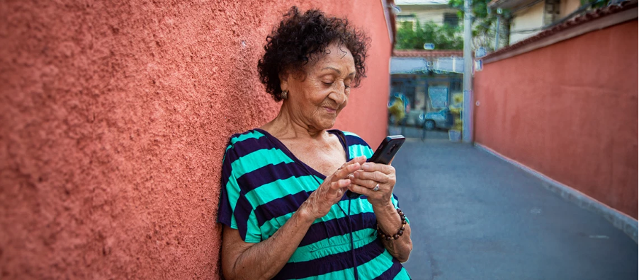

+++
title = "Uncovering the Digital Divide in Brazil: Data Reveals Internet Inequality Across Income Groups"
authors = ["Niccolo Comini", "Nicolo Gozzi", "Nicola Perra"]
categories = ["Case Study"]
partner = ["Ookla"]
dev_partner = "World Bank"
tags = ["Digital Development"]
links = ["https://blogs.worldbank.org/en/digital-development/bridging-brazil-s-digital-divide--how-internet-inequality-mirror","https://arxiv.org/abs/2406.01113"]
date = 2024-07-10T00:00:00Z
+++

Leveraging data from [Ookla for Good™](https://www.ookla.com/ookla-for-good), the World Bank's Digital Development Global Practice has analyzed the relationship between internet speed and income inequality within a sample of Brazilian cities. The team found that prosperous areas generally exhibit better internet speed, and that the dependence of Internet quality on wealth has increased over time.

## Challenge

As digital technologies and services have become essential in many people's daily lives, access to the Internet is ever more important because it is a crucial gateway to education, job opportunities, and essential services. However, internet usage remains a luxury in less affluent communities where not everyone can afford to access the Internet or where existing network infrastructure is not well-developed.

Across Latin America, the digital divide is not just a technological issue but a stark reflection of income inequality. Research highlights a significant disparity, meaning people with higher incomes benefit from better and more reliable internet whereas those on lower incomes suffer from limited or even no access. This compounds the socio-economic divide and hampers regional development.

<figure align="center">
    
        

Photo:  © Shutterstock
  

    </figcaption>
</figure>

## Solution

Through the Development Data Partnership, the World Bank's Digital Development Global Practice has leveraged data from [Ookla for Good™](https://www.ookla.com/ookla-for-good) to dig deeper into the nexus between income inequality and internet access, by studying six major Brazilian cities—Belo Horizonte, Brasilia, Fortaleza, Manaus, Rio de Janeiro, and São Paulo. Ookla is widely used by academic and official institutions to measure internet connectivity.

The study tracked mobile and fixed internet speeds in these cities from 2017 to 2023 using data from nearly 100 million geolocalized Ookla® Speedtest Intelligence® tests. Furthermore, the data is geolocalized and provides the download/upload speed and latency for fixed networks. 

Unsurprisingly, more affluent neighborhoods were found to consistently enjoy superior speeds, especially on fixed networks (Fig1a). Although mobile internet speed is also better for wealthier individuals, this trend has been decreasing over time, probably due to wider mobile network coverage and infrastructure upgrades like the shift to 4G and 5G (Fig1b).

<figure align="center">
    
        

Figure 1: Correlation between fixed (a) and mobile (b) internet speed and a proxy for income in different cities) 
  

    </figcaption>
</figure>

The team also examined internet speeds around educational facilities in 2023. They found that approximately 13% of these areas may have encountered challenges in accessing key digital services such as e-learning as they had speeds below the recommended 80 Mbps threshold for effective e-learning. This affected around 8 percent of the school-age population.

## Impact

By utilizing Ookla data, this study showcased that the poorest segments of population still experience a slower internet connectivity compared to the wealthiest.  Such disparity can significantly hinder the socio-economic development of a country and it requires a joint effort of policy makers and the private sector to find a solution.

For instance, we need initiatives that focus on improving connectivity in underserved areas such as: promoting Fiber to the Home (FTTH), a broadband technology that uses optical fiber to deliver faster and more reliable high-speed internet directly to buildings; making high-speed internet packages and devices more affordable; and fostering digital literacy through training and awareness programs.

Putting these solutions into practice, we can work towards the goal of providing more equitable internet access, ensuring everyone can have access to a fast, affordable, and reliable connection to the Internet—the foundation of development in the digital age.