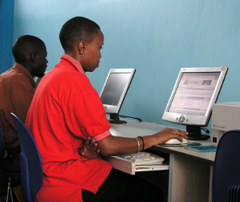

+++
title = "Understanding Internet Connectivity to Tackle the Digital Divide"
authors = ["Kwok Kin Lee"]
categories = ["Case Study"]
partner = ["Ookla"]
dev_partner = ["World Bank", "Organisation for Economic Co operation and Development", "International Monetary Fund", ]
tags = ["Digital Development"]
date = 2024-11-14T00:00:00Z

+++

The Internet offers great potential for contributing to more prosperous societies. For instance, it enables small businesses to overcome the challenges of entering worldwide markets. It also allows school children living in poorer and more remote areas to access the same information as children in wealthier regions. The Internet also provides critical support for rural households enabling them to use digital health services despite being in remote areas. 

However, people living in rural areas or developing countries may not have full access to fast, reliable, and affordable Internet. For example, [according to the United Nations, just one in 100 people has a broadband Internet connection in some developing nations](https://unctad.org/data-visualization/now-8-billion-and-counting-where-worlds-population-has-grown-most-and-why). The lack of internet access leaves millions of people without the critical public goods and services necessary to the achievement of the Sustainable Development Goals (SDGs).
 
Having a clear picture of the Internet's performance, quality, and availability can help governments make targeted policies and investments to tackle the digital divide. Reliable and rich datasets play a pivotal role in this by helping us understand the Internet landscape in rural areas and developing countries. 

Through the Development Data Partnership, international organizations have leveraged data from [Ookla for Good™](https://www.ookla.com/ookla-for-good) to study internet accessibility to improve people's lives for a sustainable future. 

<figure align="center">
    
        

Photo:  World Bank
  

    </figcaption>
</figure>

For example, a study by the Organisation for Economic Co-operation and Development (OECD) leveraged Ookla data to evaluate broadband speeds across urban and rural areas within EU and G20 countries. They found that fixed broadband download speeds in rural areas were close to 50% slower than those in cities in some cases. This study emphasized the need to invest in new digital connections to bridge the connectivity divide. Discover more [here](https://datapartnership.org/updates/reaching-digital-deserts/).

In another example, the World Bank's Digital Development Global Practice used Ookla data to dig deeper into the link between income inequality and internet access, by studying six major Brazilian cities—Belo Horizonte, Brasilia, Fortaleza, Manaus, Rio de Janeiro, and São Paulo. They found that the poorest segments of the population still experience a slower internet connectivity compared to the wealthiest. Their policy recommendations include promoting Fiber to the Home (FTTH) to improve connectivity. Read more [here](https://datapartnership.org/updates/uncovering-digital-divide-in-brazil/). 

The Maldives also face the problem of internet connectivity inequality. The World Bank utilized Ookla data for a study on how digital technologies can help the Maldives become resilient and what policymakers can do to strengthen the country's existing digital infrastructure. 

The team found that Internet users in Malé, in the capital of the Maldives, enjoyed average download speeds for fixed broadband connections that were twice as fast as those in atolls. Read more [here](https://datapartnership.org/updates/maldives-development-update/). 
 
The case studies of Brazil and the Maldives showcase the digital divide within countries. However, Ookla also provides data support to help the World Bank understand Internet access inequality at a continental scale. Leveraging the company's Speedtest Intelligence® data, a World Bank study revealed an overall discrepancy in fast mobile internet connections within cities across Africa.  

For instance, in Lagos, Nigeria, download speeds differed by a range of 40Mbps, and in Abidjan, Côte d'Ivoire they differed by as much as 80Mbps. This significant disparity illustrates that despite improvements in connectivity infrastructure, large parts of the population might still be excluded from fast mobile Internet, even in cities. Learn more [here](https://datapartnership.org/updates/africa-digital-transformation/). 

Ookla also provided crucial data support for another project on digital connectivity in Africa. The International Monetary Fund (IMF) utilized the company’s Coverage Right data for a study on whether households with mobile connectivity in Sub-Saharan African countries withstood COVID-19 shocks. Their findings revealed that digital connectivity enhanced households' resilience to shocks during the pandemic in three areas: market access, employment, and human capital development. Find out more [here](https://datapartnership.org/updates/imf-digitalization-in-sub-saharan-africa/). 

All these studies highlighted the need to bridge the digital divide to foster inclusive economic growth. Improving internet connectivity can also enhance people's well-being through e-health services.  

However, many developing countries have difficulty providing e-health services because they lack well-developed digital infrastructure, advanced technological tools, and relevant digital skills for doctors and patients. 

For example, to understand to what extent the national healthcare system could leverage the existing digital infrastructure and develop e-health applications, the World Bank's Digital Economy for Latin America (DE4LAC) initiative leveraged data from Ookla to analyze El Salvador's telecommunication network. Their findings showed a stark disparity in internet quality between healthcare facilities in urban and rural areas. Read more [here](https://datapartnership.org/updates/el-salvador-telemedicine/). 

Using Ookla’s diverse and holistic connectivity data, all these projects called for improving internet access to enhance people's lives and inform policy recommendations. Our collaboration with Ookla provides important data and insights support to bridge data gaps and promote equitable access to the Internet in rural areas and developing countries, with the aim of achieving a sustainable and inclusive future and advancing progress towards the SDGs.

