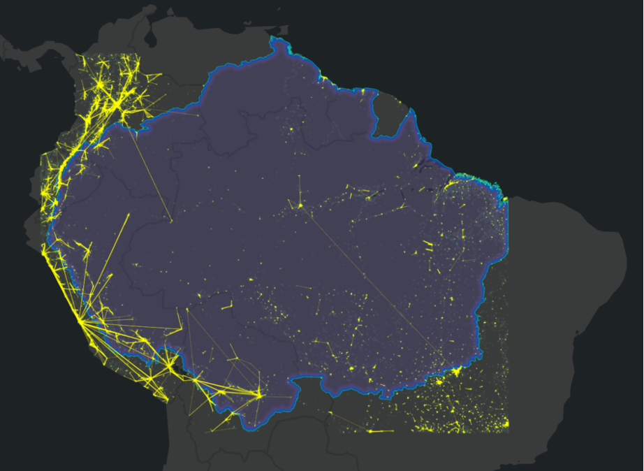

+++
title = "Understanding people mobility in Amazonia"
authors = ["Adam Mehl", "Yves Lesenfants", "Victor Osorio", "Roberto Prato"]
categories = ["Case Study"]
partner = ["Meta"]
dev_partner = "Inter American Development Bank"
tags = ["Urban Development"]
date = 2024-05-01T00:00:00Z
+++

Amazonia has many small and remote communities but also some big and influential urban centers. At the Inter-American Development Bank (IDB), in our efforts towards a sustainable development in Amazonia through the [Amazonia Forever](https://www.iadb.org/en/who-we-are/topics/amazonia) program, we leveraged movement data from [Meta]( https://dataforgood.facebook.com/dfg/about) to shed light on the relationships between cities in each country within Amazonia, as well as the connection between the region's urban areas and other parts of the countries as we understand that there is a constant movement of people and merchandise between areas.

## Challenge

Amazonia is extensive and complex – with 8.3 million square km, it covers 40% of the area in Latin America and the Caribbean and is home to about 60 million people (including areas of influence of large cities). Understanding movement patterns of people, goods and services is essential for identifying opportunities for ongoing projects, addressing infrastructure needs and supporting residents, especially those who are far from economic centers and public services.

Virtually every project, from boosting bioeconomy value chains to health care improvement for remote communities, will contribute to a regional mobility scheme and can take advantage of it to realize its potential impact.

The mobility patterns observed will thus enable the classification of territories based on their connectivity with the region, differentiating local hubs from almost isolated regions in terms of population movement.

## Solution

Leveraging data from Meta, the Amazon Coordination Unit (ACU) of the IDB, through its Amazonia360 Hub, has been exploring Movement Distribution datasets which shows how far Facebook users in different regions travel from home on a given day. It is used as a proxy for transportation of goods and services as well as population displacement.

It is worth noting that, to understand the general dynamics of mobility in the region, this analysis must be extended beyond Amazonia's borders, to also cover territories outside of the regular work area. Data should be gathered over a longer period of time and over larger areas to include the more coastal cities (eg. São Paulo and Lima) where merchandise, raw materials and finished products converge from the Amazon.

In this study, we must also better determine the trade corridors between the Amazon region of each of the eight countries and other parts of the countries. The analysis, covering only a short period, reveals the intense dynamism of people around the large Andean cities and the Bolivian, Peruvian and Ecuadorian Andean-Amazonian flank. It also exposes the relative isolation of the deep Amazon and its hinterlands, the role of the Amazon River and its tributaries, and the road axes, for the regional transportation dynamics.

<figure align="center">
    
        

Source: IDB analysis based on Meta's Data for Good (Oct-Nov 2023) 
  

    </figcaption>
</figure>

## Impact

The pattern of cargo connections in Brazil, for example, reveals the intense exchange of goods and services that supply the urban enclaves and productive activities within Amazonia. This pattern also shows the traffic of raw materials and finished products, which satisfies the demand in the urban areas of the southeastern coast. The current study aims to reveal this dynamic for all of Amazonia.

Using data on population mobility from Meta, the IDB team has been able to explore the relationship of urban centers with the surrounding territory. The intense intra-urban traffic of Manaus extends towards smaller urban centers around it. The urban pressure on these spaces makes them a priority for sustainable development. This information is not an end in itself but contributes to telling a story within a larger regional narrative.

This study will contribute to continued research on Amazonia360 Hub not only on mobility patterns in Amazonia but also on understanding the entire territory with reliable environmental, socio-economical, and financial data to support its conservation and sustainable development.

## About Amazonia Forever

[Amazonia Forever](https://www.iadb.org/en/who-we-are/topics/amazonia)  is a holistic umbrella program that aims at protecting biodiversity and accelerating sustainable development in three lines of action: expanding funding, boosting knowledge exchange, and facilitating regional coordination among the eight Amazonian countries.  
 
The program is based on five pillars: (i) Combating deforestation and strengthening environmental control and security in the context of national governments; (ii) Bioeconomy and creative economy, promoting alternative and sustainable economic activities; (iii) People, aiming at adequate access to quality education, healthcare, and employment; (iv) Sustainable cities and infrastructure and connectivity; and (v) Sustainable, low-carbon agriculture, livestock and forestry. In addition, the program focuses on promoting the inclusion of women, indigenous peoples, people of African descent and local communities; climate and forest conservation; and strengthening institutional capacities and the rule of law.