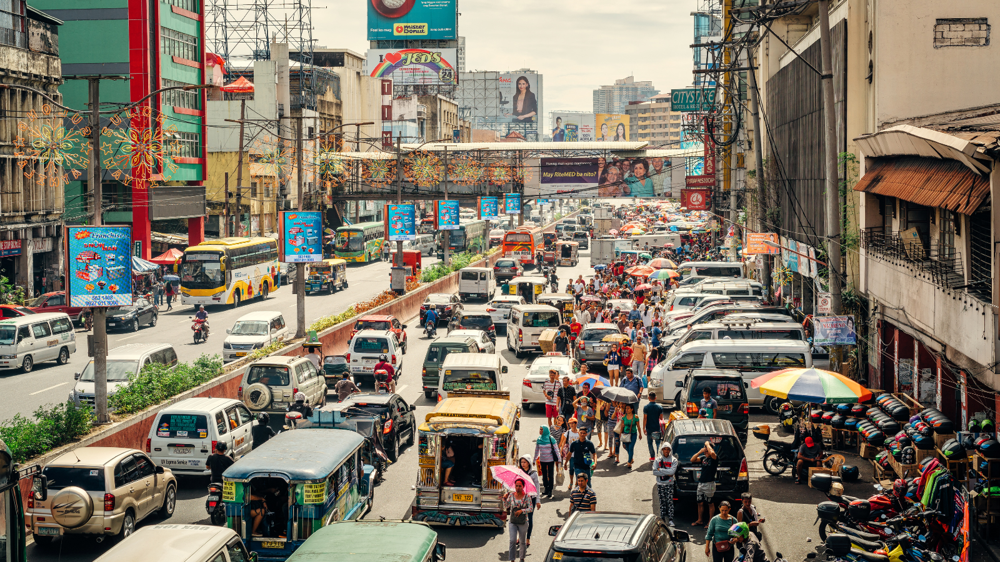

+++
title = "Understanding Traffic Changes During COVID-19 Through Waze Data"
authors = ["Ana Florina Pirlea", "Divyanshi Wadhwa"]
categories = ["Case Study"]
partner = ["Waze"]
dev_partner = ["World Bank"]
tags = ["Transport"]
link= ["https://datatopics.worldbank.org/sdgatlas/goal-9-industry-innovation-and-infrastructure/?lang=en"]
date = 2025-11-24T00:00:00Z
+++

The World Bank’s Development Data Group leveraged [Waze](https://www.waze.com/wazeforcities) data to examine the impact of the COVID-19 pandemic on city traffic. This study is part of [the Atlas of Sustainable Development Goals 2023](https://datatopics.worldbank.org/sdgatlas/?lang=en), which aims to be a reservoir of knowledge about the SDGs for policymakers, academics, journalists, and the public at large.

## Challenge

Transportation is a cornerstone of development, linking people to jobs, healthcare, and education, and enabling goods and services to move efficiently across regions. Under Sustainable Development Goal 9 (SDG 9), one key target is to strengthen the availability of reliable and resilient infrastructure, including transport systems that underpin both human well-being and economic growth.

Yet, the expansion of transport networks, whether by road, air, or sea, comes with a high environmental cost. The sector remains one of the largest contributors to greenhouse gas emissions, exacerbating the climate crisis. The challenge for countries, therefore, is to balance accessibility with sustainability by building transport systems that are affordable, inclusive, and energy-efficient while minimizing their carbon footprint.

<figure style="text-align: center;">
  
</figure>

## Solution

The [Atlas of Sustainable Development Goals 2023](https://datatopics.worldbank.org/sdgatlas/?lang=en) features interactive storytelling and data visualizations about the 17 Sustainable Development Goals. It showcases trends for specific targets within each goal and explains how certain SDGs are measured.

As part of the chapter on SDG 9, a chapter which focuses on transport among other topics, the World Bank team examined the COVID-19 pandemic's impact on various transportation modes. Once COVID-19 was officially declared a global pandemic, many countries issued stay-at-home orders or recommendations, which caused an immediate drop in the number of cars on the roads.

City-level, real-time traffic data can provide insights into travel patterns during the pandemic. Through the Development Data Partnership, the World Bank’s Development Data Group leveraged Waze data to examine changes in road traffic volume in New York, Bogotá, Mumbai, and Manila following the implementation of lockdowns.

<figure style="text-align: center;">
  
</figure>

## Impact

By using Waze’s data, the World Bank was able to capture how city traffic changed following pandemic restrictions. In places like New York, Bogotá, Mumbai, and Manila, traffic volume dropped sharply during lockdowns, then gradually rebounded as economies reopened. These shifts reveal how quickly urban mobility can respond to policy changes caused by crises.

When mobility data from platforms like Waze is combined with economic and environmental indicators, it enables more informed decisions about infrastructure planning, public transit investment, and urban development. Ultimately, this helps create more sustainable, inclusive, and resilient transportation systems, bringing countries closer to the goal of sustainable development.

