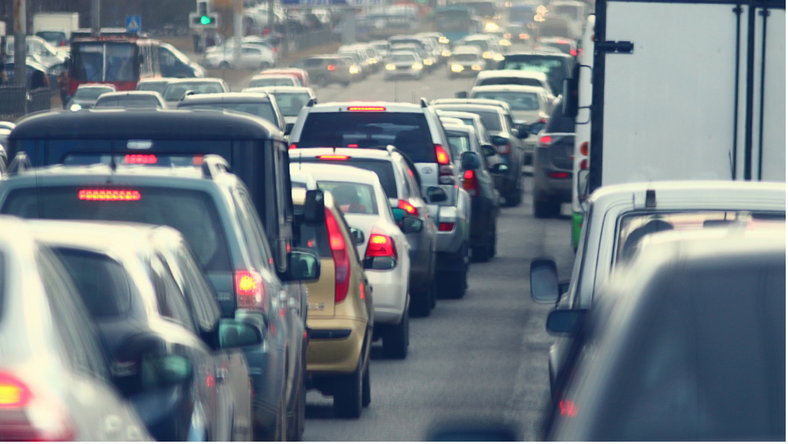
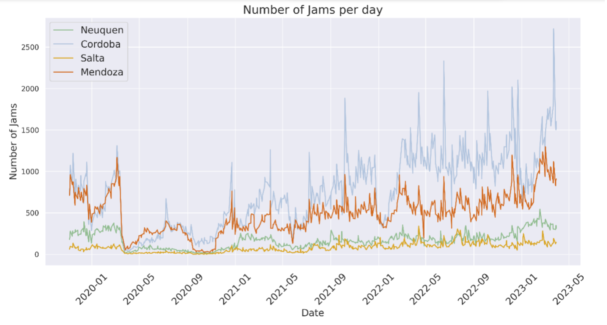
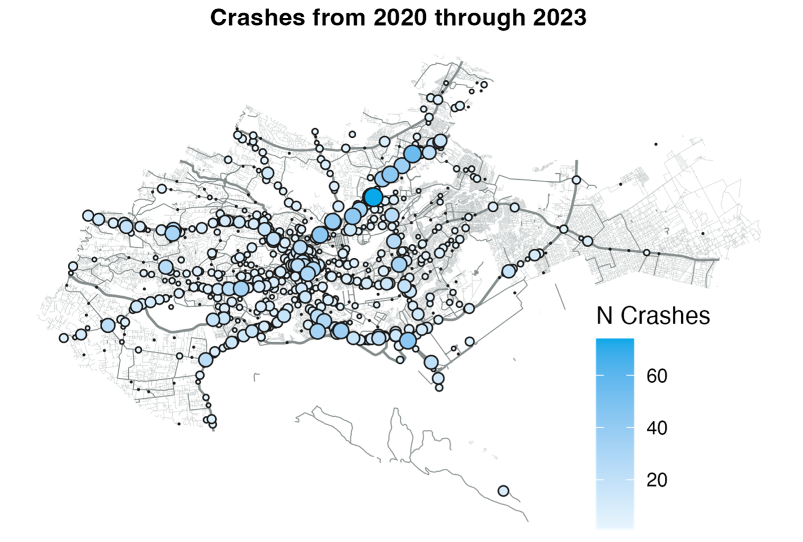

+++
title = "Unleashing the Power of Data to Tackle Traffic Congestion and Promote Road Safety"
authors = ["Kwok Kin Lee"]
categories = ["Case Study"]
partner = ["Mapbox", "Mapillary", "Waze"]
dev_partner = ["World Bank"]
tag = ["Transport"]
date = 2025-02-24T00:00:00Z
links = ["https://datapartnership.org/updates/traffic-congestion-argentina/", "https://datapartnership.org/updates/detecting-urban-clues-for-road-safety/","https://datapartnership.org/updates/leveraging-social-media-data-to-map-road-traffic-crashes/"]

+++

As the global population is constantly increasing, building modern and sustainable cities to accommodate everyone is crucial. This is enshrined in the 2030 Agenda for Sustainable Development, in which the Sustainable Development Goal 11 aims to make cities more inclusive, safe, resilient and sustainable. 

However, traffic congestion, a persistent global problem in many cities, poses a complicated challenge with significant repercussions for the achievement of the Sustainable Development Goals (SDGs). This issue affects not only the efficiency of urban transport systems but also the health, environment, and overall sustainability of cities.

Another integral element of sustainable development is road safety. For the creation of a sustainable city, roads need to be safer for everyone to use so that we can prevent deaths and accidents from road accidents. The [Sustainable Development Goal 3](https://sdgs.un.org/goals/goal3) seeks to “Ensure healthy lives and promote well-being for all at all ages”, which includes the aim of cutting the number of road crashes by half by 2030.

Reliable and robust data analysis is thus essential for policymakers and international development organizations to study how to improve people’s daily lives and the sustainability of cities, such as easing traffic bottlenecks and improving road safety.

<figure align="centre">
    
        

  

    </figcaption>
</figure>

Through the Development Data Partnership, the World Bank leveraged data from tech companies to address traffic congestion and promote road safety in low-income countries. For instance, the World Bank’s Transport Global Practice in Latin America assessed mobility patterns in the Metropolitan Areas of Córdoba, Mendoza, Salta and Neuquén-Cipolletti in Argentina, where traffic congestion has become a challenge, impacting road safety and environmental sustainability. As part of [this study](https://datapartnership.org/updates/traffic-congestion-argentina/), the team leveraged high-frequency data from [Mapbox](https://www.mapbox.com/) and [Waze for Cities](https://www.waze.com/wazeforcities/).

An increase in daily traffic jams across all metropolitan areas was observed in the study. While traffic jams decreased during the COVID-19 pandemic in 2020, they have been steadily increasing since the end of 2021. This trend was consistent across cities, although with some variations in the intensity and spatial distribution of congestion. 

<figure align="center">
    
    <figcaption>
        

            <a href="https://datapartnership.org/updates/traffic-congestion-argentina/">Figure 1: Number of daily traffic jams, Nov 2019 to May 2023. The study’s own calculation based on Waze for Cities data.</a>
        

    </figcaption>
</figure>

Their analysis also discovered variations in traffic congestion throughout the day. More pronounced congestion was observed in morning peak hours across all metropolitan areas except Salta, and in evening peak hours in Mendoza.

The findings using [Mapbox](https://www.mapbox.com/) and [Waze for Cities](https://www.waze.com/wazeforcities/) data underscore the need for improved public transport and cycling infrastructure to provide viable alternatives to car travel. By prioritizing the reduction of congestion on main access roads and enhancing accessibility to jobs through sustainable modes of transport, cities can enhance overall mobility and reduce reliance on cars. Find out more about the study [here](https://datapartnership.org/updates/traffic-congestion-argentina/).

Apart from the issue of traffic congestion, road safety is another major concern for cities and is crucial to protect people’s lives by preventing road fatalities and injuries. The World Bank utilized data from [Mapillary](https://www.mapillary.com/), [Mapbox](https://www.mapbox.com/), and [Waze for Cities](https://www.waze.com/wazeforcities/) to study how big data and machine learning can improve data collection and analysis and ultimately improve road safety.

In the case study of Bogotá, Colombia, a machine-learning-based framework was developed to assess road safety. For this framework, two machine-learning models were created. The first model was developed using [Mapillary](https://www.mapillary.com/) to obtain street-view images near the centroid of a road segment. The images gave information about road characteristics such as crosswalks, sidewalks, streetlights, traffic signs, and utility poles.

The second model was produced to evaluate road risks in selected areas. The team then compared the road risk predictions with the crash data from [Waze for Cities](https://www.waze.com/wazeforcities/) which provided a valuable source of crash and traffic data by allowing users to report road crashes through their smartphone applications.

The findings revealed that the framework accurately predicted low-risk road segments 70% of the time and high-risk segments 75% of the time. 

Accessing valid and representative data can be challenging in evaluating road safety risks and reducing crash fatalities. However, thanks to [Mapillary](https://www.mapillary.com/), [Mapbox](https://www.mapbox.com/), and [Waze for Cities](https://www.waze.com/wazeforcities/), the Bogotá study demonstrated how big data and machine learning can be used to improve road safety analysis. Read more about the project [here](https://datapartnership.org/updates/detecting-urban-clues-for-road-safety/).

Social media can also play an essential role in improving road safety. Through the Development Data Partnership, the Smart and Safe Kenya Transport (smarTTrans) team at the World Bank leveraged crowdsourced reports of crashes by using a popular [X](https://x.com/) (formerly Twitter) account in Kenya, @Ma3Route, where users share information about transport and traffic conditions.

As a result, the team produced publicly available data on the time and location of 30,000 crashes across Nairobi. Mapping crashes has enabled the identification of blackspots and high-risk corridors in the Kenyan capital. For example, the map below shows crashes concentrated in Nairobi’s Central Business District as well as along major roads, such as Thika Road.

<figure align="center">
    
    <figcaption>
        

            <a href="https://datapartnership.org/updates/leveraging-social-media-data-to-map-road-traffic-crashes/">Figure 2: Number of crashes from 2020 through 2023 in Nairobi</a>
        

    </figcaption>
</figure>

[This study](https://datapartnership.org/updates/leveraging-social-media-data-to-map-road-traffic-crashes/) showcases the potential of crowdsourced efforts on social media to target interventions, evaluate policies, and understand the larger consequences of crashes for improved road safety. Discover more [here](https://datapartnership.org/updates/leveraging-social-media-data-to-map-road-traffic-crashes/).

The above World Bank projects in Argentina, Colombia and Kenya were able to provide valuable insights with the support of our data partners. These insights could help city planners identify where the problems are and how big they are, and devise solutions.

As data is key to making our roads safer and addressing traffic congestion, the Development Data Partnership continues to work with tech companies and provide data support for international development projects to make cities more sustainable.