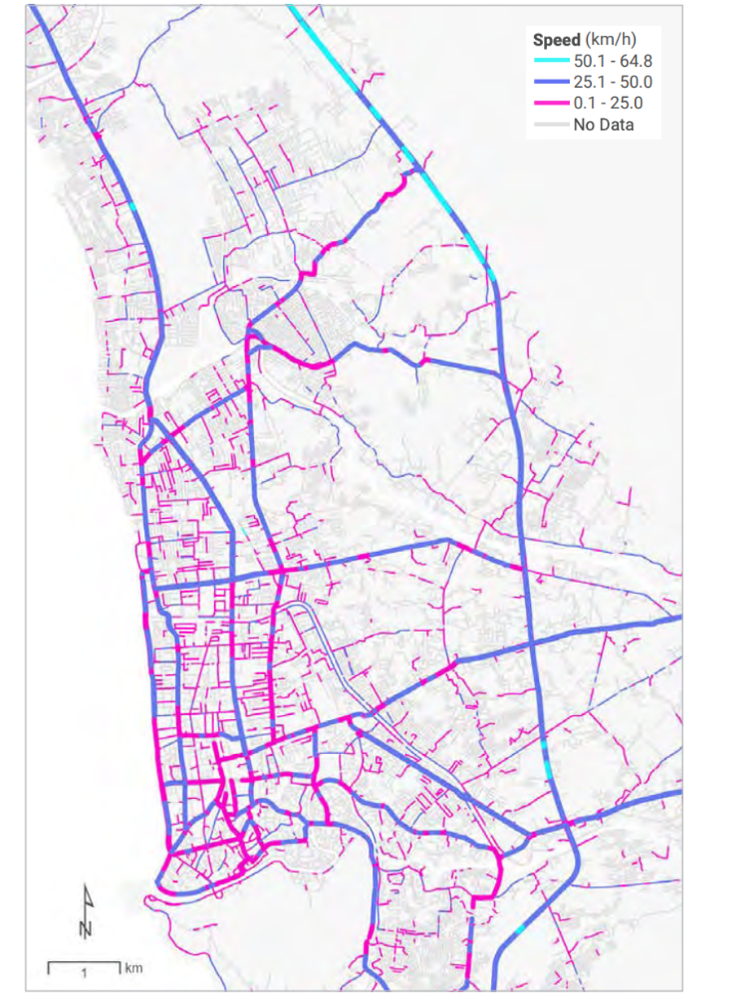
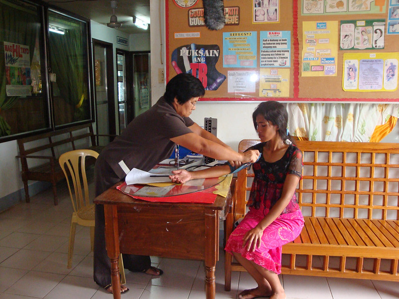

+++
title = "Unlocking Mapbox Data: Enhancing People’s Daily Lives through Data-Driven Urban Planning"
authors = ["Kwok Kin Lee"]
categories = ["Case Study"]
partner = ["Mapbox"]
dev_partner = ["World Bank"]
tags = ["Urban Development", "Transport"]
date = 2025-06-01T00:00:00Z

+++

Cities around the globe confront significant challenges in providing infrastructure, essential services, and access to public transportation. In response, many urban areas are striving to enhance their infrastructure to improve the daily lives of their citizens. This endeavor ranges from developing more efficient transport networks to ensuring health facilities are more accessible to the populations they serve. 

Data-driven urban planning plays a crucial role in enabling cities to prioritize investments to create sustainable environments for their residents. However, one of the most persistent challenges is the scarcity of up-to-date and high-frequency data in low-income countries. To address this issue, the Development Data Partnership facilitates collaboration between international organizations and technology companies to analyze and tackle urban challenges in these regions. 

Since March 2020, [Mapbox](https://www.mapbox.com/), a global location platform, through the Development Data Partnership, has been providing movement data and traffic data to international organizations, such as the World Bank, the International Monetary Fund, the Inter-American Development Bank, and the Organisation for Economic Co-operation and Development. This data captures anonymized aggregated activity and daily live traffic data, giving insights into where people are moving the most, and how. 

<figure style="text-align: center;">
    
    <figcaption style="text-align: center; margin-top: 8px;">
      <strong>Figure 1.</strong> Mapbox typical speeds in Padang, Indonesia on Thursday, 5:00 p.m. to 6:00 p.m. 
Source: Original figure from 
      <a href="https://documents1.worldbank.org/curated/en/099200002152227482/pdf/P170812026cd2b0550acec0ef8165301833.pdf" target="_blank"> Detecting Urban Clues for Road Safety: Leveraging Big Data and Machine Learning</a>based on data by <a href="https://www.mapbox.com/about/maps" target="_blank">©Mapbox</a>.
    </figcaption>
  </figure>

  Improving Transportation Networks: The Case of Lima

For instance, [Mapbox supported the World Bank’s Transport Global Practice to inform interventions to improve the transport network in Lima](https://datapartnership.org/updates/mobility-data-lima/), where less than 1 in 10 residents report feeling satisfied with public transport quality. In this project, the World Bank team was able to identify the number of trips between different areas of the city, average distances traveled, travel times, average speeds, and congestion hotspots, which are all helpful in a context where no recent traditional mobility survey data is available. 

This project helped the Peruvian government and Lima’s transportation agencies to improve traffic flow, enhance road safety, lower carbon emissions, and promote a shift toward walking, cycling, and public transport.

  Enhancing Health Facility Accessibility

In addition to transportation, analyzing and enhancing the accessibility of health facilities is paramount for improving people’s lives.  [With Mapbox’s data support, the World Bank tested hundreds of origin-destination pairs in Indonesia and the Philippines to find the closest hospital or clinic to each origin and calculate the associated travel time](https://datapartnership.org/updates/planning-for-equitable-access-to-health-infrastructure/). This enabled the team to examine how hospitals and clinics are practically accessed and how governments, in the short term, can efficiently allocate resources by setting up mobile health clinics that expand health accessibility to vulnerable populations in the two countries.

Another World Bank [project](https://datapartnership.org/updates/health-planning-in-the-philippines/) in the Philippines also received data support from Mapbox. This project leveraged [the Mapbox Matrix API](https://www.mapbox.com/matrix-api) to calculate people’s access to health services in this Southeast Asian country where the delivery of health services is highly fragmented across different levels of administration. The team’s work was presented to staff from the health ministry in the Philippines to identify optimal ways to register citizens with health care providers.

In [this project](https://datapartnership.org/updates/health-planning-in-the-philippines/), researchers used [the Mapbox Matrix API](https://www.mapbox.com/matrix-api)  to record the time it takes to travel from every 1km grid cell in the region to the nearest health clinic or hospital. The API provided an efficient way to query travel time estimates without having to compile and refine road networks and create naive assumptions for travel speed.

This project was well received by local government staff in the Philippines and helped frame discussions about optimal ways to register citizens with healthcare providers.

<figure style="text-align: center;">
  
  <figcaption style="text-align: center;">
    Photo: World Bank
  </figcaption>
</figure>

The successful application of Mapbox data in various World Bank projects across Peru, Indonesia, and the Philippines underscores the importance of robust data partnerships in addressing development challenges. Collaborative efforts between international organizations and private sector entities can significantly impact the quality of life for individuals in low-income countries.

The Development Data Partnership will continue to facilitate collaborations, ensuring that data-driven solutions are leveraged for the public good. By harnessing the power of data, we can work toward building more sustainable urban environments that enhance the daily lives of all citizens.
