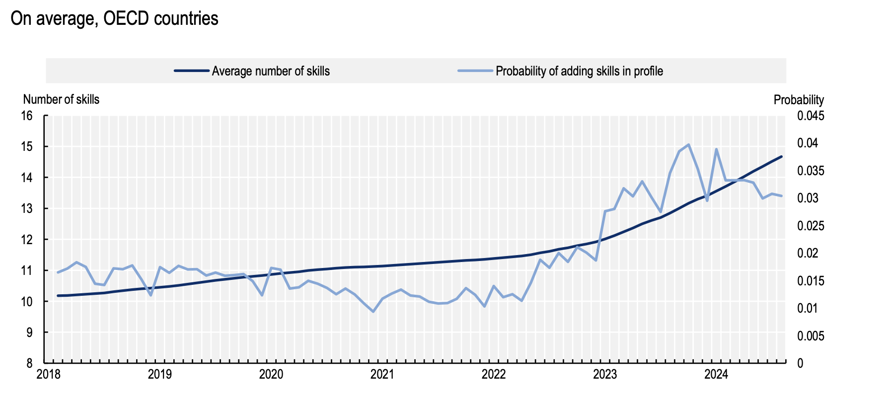
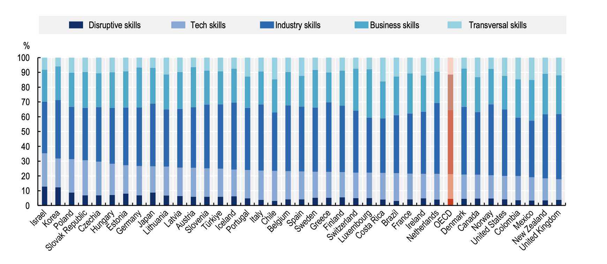

+++
title = "Using LinkedIn Data to Understand the Shift Towards Skills-First Labour Markets"
authors = ["Ivan Bornacelly", "Francesca Borgonovi", "El Iza Mohamedou"]
categories = ["Case Study"]
partner = ["LinkedIn"]
dev_partner = ["Organisation for Economic Co Operation and Development"]
tags = ["Jobs and Development"]
links = ["https://www.oecd.org/en/publications/empowering-the-workforce-in-the-context-of-a-skills-first-approach_345b6528-en.html"]
date = 2026-09-14T00:00:00Z
+++

As labour markets evolve, the skills people need at work are changing. Leveraging [LinkedIn](https://economicgraph.linkedin.com) data through the Development Data Partnership, an OECD project looks at the rise of skills-first approaches across OECD labour markets. It explores how individuals signal their skills, how employers search for talent, how hiring and workforce development can give greater weight to demonstrated skills and competencies and the role public policy can play to realise the benefits of such shifts. 

## Challenge

For many years, employers and policy makers have relied heavily on formal qualifications and past job titles to understand what people can do. These signals remain important, but they do not always provide a complete or up-to-date picture of a person’s skills.

In addition, recent technological advances mean that skills needs today are changing faster than many traditional labour market information systems can track. Employers increasingly need new technical, transversal and transferable skills, while workers need clearer and trusted ways to demonstrate what they know and can do.

Traditional data sources, such as official labour market statistics and surveys, remain essential. However, they may not fully capture in a timely manner how people present their skills online, how recruiters search for candidates, or which skills are being signalled across sectors and occupations. They also lack the level of granularity that is needed to consider specific skills requirements and emerging labour market needs.

Skills-first practices can broaden opportunities for people without degrees or conventional career paths. These groups may have fewer opportunities to develop and validate skills, weaker professional networks, or less confidence and capacity to use digital platforms effectively to showcase what they can do.

<figure style="text-align: center;">
  
</figure>

## Solution

To develop a more comprehensive understanding of how skills-first practices are being implemented across different contexts, the [OECD Centre for Skills](https://www.oecd.org/en/about/directorates/centre-for-skills.html) combined LinkedIn data with official statistics, labour market surveys, country case studies and policy analysis.

Analyses of LinkedIn data allowed the OECD team to identify important patterns in how individuals signal skills and recruiters search for talent.

For instance, more individuals are making their skills visible online. Across OECD countries, the likelihood of a person adding skills to a LinkedIn profile rose from 1.5% in 2018 to 3.2% in 2023, while the average number of skills listed increased from 10 to more than 12. This suggests that workers are increasingly using digital platforms to show employers what they can do, not only where they studied or what jobs they previously held.

<figure align="center">
    
    <figcaption align="center">Figure 1: Trends in skills signalling on digital platforms Note: This figure includes the trend of the average number of skills that LinkedIn members have added to their profiles at a given time point, conditional on having at least one added skill, and the probability of adding a skill in each month, conditional on having at least one skill they have added in the past. (Source: LinkedIn, 2024)</figcaption>
</figure>

The LinkedIn data also revealed differences in the types of skills people signal across OECD countries. For example, Israel, Korea, and Poland had comparatively high shares of disruptive and tech skills on profiles, reflecting the prominence of innovation-driven sectors and emerging technologies. The Slovak Republic also showed a relatively balanced mix of balanced industry and business skills, illustrating how workers combine sector-specific expertise with more transferable capabilities.

<figure align="center">
    
    <figcaption align="center">Figure 2: Distribution of skills signalled by type of skill across OECD countries in 2023 Note: Countries are ordered based on the sum of the share of disruptive and tech skills. Disruptive skills refer to skills related to developing and applying emerging technologies expected to reshape labour markets, such as robotics, genetic engineering, and artificial intelligence, key drivers of innovation and industrial transformation. (Source: LinkedIn, 2024)</figcaption>
</figure>

Moreover, skills signaling also appear to be associated with shorter employment gaps. Adding skills to online profiles is linked with shorter gaps between jobs, with particularly strong effects among people who do not list formal education on their profiles.

## Impact

[This OECD study](https://www.oecd.org/en/publications/empowering-the-workforce-in-the-context-of-a-skills-first-approach_345b6528-en.html?) provides governments with evidence to support a better-informed and more inclusive transition towards skills-first labour markets.

A skills-first approach can help broaden talent pools, improve job matching and create new pathways for people whose skills were developed through work experience, online learning or other non-traditional routes. 

However, skills-first hiring is not a simple fix. Poorly designed skills assessments or AI enabled recruitment tools could reproduce or create new forms of bias. Moreover, an excessive focus on immediate skills needs could weaken long-term adaptability; and changes to qualification-based job structures could affect worker protections. Governments can support more responsible lifelong and work-based learning, strengthening labour market intelligence, and leading by example in public-sector hiring.

Finally, this project demonstrates that relevant private-sector data, such as LinkedIn data, combined with official statistics can help policy makers better understand fast-changing labour markets. These insights can support policies that help workers make their skills more visible and employers find the talent they need.

