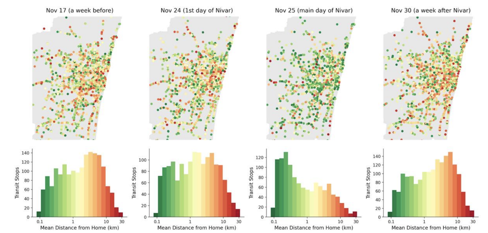

+++
title = "Using Mobility Data for Resilient Transport Planning and Investments"
authors = ["Satish Ukkusuri", "Gerald Ollivier", "Kwok Kin Lee"]
categories = ["Case Study"]
partner = ["Unacast", "Quadrant"]
dev_partner = "World Bank"
tags = ["Transport"]
date = 2024-10-07T00:00:00Z

+++

Chennai has been facing various challenges like changes in land use patterns and urban population stress, and a growing risk from events like floods and heavy rains, which all put pressure on its transport infrastructure. [Unacast](https://www.unacast.com/) and [Quadrant](https://www.quadrant.io/) provided data support to the World Bank’s South Asia Transport team for a study on resilient transport investments.

## Challenge

In recent years, vulnerable communities in Chennai have had to deal with the aftermath of the devastation caused by recurring floods and rains. These extreme weather events highlight the urgent need for comprehensive measures to mitigate their impact and enhance the city's resilience.

For instance, in November 2020 Cyclone Nivar brought intense weather conditions such as flooding to Chennai, disrupting public transport services.

To ensure the resilience of vulnerable communities living in the Chennai Metropolitan Area, it is vital to assess the level of vulnerability and criticality of the urban mobility network and provide adequate disaster risk management mechanisms when development is located in vulnerable areas. 

In addition, the COVID-pandemic also affected how people used public transport due to lockdowns and social distancing measures. 

<figure align="centre">
    
        

  

    </figcaption>
</figure>

## Solution

Through the Development Data Partnership, the World Bank’s South Asia Transport team utilized data from companies including [Unacast](https://www.unacast.com/) and [Quadrant](https://www.quadrant.io/) to conduct a study for accessible and resilient transit planning.

In this study, for the purpose of public transit demand analysis, the researchers used Quadrant GPS data to create detailed origin-destination matrices at various levels, including wards and individual stops. This revealed the busiest routes and stops across different times of day. The study also highlighted areas where demand outpaced available services.

COVID-19 impacts were also examined by tracking changes in transit usage patterns throughout different phases of the pandemic and lockdowns. This helped understand how the crisis affected public transportation use and which areas or routes were most impacted.

For the purpose of flood resilience analysis, the study focused on Cyclone Nivar in November 2020, using Unacast data to assess how the event disrupted transit stop visits. Researchers compared normal travel patterns to those during and after the cyclone, identifying which parts of the system were most affected. They found that during the disaster, most transit users lived very close to stops, revealing inequalities in access to public transport during emergencies.

<figure align="centre">
    
        

Figure 1: Histograms of the distance traveled to transit stations from home locations. During the Cyclone, the visits to transit stops were significantly limited to residents who live closer (< 1 km) to transit stations (> 80% of visitors), suggesting that during disaster events, the inequality in accessibility becomes amplified.
  

    </figcaption>
</figure>

This study also used Google Maps, Open Street Map data, GTFS data and flooding data available from Chennai Met.

## Impact

As the climate changes and cities experience more frequent extreme weather events, investing in climate-resilient transport infrastructure is more important than ever.

By combining these three aspects - regular transit demand, COVID-19 effects, and flood impacts - this study provided a multi-faceted view of Chennai's public transportation system and its resilience to climate change. This comprehensive analysis offers valuable insights for improving both daily operations and climate resilience to various disruptions, showcasing the power of mobile phone data in informing transit investments and preparing transport systems for climate resilience and pandemic response.

