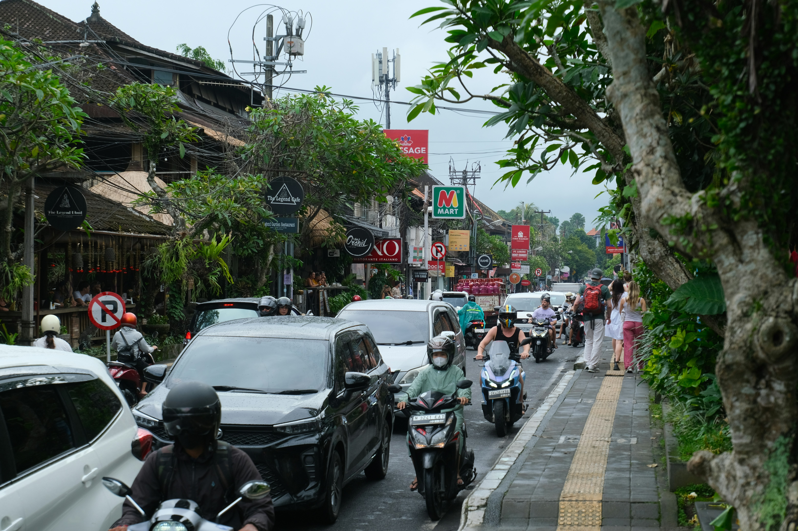
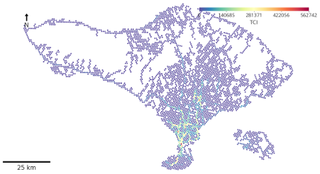

+++
title = "Using Private-Sector Data to Support Transportation Planning in Bali"
authors = ["Maria Sol Tadeo", "Luis Jan", "Abril Rodriguez" ]
categories = ["Case Study"]
partner = ["Meta", "Waze", "Mapbox", "GrabMaps"]
dev_partner = ["World Bank"]
tags = ["Transport", "Urban Development"]
date = 2026-09-02T00:00:00Z
+++

Bali is working toward a more resilient, low-carbon, and better-connected future. Its broader transportation vision includes improving urban mobility, expanding access across the island, and accelerating the transition to greener transportation.

To support this vision, a World Bank team used alternative data accessed through the Development Data Partnership to assess current traffic conditions and evaluate proposed transportation infrastructure. Data from [Meta](https://ai.meta.com/ai-for-good), [Waze](https://www.waze.com/wazeforcities), [Mapbox](https://www.mapbox.com), and [GrabMaps](https://grabmaps.grab.com) provided more detailed information on congestion, accidents, travel speeds, and the communities that could be served by future investments.

## Challenge

Bali’s fragmented and car-dependent transportation system creates severe congestion, limits access to jobs and destinations, increases emissions, and affects the island’s quality of life and appeal.

The congestion is structural, driven by heavy reliance on private vehicles and the limited availability of high-quality public transportation and mobility options. During peak hours, travel speeds can fall to around 16 kilometers per hour along certain corridors in Bali.

Transportation planners therefore needed more frequent and geographically detailed information to understand where and when congestion occurred, how travel patterns differed across the island, and how proposed infrastructure could improve connectivity.

<figure style="text-align: center;">
  
  <figcaption style="text-align: center; font-size: 0.9em; color: #555;">
    Photo Credit: Photo by Anil Baki Durmus on Unsplash 
    </a>
  </figcaption>
</figure>

## Solution

The team combined official information with the following data from four Development Data Partnership partners.

Waze for Cities Jams data helped the team examine congestion hotspots, daily congestion peaks, and reported accident locations. The analysis showed that congestion was concentrated around major tourism areas and that traffic patterns varied across Bali. In some locations, congestion peaked later than expected during the mornings, suggesting that tourism-related travel influenced traffic patterns there.

<figure style="text-align: center;">
  
  <figcaption style="text-align: center; font-size: 0.9em; color: #555;">This figure shows the Traffic Congestion Intensity Index across the whole island for Tuesdays, Wednesdays and Thursdays during July 2025. The TCI allows us to find congestion hotspots.
</figcaption>
</figure>

Waze for Cities Alerts dataset was used to understand the spatial distribution of accidents and their relationship with congestion. The team also calculated the number of accidents per registered vehicle and found that Badung was the administrative level with the higher rate. 

GrabMaps and Mapbox data supported the analysis of travel speeds and travel times along selected origin-destination pairs. GrabMaps data were used to assess proposed electric bus rapid transit routes in urban areas, while Mapbox data supported the analysis of longer connections outside the main urban area, including routes toward northern and western Bali.

Meta’s high-resolution population density maps helped identify where people lived, while its Relative Wealth Index supported an assessment of the characteristics of people in the area of interest. With this data, the team was able to evaluate the number of people that is going to be served by the proposed transportation infrastructure and their economic characteristics. 

The analysis found that:
 
•	Peak-hour travel speeds fell as low as 15 kilometers per hour in parts of southern Bali, compared with 30 kilometers per hour at midnight in Denpasar City. 

•	Intra-island travel times ranged from 2.5 to 4 hours across north-south and east-west corridors. 

•	Congestion was concentrated in Sarbagita (Denpasar, Badung, Gianyar, and Tabanan), overlapping with tourism hubs such as Kuta, Seminyak, and Ubud.

•	Accident hotspots were concentrated in the Kuta, Denpasar, and Ubud corridors, overlapping with major congestion and tourism areas.

•	Road safety risks persisted through most of the day, from 11 a.m. to 8 p.m., peaking between 3 p.m. and 4 p.m.

•	Kuta recorded 455 accidents per 100,000 people, while Ubud recorded 135 per 100,000 people. 

## Impact

The analysis provided transportation planners with a more detailed evidence base for assessing proposed investments.

Using Meta’s population data, the team estimated that the proposed transit system could reach 64% more people than the existing system.

The Relative Wealth Index analysis also found that areas served by the existing and proposed infrastructure had similar average economic characteristics to the wider study area. This suggests that the proposed network could expand population coverage without substantially changing the overall profile of the communities served.

The project demonstrates how high-frequency and geographically detailed private-sector data can complement official sources. By improving understanding of congestion, accidents, travel speeds, and potential beneficiaries, the analysis can support more informed decisions about future transportation investments in Bali.

