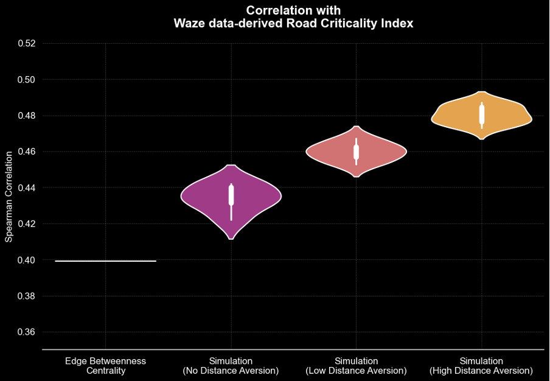

+++
title = "Using Traffic Data to Build Resilience: How Waze Supports Smarter Disaster Risk Management"
authors = ["Paolo Avner", "Jun Rentschler", "Neave O'Clery", "Sukankana Chakraboty", "Shaun Hoang"]
categories = ["Case Study"]
partner = ["Waze"]
dev_partner = ["World Bank"]
tags = ["Disaster Risk Management", "Transport"]
date = 2025-10-15T00:00:00Z
+++

With the support of [Waze](https://www.waze.com/wazeforcities), the World Bank validated a new traffic simulation model that identifies the most critical road segments in developing cities, helping governments prioritize climate-proofing and resilience investments.

## Challenge

Floods and various other hazards are becoming increasingly costly for societies worldwide. These costs extend beyond direct damages to assets and infrastructure; they also encompass more subtle yet significant impacts, such as the loss of access to jobs, educational institutions, and healthcare facilities, when transportation routes are disrupted. 

Developing countries are particularly vulnerable as rapid urbanization and climate change exacerbate the impact of extreme weather events. Given the constraints of limited resources and strained public budgets, it is crucial for Disaster Risk Management (DRM) strategies to focus on climate-proofing the key parts of the transportation network. Prioritizing the most critical road segments—those vital for maintaining consistent transport services—can significantly reduce the societal disruptions caused by natural hazards. By safeguarding these crucial routes, communities can ensure quicker recovery, maintain economic stability, and enhance resilience against future climate-related events.

Identifying which roads are the most critical, however, is not straightforward. The traditional methodology of betweenness centrality metrics, often used in network analysis, has clear limitations in this context. These metrics measure how often a road lies on the shortest routes across a network, but they do not consider where people actually live, work, or access services. This makes them less reliable for capturing the real-world importance of transport links, especially in rapidly growing urban areas of developing countries. In addition, they are also extremely computationally intensive when applied to large cities with large complex road networks. 

<figure style="text-align: center;">
  
</figure>

## Solution

Through the Development Data Partnership, the World Bank’s Global Facility for Disaster Reduction and Recovery (GFDRR) team leveraged the Waze for Cities dataset for Medellín—which provides road traffic jam data from February 2020—as a validation dataset for a traffic simulation methodology they developed. This approach, which exhibits good computational efficiency, identifies critical roads by sampling and simulating trips between areas with high home and job density. 

The team’s preliminary findings show that their algorithm's predictions of critical roads matched Waze data with a correlation of approximately 0.3 to 0.4, which reflects a 10–15% improvement over standard edge-betweenness centrality method. It also requires significantly less time and computational power. This encouraging pilot result cautiously suggests the potential of our traffic simulation approach and its scalability, with further testing to be conducted.

<figure style="text-align: center;">
  
  <figcaption style="text-align: center; font-size: 0.9em; color: #555;">The simulation outperforms the edge-betweenness centrality method. Results further improve with a distance aversion parameter that penalises unrealistically long trips.</figcaption>
</figure>

## Impact

The Waze dataset was instrumental to this project, serving as the key ground-truthing resource against which the performance of several methodologies for identifying critical road segments in a real-world developing city was evaluated. Given the global ubiquity of Waze data, it holds significant potential for scaling such analyses, enabling more targeted disaster risk management strategies that help mitigate transport disruptions from flooding and deliver tangible benefits to communities.

All in all, this project could support policymakers in designing more effective DRM strategies and deciding where to invest limited resources for climate-proofing. By pinpointing the road segments most critical for keeping people connected to jobs, schools, and healthcare, it offers a pathway to reducing everyday disruptions and safeguarding lives and livelihoods during disasters.

