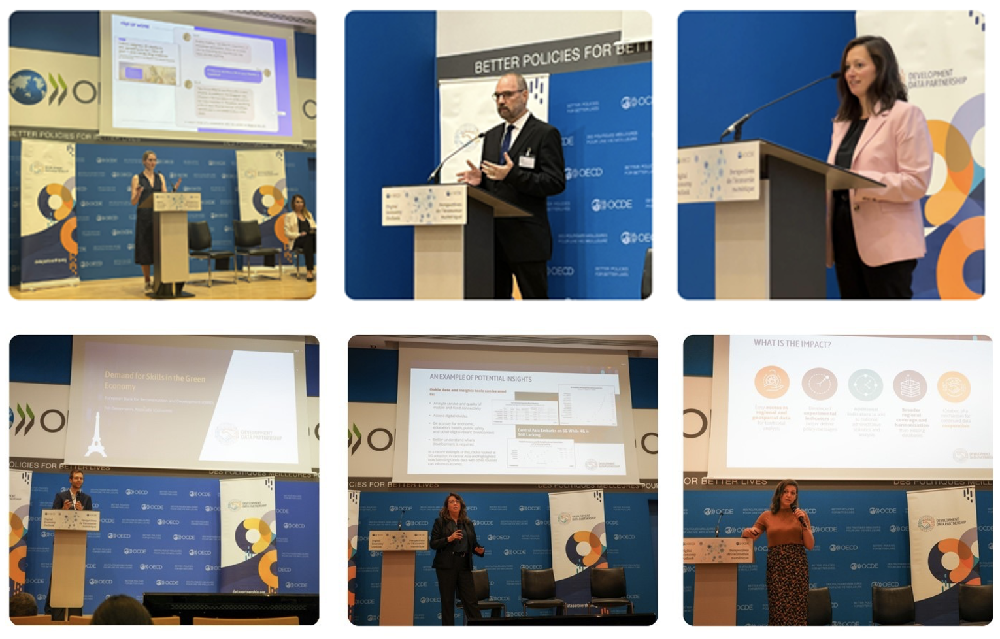

+++
title = "A Year in Review: Looking back on 2024"
authors = ["Kwok Kin Lee", "Claudia Calderon" ]
date = 2024-12-18T00:00:00Z

+++

This has proven to be a busy yet fulfilling year for the Development Data Partnership (the Partnership). As we bid farewell to 2024, we reflect on a year marked by impactful projects and fruitful partnerships. Join us as we take a look at the key highlights of this year.

## Fostering Collaborative Success 

Collaboration is crucial to our work as we cannot achieve our goals alone. The Partnership has continued its collaboration with its network of data and development partners. This year, we have developed a new agreement to facilitate data sharing between international organizations. We have also welcomed our new partners: IDB Invest, EarthGenome, Costellar, QuantCube, and VesselBot. 

We are excited to have such great partnerships that reflect our dedication to unleashing the power of data sharing for the public good. Our current and new partners represent a diverse range of sectors, and their contributions have extended our reach within the data community, strengthening our impact on international development.

## Engaging with the Data Community

Our annual Development Data Partnership Day took place in Paris in May this year and was an exciting and insightful event where we had the pleasure of engaging with participants from international organizations and the private sector at the OECD Headquarters and Conference Centre. Featuring speakers from tech industries, economists, and data scientists, sessions covered topics ranging from harnessing the power of AI to strengthening public-private sector data collaboration for the public good. 

For instance, the maps help define flood risk extents in countries and cities, allowing users to prioritize engagements and resources. Their visual nature makes them effective decision-making tools. For this IDB project, the Maps enabled the team to visualize flood risks for return periods of 20 and 100 years (see maps below). This is particularly important because the tool allows them to see geospatially how, in different return periods, the areas are more exposed and vulnerable to flooding. 

<figure align="centre">
    
        

  

    </figcaption>
</figure>

## Promoting Data Collaboration for Sustainable Development

Data is a key driver for sustainable development. By sharing high-quality data and expertise with data scientists, policymakers, and other data practitioners, tech companies play an important role in addressing international development challenges.  Over the year, the Partnership has supported 96 proposals, with more than one-third targeting SDG 9 (Industry, Innovation, and Infrastructure), SDG 13 (Climate Action), and SDG 11 (Sustainable Cities and Communities).

This year, we have also published almost 30 impact stories showcasing the results and impact of the collaboration with the private sector. Here’s a look back at some of the stories.

•	Cities across Nepal are increasingly vulnerable to natural hazards and climate change impacts. The World Bank used JBA’s Global Flood Maps to assess flood risks and identify high-hazard areas in Itahari, Nepal. Find out more [here] (https://datapartnership.org/updates/nbs-for-climate-resilient-urban-development-in-nepal/).

•	Climate change and geopolitical trade tensions threaten world trade flows. Thanks to Esri's support, online platform PortWatch was set up by the International Monetary Fund and the Environmental Change Institute at the University of Oxford to assess the domestic and international trade impact of actual and future disruptions. Click [here] (https://datapartnership.org/updates/monitoring-and-simulating-trade-disruptions/) for more information.

•	Technological advancements can shape labor markets in Central America and the Dominican Republic (CADR). Leveraging LinkedIn data, a World Bank study has revealed the challenges CADR countries are facing regarding technology-related skills. Read more [here] (https://datapartnership.org/updates/prevalence-of-technology-skills-in-cadr/).

•	The availability and accessibility of high-quality services are essential for people’s well-being, especially in towns and villages. An OECD project utilized Mapbox data for a study on service accessibility in towns and villages. Find out more [here] (https://datapartnership.org/updates/studying-service-accessibility-in-towns-and-villages/).

•	Chennai has been facing various challenges such as extreme weather which all put pressure on its transport infrastructure. Unacast and Quadrant provided data support for a World Bank study for accessible and resilient transit planning in the city. Discover more [here] (https://datapartnership.org/updates/using-mobility-data-for-resilient-transport-planning-and-investments/).

•	Amazonia has many small and remote communities but also some big and influential urban centers. The Inter-American Development Bank leveraged movement data from Meta to study the relationships between cities in each country within Amazonia, as well as the connections between the region’s urban areas and other parts of the countries. Learn more [here] (https://datapartnership.org/updates/understanding-people-mobility-in-amazonia/).

•	As traffic is a key source of air pollution in Tbilisi, it is vital for policymakers to tackle this health issue. The World Bank used traffic data from Waze for Cities to study how pollution varies within the Georgian capital. Read more [here] (https://datapartnership.org/updates/role-of-traffic-related-emissions-on-air-pollution-in-tbilisi/).

•	Internet usage still remains a luxury in less affluent communities. Using data from Ookla, the World Bank has analysed the relationship between internet speed and income inequality in Brazil. Click [here] (https://datapartnership.org/updates/uncovering-digital-divide-in-brazil/) to learn more.

## Looking Ahead

Looking forward, the Partnership will continue to showcase the impact of data collaborations between the private sector and international organizations and expand its network and outreach. Strengthening partnerships and cultivating new collaborations are key to our journey ahead.

We are grateful for the continued support of our partners and of the data community. We anticipate another year of fruitful collaboration and achievement for 2025. 

Thank you again for being an integral part of this remarkable 2024 journey!

